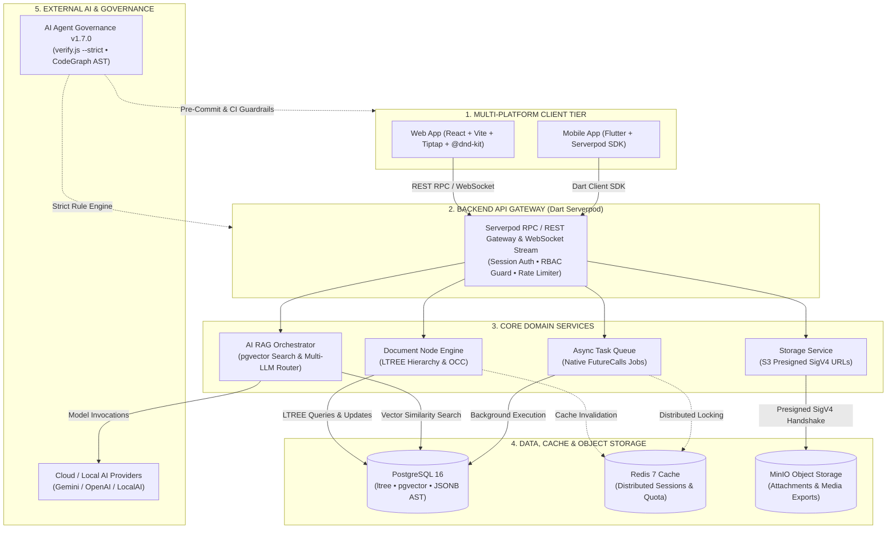

# nodetask

> **High-Performance Hierarchical Document Node & Knowledge Management Monorepo**  
> Built with **React (Vite)**, **Dart (Serverpod Framework)**, **PostgreSQL (`ltree` + `pgvector`)**, **Redis**, **MinIO Object Storage**, and **Flutter**, governed by an automated **AI Agent Governance System (`.agents/` v1.7.0)**.

---

## ⚡ Key Highlights

* **Hierarchical Document Node Engine**: Multi-level document node hierarchy (`Workspace -> Folder -> Document -> Section`) managed via PostgreSQL `ltree` extension and `@dnd-kit` sortable engine with **<16ms Optimistic UI updates**.
* **Notion-Like AST Rich Text Editor**: Integrated **Tiptap AST Editor** for block-based content editing saved as clean JSON AST.
* **Zero-Icon Monochrome UI**: Strict minimalist design philosophy with 0 icon dependencies (`lucide-react`, `react-icons` banned). Relies 100% on high-contrast typography, border tokens, container tokens (`container-fluid`, `container-wide`, `container-editorial`, `container-narrow`, `container-tight`), and text brackets `[ ]`, `[+]`, `[-]`.
* **Native AI Search & RAG Assistant**: Document semantic search and knowledge Q&A assistant powered directly by PostgreSQL **`pgvector`** with HNSW indexing and S3-compatible MinIO object store (**Zero Extra Infra Bloat**).
* **Code-First Serverpod SDK Auto-Generation**: Declarative YAML data models automatically generate type-safe Dart Client SDK (`apps/client/`) & REST RPC endpoints.
* **Script Lifecycle Governance**: Standardized lifecycle for utility scripts with strict classification into **Reusable** (`scripts/reusable/` with `.manifest.yaml`) and **Ephemeral** (`scripts/tmp/` with audit evidence).
* **AI Agent Governance Engine (v1.7.0)**: Built-in automated guardrails, severity-matrix rule verification (`verify.js --strict`), 16 domain skills, execution pipeline, AST CodeGraph dependency tracking, and git pre-commit hooks for AI pair programming.

---

## 🏛️ System Architecture Diagram



### 📐 Architectural Layers & Responsibilities

| Layer / Tier | Core Components | Tech Stack | Key Responsibilities |
|---|---|---|---|
| **1. Multi-Platform Clients** | `apps/web`<br/>`apps/mobile` | React 18, Vite, Tiptap, Zustand, TanStack Query, Flutter | Notion-like block editing, drag-and-drop hierarchy (<16ms), offline cache, zero-icon monochrome UI. |
| **2. API Gateway & Security** | Serverpod Endpoints | Dart, Serverpod RPC/REST/WS | Session validation, RBAC enforcement (`GUEST`, `USER`, `ORG_MEMBER`, `ORG_ADMIN`, `SYSTEM_ADMIN`), WebSocket streams. |
| **3. Core Domain Services** | Node, Auth, AI, Storage, Job | Dart Domain Services | Hierarchical tree nodes (`ltree`), two-phase AI quota, S3 SigV4 presigned URLs, asynchronous `FutureCalls`. |
| **4. Data & Storage Layer** | PostgreSQL, Redis, MinIO | Postgres 16 (`pgvector`, `ltree`), Redis 7, MinIO | Document trees, embeddings vector index (HNSW), session tokens, object buckets (`nodetask-uploads`). |
| **5. AI & Governance Tier** | AI Providers & `.agents/` | Gemini, OpenAI, CodeGraph, `.agents` Engine | Semantic RAG search, automated rule verification (`verify.js --strict`), 16 domain skills, zero cloud lock-in. |

---

## ⚡ Command Matrix

| Command | Working Directory | Description |
|---|---|---|
| `npm run verify` | `./` | Rule Engine Verification in strict mode (`node .agents/scripts/verify.js --strict`) |
| `npm run scan` | `./` | Fallow codebase analyzer for dead-code, clones, cyclomatic complexity & CRAP scores |
| `npm run build:web` | `./` | TypeScript compilation & Vite production build for `apps/web` |
| `npm run check` | `./` | Run verify + web build checks |
| `docker-compose up -d` | `./` | Launch PostgreSQL (`pgvector`, `ltree`), Redis cache & MinIO object store |
| `cd apps/server && dart bin/main.dart` | `apps/server` | Start Dart Serverpod backend server |
| `cd apps/web && npm run dev` | `apps/web` | Start React Vite local development server |
| `codegraph sync` | `./` | Sync monorepo AST dependency graph in `.codegraph/codegraph.db` |

---

## 🚀 Quickstart Guide

### 1. Prerequisites

- **Node.js**: `>= 20.x`
- **Dart SDK**: `>= 3.0.x` & **Serverpod CLI** (`dart pub global activate serverpod_cli`)
- **Docker & Docker Compose**

### 2. Launch Local Environment

```bash
# Step 1: Start PostgreSQL (pgvector & ltree), Redis, and MinIO Object Storage
docker-compose up -d

# Step 2: Start Serverpod Backend
cd apps/server
dart bin/main.dart

# Step 3: Start Frontend Web Application
cd apps/web
npm run dev
```

### 3. Enable Git Pre-Commit Rule Verification Hook

Ensure all code changes adhere to AI Agent Governance rules before committing:

```bash
git config core.hooksPath .githooks
```

---

## 🛡️ AI Agent Governance Engine

This repository includes an embedded rule engine runner to verify code against architectural guardrails:

```bash
# Run verification in standard mode
node .agents/scripts/verify.js

# Run verification in strict mode (fails on ERRORS and WARNINGS)
node .agents/scripts/verify.js --strict
```

### Rule Severity Breakdown

* 🔴 **`ERROR`**: Architecture swap, forbidden dependencies, missing core docs or `.agents` structure (Blocks Commit/CI).
* 🟡 **`WARNING`**: Icon package imports or UI guidelines violations (Blocks CI in `--strict` mode).
* 🔵 **`INFO`**: Import order conventions and styling formatting suggestions.

---

## 📖 Core Documentation Index

For detailed architectural decisions and coding standards, refer to the specs in `docs/`:

* [Architecture Specification](docs/architecture.md) — Master Tech Stack, ADRs, Directory Structures & DDD Invariants
* [Data Models & API Endpoints](docs/data_and_api.md) — Serverpod RPC Endpoints, DB Schemas (`ltree`, `JSONB`, `pgvector`) & System Roles
* [Frontend & UI/UX Specification](docs/frontend_and_ui.md) — Monochrome Design System, Zero-Icon Rule, Container Tokens & Typography
* [Operations, Testing & Quality Budget](docs/operations_and_quality.md) — Ops, Performance Budget (<16ms Dnd), Security & Testing Guidelines
* [Modular Service Specifications](docs/services/) — 12 Independent per-service specs (`docs/services/<service_name>.md`)
* [Modular Frontend Page & Route Specifications](docs/page_routes/) — 20 Independent per-route specs (`docs/page_routes/<route_name>.md`)

---

## 📜 License

MIT © [nvtruongops](https://github.com/nvtruongops)

