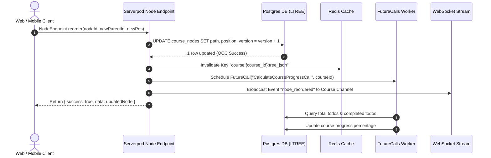
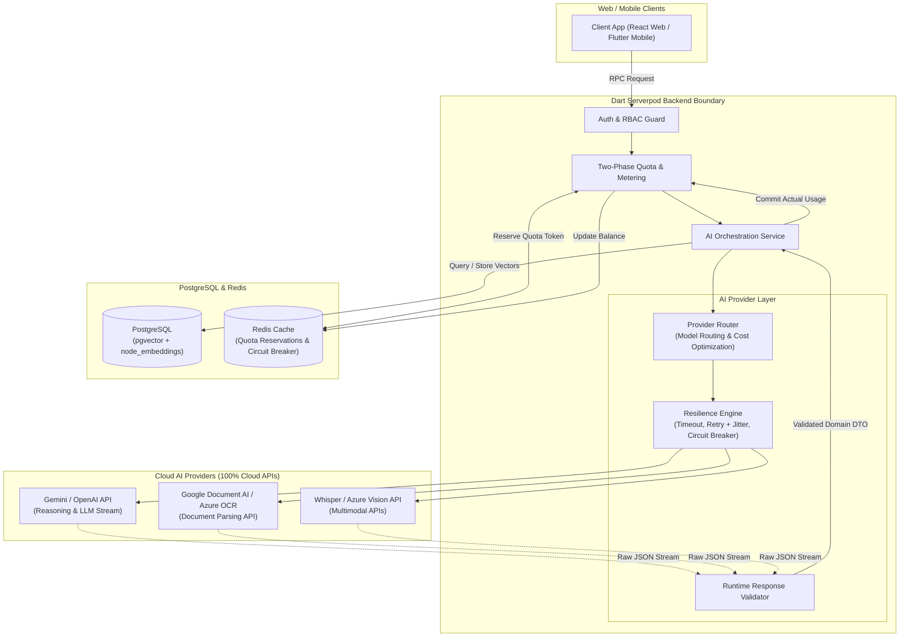
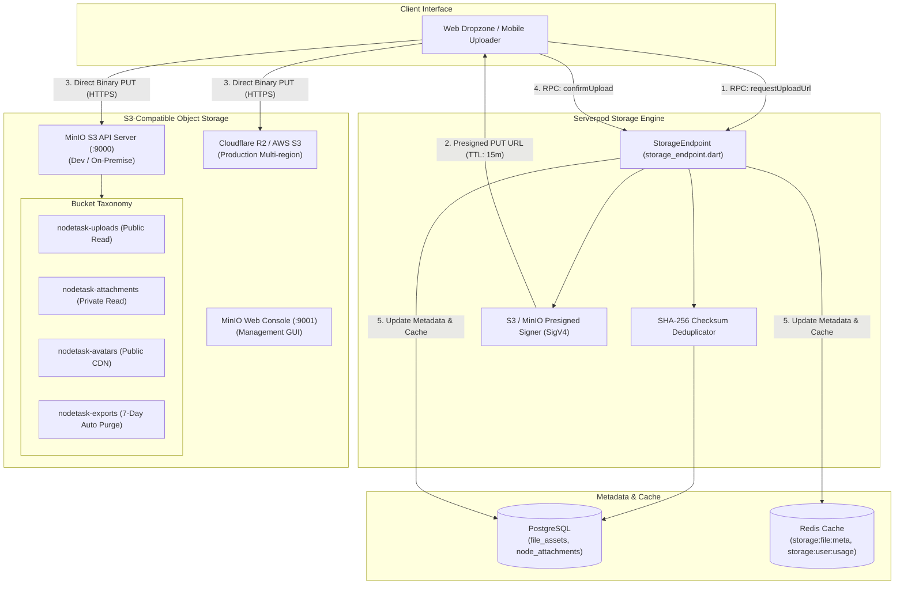

# Quy Chuẩn Kiến Trúc Dự Án (Architecture Specification)

> **Specification Version**: `1.3.0`  
> **Schema Version**: `1`  
> **Last Updated**: `2026-08-06`  
> **Status**: `APPROVED`  

---

### 1. Master Tech Stack

| Tầng (Layer) | Công nghệ / Framework | Lý do & Vai trò |
| :--- | :--- | :--- |
| **Web Frontend (FE)** | **React (Vite)** | Tốc độ build cực nhanh, hệ sinh thái Tiptap & dnd-kit tốt nhất. Tương tác với Backend qua Serverpod Client / REST RPC HTTP Gateway. |
| **Styling & UI Kit** | **Tailwind CSS + Shadcn UI** | UI hiện đại, responsive, hỗ trợ Dark/Light mode Monochrome. |
| **State & Caching** | **Zustand + TanStack Query** | Phản hồi kéo-thả dưới 16ms (Optimistic UI updates). |
| **Rich Text Editor** | **Tiptap Editor** | Soạn thảo dạng block (Notion-like), lưu dạng JSON AST. |
| **Drag & Drop Engine**| **`@dnd-kit/core` & `@dnd-kit/sortable`** | Engine kéo thả mượt nhất trên Web DOM. |
| **Backend (BE)** | **Dart (Serverpod Framework)** | Ngôn ngữ Dart mạnh mẽ. Tự động sinh **Dart Client SDK** cho Flutter Mobile & Dart Apps; Expose **REST RPC Client / Gateway** cho React TS Web. |
| **Database (DB)** | **PostgreSQL + pgvector** | ORM Code-First, extension `ltree` (cây), `JSONB` và `pgvector` (RAG Search). |
| **Distributed Cache** | **Redis (Serverpod Redis Cache)** | Caching Session Auth & Cây bài học (Read-heavy) giảm tải DB. |
| **Async Task Queue** | **Serverpod FutureCalls Engine** | Engine native xử lý ngầm (Background jobs & Scheduled Tasks). |
| **Object Storage** | **MinIO (Dev/On-Prem) / Cloudflare R2 / AWS S3 (Prod)** | Lưu trữ tệp tin đa phương tiện, tài liệu đính kèm và ảnh qua Presigned URLs (AWS S3 API compatible). |
| **Mobile App** | **Flutter (Dart)** | Tái sử dụng 100% Data Models và Dart Client SDK tự động sinh từ Backend Dart Serverpod. |

---

### 2. Cấu trúc Tổng quan Monorepo (`./`)

```text
./
├── .agents/                      # AI Agent Governance System (AGENTS.md, manifest v1.3.0, registry, pipeline, rules)
├── docs/                         # Bộ tài liệu quy chuẩn cốt lõi
│   ├── architecture.md           # Master Tech Stack, ADRs & DDD Invariants Spec
│   ├── data_and_api.md           # Serverpod RPC Endpoints, DB Schemas & Error Contract Index
│   ├── frontend_and_ui.md        # Master UI/UX & Zero-Icon Spec
│   ├── operations_and_quality.md # Master Ops, Testing & Quality Budget Spec
│   └── services/                 # Thư mục chứa đặc tả chi tiết độc lập theo từng Dịch vụ (<service_name>.md)
├── apps/                         # Các ứng dụng client & server
│   ├── web/                      # React (Vite) Frontend + Zustand + TanStack Query
│   ├── server/                   # Dart Serverpod Backend + PostgreSQL + Redis
│   └── mobile/                   # Flutter Mobile App (Dart Client SDK)
├── packages/                     # Dynamic Shared packages/models
└── docker-compose.yml            # Docker cấu hình PostgreSQL (pgvector), Redis & MinIO Object Storage
```

#### 2.1. Cấu trúc Frontend Web (`apps/web/src/`)
```text
apps/web/src/
├── assets/                       # Images, Fonts
├── components/                   # Shared UI Components (Shadcn UI, Custom Layout, Tree)
├── features/                     # Feature-driven Slices (landing, auth, workspace, editor, ai-search)
│   └── <feature_name>/
│       ├── components/           # Feature UI Components
│       ├── content/              # Feature-Sliced Self-Contained i18n (en.json, vi.json, index.ts)
│       └── <FeaturePage>.tsx     # Main Feature Page Entry
├── hooks/                        # Custom React Hooks
├── lib/                          # Utils, Client SDK Instantiation (serverpod.ts, utils.ts)
├── services/                     # API Fetching & React Query Queries
├── store/                        # Zustand Local Stores (useAuthStore.ts, useThemeStore.ts, useLanguageStore.ts)
├── types/                        # TypeScript Interfaces & Types
└── styles/                       # globals.css (Theme Tokens)
```

#### 2.2. Cấu trúc Backend Serverpod (`apps/server/`)
```text
apps/server/
├── config/                       # Passwords & Server Configuration (development.yaml, passwords.yaml)
├── lib/
│   ├── src/
│   │   ├── endpoints/            # API Endpoints (auth_endpoint.dart, course_endpoint.dart, node_endpoint.dart, todo_endpoint.dart, ai_endpoint.dart)
│   │   ├── generated/            # Code tự sinh bởi Serverpod (DO NOT EDIT)
│   │   ├── models/               # Declarative YAML Models (course.yaml, course_node.yaml, node_todo.yaml, node_embedding.yaml)
│   │   ├── future_calls/         # Serverpod Native Async Job Handlers
│   │   └── services/             # Business Logic & Helpers (ai_service.dart, vector_service.dart)
│   └── server.dart               # Server Initializer Entry
└── pubspec.yaml                  # Dart Dependencies
```

---

### 3. Danh sách Thư viện Yêu cầu (Whitelisted Dependencies)

Chỉ sử dụng các thư viện đã được duyệt dưới đây. **Không cài thêm UI kit hoặc State Library khác.**

#### 3.1. Frontend Web (`apps/web`)
* **UI & Theme**: `tailwindcss`, `next-themes`, `shadcn-ui` / `@radix-ui/*`.
* **Auth & Forms**: `zod`, `react-hook-form`.
* **State & Data**: `zustand`, `@tanstack/react-query`.
* **Drag & Drop**: `@dnd-kit/core`, `@dnd-kit/sortable`.
* **Rich Text**: `@tiptap/react`, `@tiptap/starter-kit`, `@tiptap/extension-task-list`.

#### 3.2. Backend (`apps/server`)
* `serverpod`, `serverpod_postgres`, `serverpod_redis`, `serverpod_auth_server`.

#### 3.3. Mobile (`apps/mobile`)
* `flutter_riverpod`, `serverpod_auth_shared_flutter`, `flex_color_scheme`, `go_router`.

---

### 4. Quyết định Kiến trúc Bắt buộc (Architecture Decisions - ADR)

1. **ADR-01: Serverpod Declarative YAML Models & SDK Generation**
   * Tất cả data model đều được định nghĩa tại `apps/server/lib/src/models/*.yaml`. Dùng `serverpod generate` để tự động tạo Dart Client SDK cho Flutter Mobile và TypeScript interfaces cho React Web. KHÔNG bao giờ viết thủ công API client code.
2. **ADR-02: PostgreSQL `ltree` cho Cây bài học phân cấp**
   * Quản lý cây bài học (Topic -> Module -> Session -> Subsession) bằng `ltree` extension trên Postgres. Giúp query nhanh toàn bộ cây con bằng 1 câu lệnh duy nhất mà không tốn công đệ quy.
3. **ADR-03: Optimistic Concurrency Control (OCC)**
   * Dùng trường `version` trong bảng `course_nodes`. Cập nhật dữ liệu luôn kiểm tra `WHERE id = $1 AND version = $2`. Nếu không trùng version, báo lỗi `VERSION_CONFLICT` để client rollback.
4. **ADR-04: Serverpod Native Cache & FutureCalls Engine**
   * Sử dụng `session.caches` (In-memory & Redis distributed cache) để cache dữ liệu đọc nhiều. Sử dụng `FutureCalls` làm Task Queue native chạy ngầm mà không cài thêm BullMQ hay RabbitMQ.
5. **ADR-05: PostgreSQL Native Vector Extension (`pgvector`) cho AI Search & RAG**
   * Tận dụng extension `pgvector` ngay trong PostgreSQL database chính với chỉ mục HNSW. KHÔNG cài thêm Vector DB độc lập như Chroma hay Qdrant để tối giản hạ tầng (Zero Extra Infrastructure Bloat).
6. **ADR-06: AI Orchestration & AI Provider Abstraction Layer**
   * Giữ toàn bộ AI Orchestration trong Dart Serverpod Boundary; thiết lập **AI Provider Layer** (Router, Timeout, Retry + Jitter, Circuit Breaker, Two-Phase Quota Reservation, Runtime Response Validation) điều phối 100% Cloud AI APIs (Gemini, OpenAI, Document AI, Azure Vision).
7. **ADR-07: S3-Compatible Object Storage & 3-Way Presigned Handshake (MinIO / R2 / S3)**
   * Toàn bộ tệp tin đa phương tiện và tài liệu đính kèm được lưu trữ trên **S3-Compatible Object Store**: MinIO cho môi trường Local Dev & On-Premise (`:9000` API, `:9001` Console), Cloudflare R2 / AWS S3 cho Production. Mọi luồng tải lên/xuống đều dùng **Presigned URLs** 3 chiều (AWS SigV4, TTL 15m) để giải phóng 100% băng thông của Serverpod API Server.

---

### 5. Đặc Tả Kiến Trúc Cache, Task Queue, Vector Search & Object Storage

#### 5.1. Kiến trúc Caching Service (`session.caches`)
- **Layer 1: Local In-Memory Cache (`session.caches.local`)**: Rate Limiting counters & Temporary Tokens.
- **Layer 2: Distributed Redis Cache (`session.caches.global`)**:
  - `auth:session:{session_key}` (TTL 24h).
  - `course:{course_id}:tree_json` (TTL 1h).
- **Cache Invalidation Flow**: Purge Redis Key `course:{course_id}:tree_json` ngay khi có mutation trên cây node.

#### 5.2. Luồng Xử Lý Async Task Queue & Dynamic Invalidation (Sequence Diagram)



#### 5.3. Kiến trúc AI Provider Layer & Cloud Orchestration Engine



#### 5.4. Kiến trúc S3-Compatible Object Storage & MinIO Topology



---

### 6. Lớp Nghiệp Vụ Domain (Domain-Driven Design - DDD Invariants)

Hệ thống định nghĩa các quy tắc nghiệp vụ cố định (Business Invariants) bắt buộc phải thỏa mãn tại Domain Layer trước khi ghi dữ liệu:

1. **Tree Hierarchy Invariants**:
   - Vòng lặp đệ quy (Circular Dependency): Nút con không bao giờ được phép làm nút cha của chính nút tổ tiên của nó.
   - Loại Nút phân cấp chuẩn: `TOPIC` -> `MODULE` -> `SESSION` -> `SUBSESSION`. Nút loại `SUBSESSION` không được chứa nút con.
2. **Optimistic Concurrency Invariant**:
   - Mọi thao tác Mutation trên `course_nodes` bắt buộc phải tăng `version = version + 1`. Nếu `version` gửi lên khác `version` hiện tại trong DB, hệ thống từ chối cập nhật và trả về lỗi `VERSION_CONFLICT`.
3. **Progress Calculation Invariant**:
   - Phần trăm hoàn thành cây bài học / tài liệu $\text{Progress} = \left(\frac{\text{Completed Todos}}{\text{Total Todos}}\right) \times 100$. Nếu `Total Todos == 0`, `Progress = 0%`.

---

### 7. Environment Strategy & Dev/Prod Quality Isolation

Dự án áp dụng mô hình phân tách môi trường nghiêm ngặt (Environment-Driven Configuration) nhằm cân bằng giữa trải nghiệm lập trình linh hoạt (Developer Experience) và chất lượng/bảo mật sản phẩm (Production Quality):

| Tiêu chí | Môi trường Development (`DEV`) | Môi trường Production (`PROD`) |
| :--- | :--- | :--- |
| **Frontend Runtime** | `import.meta.env.DEV === true` | `import.meta.env.PROD === true` |
| **Env Files** | `apps/web/.env.development` & `.env` | `apps/web/.env.production` |
| **Backend Serverpod** | `apps/server/config/development.yaml` (`http://localhost:8080`) | `apps/server/config/production.yaml` (`https://api.nodetask.io`) |
| **Structured Logger** | Hiển thị đầy đủ `DEBUG`, `INFO`, `WARN`, `ERROR` kèm namespace badge & timestamps. | Tự động tắt `DEBUG` & `INFO`; chỉ log `WARN` và `ERROR` bảo mật. |
| **Console & Debugger** | Giữ nguyên cho việc inspect & trace luồng RPC/Store. | **Vite esbuild drop sạch** toàn bộ `console.*` và `debugger` khi build bundle. |
| **Dev Debug Toolbar** | Kích hoạt `DevToolbar` (Quick Role Switcher, Latency Simulator, Reset State). | **Tree-shaken 100%**, không xuất hiện trong bundle build. |
| **Auth & Guards** | Cho phép Dev Role Switcher để test nhanh các view `GUEST`, `USER`, `ORG_ADMIN`. | Thực thi nghiêm ngặt JWT Session, Cookie Secure, RBAC và Rate Limiter. |
| **Quality Verification** | Kiểm tra linh hoạt trong quá trình code. | Bắt buộc PASS `node .agents/scripts/verify.js --strict` (0 Error, 0 Warning). |

