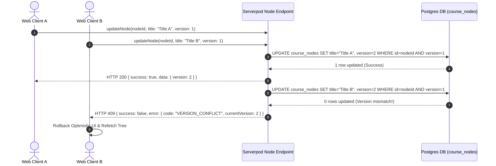

# Quy Chuẩn Dữ Liệu & API Backend (Data & API Specification)

> **Specification Version**: `1.3.0`  
> **Schema Version**: `1`  
> **Last Updated**: `2026-08-06`  
> **Status**: `APPROVED`  

---

> [!NOTE]
> **Thư mục Đặc tả Dịch vụ Độc lập (`docs/services/`)**:
> Chi tiết về API Endpoints, Database Schema, Logic nghiệp vụ và Ma trận Phân quyền của từng Dịch vụ được lưu trữ độc lập tại thư mục [docs/services/](file:///E:/Code/nodetask/docs/services) theo định dạng `docs/services/<service_name>.md`.
> Khi khởi tạo hoặc mở rộng dịch vụ mới, chỉ cần tạo file mới trong `docs/services/` mà KHÔNG cần sửa đổi hay đăng ký lại tại các file Core Spec chung.

---

### 1. Bản Đồ Dịch Vụ Backend & Serverpod RPC Endpoints (Services Index Map)

Serverpod định nghĩa API theo dạng các **Endpoint Classes & Methods**. Để loại bỏ lặp lại và đảm bảo nguyên tắc **Single Source of Truth**, tất cả Endpoint Method Signatures, Request/Response DTOs, Zod Validation, RBAC Matrix và Caching Rules chi tiết được quản lý độc lập tại thư mục `docs/services/`.

File Core Spec `data_and_api.md` đóng vai trò **Bản đồ Chỉ mục (Index Map)** và **Quy chuẩn hạ tầng dùng chung (Master Standards)**:

| Dịch vụ (Service Domain) | Serverpod Endpoint Class | File Đặc tả Chi tiết (Single Source of Truth) | Phạm vi & Chức năng Dịch vụ |
| :--- | :--- | :--- | :--- |
| **Authentication & Access Control** | `AuthEndpoint` | [docs/services/auth.md](file:///E:/Code/nodetask/docs/services/auth.md) | Đăng ký (Email OTP), Đăng nhập, Quên/Đổi mật khẩu, Session & Ma trận RBAC. |
| **Course & Learning Workspace** | `CourseEndpoint` | [docs/services/course.md](file:///E:/Code/nodetask/docs/services/course.md) | Quản lý Không gian tri thức, Cây thư mục học tập phân cấp & Workspace resources. |
| **Node Structure & AST Document** | `NodeEndpoint` | [docs/services/node.md](file:///E:/Code/nodetask/docs/services/node.md) | Cấu trúc cây `ltree`, Kéo-Thả (Reorder) & Nội dung ghi chú Tiptap AST JSON. |
| **Todo & Task Management** | `TodoEndpoint` | [docs/services/todo.md](file:///E:/Code/nodetask/docs/services/todo.md) | Quản lý công việc (Todo) đính kèm nút & Tính toán phần trăm tiến độ học tập. |
| **Background Jobs & Export** | `JobEndpoint` | [docs/services/job.md](file:///E:/Code/nodetask/docs/services/job.md) | Xuất dữ liệu PDF/Markdown ngầm và theo dõi trạng thái background job. |
| **AI Semantic Search & RAG** | `AiEndpoint` | [docs/services/ai.md](file:///E:/Code/nodetask/docs/services/ai.md) | Tìm kiếm ngữ nghĩa bằng `pgvector` & Trợ lý AI RAG giải đáp dữ liệu tri thức. |

---

### 2. Định dạng Response & Ma Trận Chuẩn Lỗi (Error Contract Standard)

#### 2.1. Standard Response Payload Format
```json
// Success Response
{
  "success": true,
  "data": { "id": "uuid-v4", "title": "Dart Fundamentals", "position": 1, "version": 2 }
}

// Error Response Format
{
  "success": false,
  "error": {
    "code": "VERSION_CONFLICT",
    "message": "Node has been updated by another user/session.",
    "details": { "currentVersion": 4, "providedVersion": 3 }
  }
}
```

#### 2.2. Error Code Matrix

| Error Code | HTTP Status | Nguyên nhân | Hành động xử lý client |
| :--- | :--- | :--- | :--- |
| `INVALID_INPUT` | `400 Bad Request` | Dữ liệu gửi lên vi phạm Zod validation / Trust Boundary. | Hiển thị thông báo lỗi form tại client. |
| `UNAUTHORIZED` | `401 Unauthorized` | Thao tác yêu cầu Session Key hợp lệ nhưng token hết hạn/thiếu. | Redirect về trang Đăng nhập. |
| `FORBIDDEN` | `403 Forbidden` | User không có quyền trên tài nguyên (RBAC violation). | Hiển thị thông báo "Không có quyền thực hiện". |
| `NOT_FOUND` | `404 Not Found` | Tài nguyên `course_id`, `node_id`, `todo_id` không tồn tại. | Trở về danh sách trang chính. |
| `VERSION_CONFLICT` | `409 Conflict` | Xung đột ghi đồng thời (OCC version mismatch). | Rollback UI local, fetch lại cây node mới nhất. |
| `INTERNAL_ERROR` | `500 Internal Error` | Lỗi không xác định tại backend server. | Hiển thị "Lỗi hệ thống, thử lại sau". |

#### 2.3. Luồng Xử Lý Lỗi OCC Version Conflict (Sequence Diagram)



---

### 3. Thiết Kế Database PostgreSQL (`ltree` + `JSONB` + `pgvector`)

#### 3.1. Dynamic Model YAML mẫu (`models/course_node.yaml`)
```yaml
class: CourseNode
table: course_nodes
fields:
  courseId: Uuid
  parentId: Uuid?
  path: String?               # ltree path 'topic1.module2.session5'
  nodeType: String            # 'TOPIC', 'MODULE', 'SESSION', 'SUBSESSION'
  title: String
  content: String?            # Dynamic JSON (Tiptap AST)
  position: int
  version: int                # OCC: Xử lý ghi đồng thời
  createdAt: DateTime?
indexes:
  course_parent_pos_idx:
    fields: courseId, parentId, position
```

#### 3.2. Generated DDL SQL
```sql
-- 1. Kích hoạt PostgreSQL Extensions
CREATE EXTENSION IF NOT EXISTS ltree;
CREATE EXTENSION IF NOT EXISTS vector;

-- 2. Bảng Cây Tri thức Học tập / Workspace (courses)
CREATE TABLE courses (
  id UUID PRIMARY KEY DEFAULT gen_random_uuid(),
  user_id UUID NOT NULL,
  title VARCHAR(255) NOT NULL,
  description TEXT,
  is_public BOOLEAN DEFAULT FALSE,
  created_at TIMESTAMP WITH TIME ZONE DEFAULT NOW()
);

-- 3. Bảng Cây Cấu trúc Phân cấp (Postgres LTREE + OCC Versioning)
CREATE TABLE course_nodes (
  id UUID PRIMARY KEY DEFAULT gen_random_uuid(),
  course_id UUID NOT NULL REFERENCES courses(id) ON DELETE CASCADE,
  parent_id UUID REFERENCES course_nodes(id) ON DELETE CASCADE,
  path LTREE,
  node_type VARCHAR(20) NOT NULL,
  title VARCHAR(255) NOT NULL,
  content JSONB,
  position INT NOT NULL DEFAULT 0,
  version INT NOT NULL DEFAULT 1,
  created_at TIMESTAMP WITH TIME ZONE DEFAULT NOW(),
  updated_at TIMESTAMP WITH TIME ZONE DEFAULT NOW()
);

CREATE INDEX idx_course_nodes_course_parent_pos ON course_nodes(course_id, parent_id, position);
CREATE INDEX idx_course_nodes_path ON course_nodes USING GIST(path);

-- 4. Bảng Todo đính kèm Node
CREATE TABLE node_todos (
  id UUID PRIMARY KEY DEFAULT gen_random_uuid(),
  node_id UUID NOT NULL REFERENCES course_nodes(id) ON DELETE CASCADE,
  user_id UUID NOT NULL,
  title VARCHAR(255) NOT NULL,
  is_completed BOOLEAN DEFAULT FALSE,
  priority VARCHAR(10) DEFAULT 'MEDIUM',
  due_date TIMESTAMP WITH TIME ZONE,
  created_at TIMESTAMP WITH TIME ZONE DEFAULT NOW()
);

-- 5. Bảng Vector Embeddings cho AI Semantic Search & RAG Assistant (pgvector)
CREATE TABLE node_embeddings (
  id UUID PRIMARY KEY DEFAULT gen_random_uuid(),
  node_id UUID NOT NULL REFERENCES course_nodes(id) ON DELETE CASCADE,
  chunk_content TEXT NOT NULL,
  embedding VECTOR(1536), -- Dimension cho Gemini / OpenAI Embeddings
  created_at TIMESTAMP WITH TIME ZONE DEFAULT NOW()
);

-- Chỉ mục HNSW cho tốc độ query Cosine Vector Search dưới 10ms
CREATE INDEX idx_node_embeddings_vector ON node_embeddings 
USING hnsw (embedding vector_cosine_ops);
```

---

### 4. Quy Chuẩn Cache Keys Standard

Tất cả Redis cache key phải tuân thủ chuẩn `snake_case` phân cấp bằng dấu hai chấm `:`:
- `auth:session:{session_token}` -> User Session Data (TTL 24h).
- `course:{course_id}:tree_json` -> Complete Tree Structure Json (TTL 1h).
- `user:{user_id}:course_list` -> Summary User Courses Array (TTL 30m).
