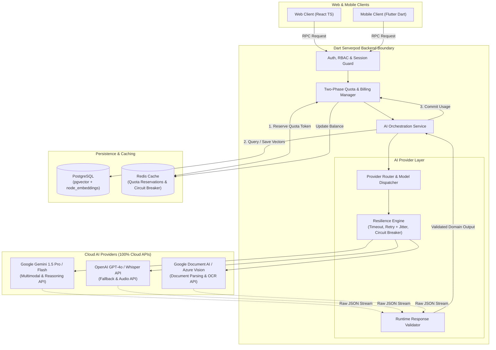
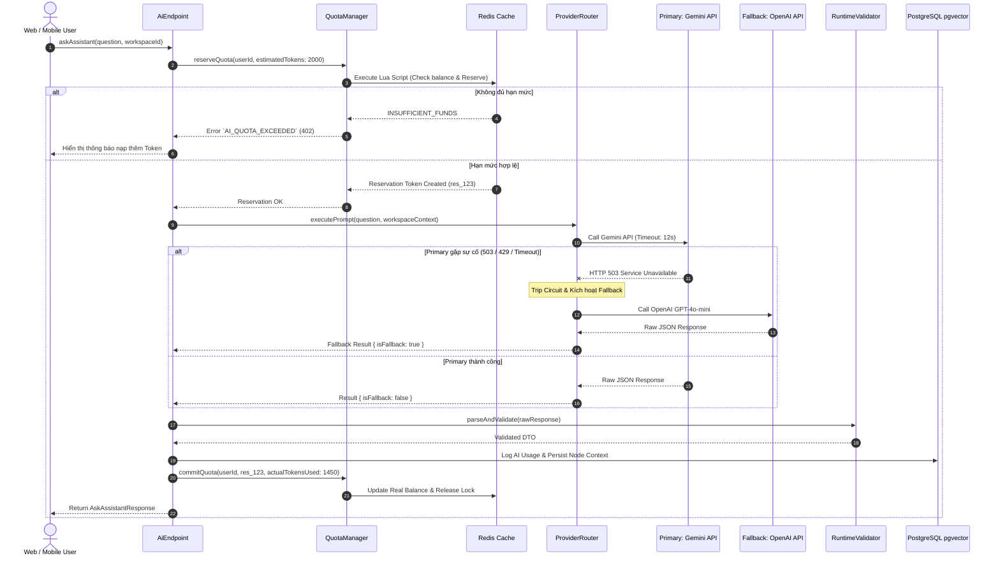
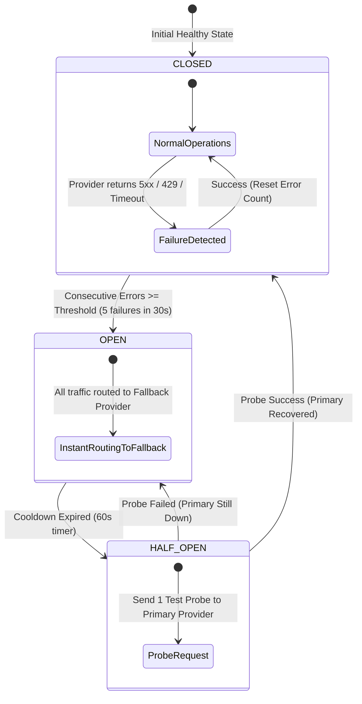

# AI Semantic Search, Multimodal & Cloud Orchestration Service Specification (`ai.md`)

> **Service**: `AI Semantic Search, Multimodal & Cloud Orchestration Service`  
> **Package**: `apps/server/lib/src/endpoints/ai_endpoint.dart`  
> **Specification Version**: `2.1.0`  
> **Status**: `APPROVED`  

---

### 1. Overview
Dịch vụ AI Semantic Search, Multimodal & Cloud Orchestration Service đóng vai trò là **Lớp Điều phối Trí tuệ Nhân tạo tập trung (Central AI Orchestration Layer)** của hệ thống `nodetask`. Dịch vụ chịu trách nhiệm xử lý toàn bộ các luồng công việc AI chuyên sâu (Tìm kiếm ngữ nghĩa Vector Search, Trợ lý hỏi đáp RAG, Bóc tách cấu trúc tài liệu/OCR, Phân tích đa phương thức Multimodal và Tự động trích xuất công việc) bằng cách điều phối an toàn các **Cloud AI APIs** (Google Gemini, OpenAI, Google Document AI, Azure Vision/OCR, Whisper API, Cohere Rerank).

Hệ thống tuân thủ mô hình phân lớp **AI Provider Abstraction Layer** với các ranh giới bảo vệ:
1. **Two-Phase Quota & Metering**: Kiểm tra và giữ trước hạn mức (Reserve Quota qua Redis Lua script), thực thi gọi Provider, sau đó ghi nhận lượng token thực tế (Commit Usage) hoặc hoàn trả hạn mức (Compensate Refund) nếu thất bại.
2. **Provider Router & Model Dispatcher**: Định tuyến thông minh giữa các nhà cung cấp dựa trên chi phí, độ trễ và tính sẵn sàng của dịch vụ.
3. **Resilience Engine**: Tích hợp sẵn cơ chế phòng vệ hạ tầng: **Timeout (Strict Deadlines)**, **Exponential Backoff with Jitter**, **Circuit Breaker** (tự động ngắt mạch khi provider quá tải) và **Instant Provider Fallback** (ví dụ: Gemini $\rightarrow$ OpenAI $\rightarrow$ Claude).
4. **Runtime Response Validation**: Kiểm định phòng thủ (Defensive Parsing) đối với mọi response từ Cloud API trước khi chuyển đổi thành Domain DTOs an toàn.
5. **Native Storage & Indexing**: Tận dụng chỉ mục HNSW Cosine Distance trên PostgreSQL `pgvector` (`node_embeddings`) và Redis Cache mà không phát sinh thêm chi phí hạ tầng trung gian.

---

### 2. Endpoints
Hợp đồng giao tiếp qua Serverpod RPC Endpoint Methods:
- `AiEndpoint.semanticSearch(Session session, SemanticSearchInput input)`
- `AiEndpoint.askAssistant(Session session, AskAssistantInput input)`
- `AiEndpoint.summarizeNode(Session session, SummarizeNodeInput input)`
- `AiEndpoint.generateActionItems(Session session, GenerateActionItemsInput input)`
- `AiEndpoint.parseDocumentOCR(Session session, ParseDocumentOCRInput input)`
- `AiEndpoint.reindexWorkspaceEmbeddings(Session session, ReindexWorkspaceInput input)`
- `AiEndpoint.getEmbeddingStatus(Session session, String nodeId)`
- `AiEndpoint.getProviderHealthStatus(Session session, GetProviderHealthInput input)`

---

### 3. Request
Cấu trúc Request DTOs:

```typescript
interface SemanticSearchInput {
  workspaceId?: string;
  query: string;
  topK?: number;
  minSimilarityScore?: number;
  filterNodeTypes?: Array<'DOCUMENT' | 'SECTION'>;
  preferredProvider?: 'GEMINI' | 'OPENAI' | 'AUTO';
}

interface AskAssistantInput {
  workspaceId?: string;
  nodeIds?: string[];
  question: string;
  conversationHistory?: Array<{ role: 'user' | 'assistant'; content: string }>;
  enableStreaming?: boolean;
}

interface SummarizeNodeInput {
  nodeId: string;
  targetLength?: 'SHORT' | 'MEDIUM' | 'DETAILED';
  language?: 'vi' | 'en';
}

interface GenerateActionItemsInput {
  nodeId: string;
}

interface ParseDocumentOCRInput {
  fileAssetId: string;
  documentType?: 'PDF' | 'IMAGE' | 'SCAN';
  targetLanguage?: 'vi' | 'en';
}

interface ReindexWorkspaceInput {
  workspaceId: string;
  forceRecreate?: boolean;
}

interface GetProviderHealthInput {
  providerName?: 'GEMINI' | 'OPENAI' | 'DOCUMENT_AI' | 'AZURE';
}
```

---

### 4. Response
Cấu trúc Response DTOs:

```typescript
interface SearchChunkResult {
  nodeId: string;
  nodeTitle: string;
  workspaceId: string;
  workspaceTitle: string;
  chunkContent: string;
  similarityScore: number;
  highlightSnippets: string[];
}

interface SemanticSearchResponse {
  query: string;
  results: SearchChunkResult[];
  totalMatched: number;
  executionTimeMs: number;
  routedProvider: string;
}

interface GroundedSource {
  nodeId: string;
  nodeTitle: string;
  snippet: string;
  confidence: number;
}

interface AskAssistantResponse {
  question: string;
  answer: string;
  sources: GroundedSource[];
  tokensUsed: number;
  latencyMs: number;
  providerUsed: string;
  isFallback: boolean;
}

interface SummarizeNodeResponse {
  nodeId: string;
  summary: string;
  keyPoints: string[];
}

interface ActionItemResult {
  title: string;
  priority: 'LOW' | 'MEDIUM' | 'HIGH';
  suggestedDueDate?: string;
}

interface GenerateActionItemsResponse {
  nodeId: string;
  actionItems: ActionItemResult[];
}

interface ParseDocumentOCRResponse {
  fileAssetId: string;
  extractedText: string;
  pageCount: number;
  confidenceScore: number;
  tokensConsumed: number;
}

interface EmbeddingStatusResponse {
  nodeId: string;
  isIndexed: boolean;
  chunksCount: number;
  lastIndexedAt?: string;
}

interface ProviderHealthResponse {
  providerName: string;
  circuitState: 'CLOSED' | 'OPEN' | 'HALF_OPEN';
  successRate24h: number;
  averageLatencyMs: number;
  lastFailureReason?: string;
}
```

---

### 5. Validation
Quy chuẩn kiểm tra tính hợp lệ dữ liệu đầu vào:
- `query` / `question`: Bắt buộc, chuỗi từ 2 đến 2000 ký tự.
- `topK`: Số nguyên dương từ 1 đến 50 (Mặc định: 10).
- `minSimilarityScore`: Số thực trong khoảng `0.0` đến `1.0` (Mặc định: `0.65`).
- `nodeIds`: Mảng tối đa 20 Node UUIDs khi hỏi đáp có giới hạn phạm vi tài liệu.
- `fileAssetId`: UUID hợp lệ trỏ tới bảng `file_assets`.
- **Runtime Cloud Validation**: Tất cả phản hồi từ Cloud Provider bắt buộc phải qua schema validator để đảm bảo trường không bị null hoặc cắt cụt (`finish_reason === 'MAX_TOKENS'`).

---

### 6. Permissions
Ma trận Phân quyền Truy cập (RBAC Matrix):

| Endpoint Method | GUEST | USER | ORG_MEMBER | ORG_ADMIN | SYSTEM_ADMIN |
| :--- | :---: | :---: | :---: | :---: | :---: |
| `AiEndpoint.semanticSearch` | ❌ (Public only) | ✅ (Personal Scope) | ✅ (Org Scope) | ✅ (Org Scope) | ✅ (All) |
| `AiEndpoint.askAssistant` | ❌ (Public only) | ✅ (Personal Scope) | ✅ (Org Scope) | ✅ (Org Scope) | ✅ (All) |
| `AiEndpoint.summarizeNode` | ❌ | ✅ (Owner/Viewer) | ✅ (Org Scope) | ✅ (Org Scope) | ✅ (All) |
| `AiEndpoint.generateActionItems` | ❌ | ✅ (Owner/Editor) | ✅ (Org Scope) | ✅ (Org Scope) | ✅ (All) |
| `AiEndpoint.parseDocumentOCR` | ❌ | ✅ (Personal Quota) | ✅ (Org Scope) | ✅ (Org Scope) | ✅ (All) |
| `AiEndpoint.reindexWorkspaceEmbeddings` | ❌ | ✅ (Owner) | ❌ | ✅ (Org Scope) | ✅ (All) |
| `AiEndpoint.getEmbeddingStatus` | ❌ (Public only) | ✅ (Owner/Viewer) | ✅ (Org Scope) | ✅ (Org Scope) | ✅ (All) |
| `AiEndpoint.getProviderHealthStatus` | ❌ | ❌ | ❌ | ✅ (Org Health) | ✅ (Full System) |

---

### 7. Errors
Bảng mã lỗi và HTTP Status tương ứng:

| Mã Lỗi (Error Code) | HTTP Status | Nguyên nhân | Hướng xử lý Client |
| :--- | :--- | :--- | :--- |
| `AI_QUOTA_EXCEEDED` | `402 Payment Required` | Người dùng đã hết số dư Token hoặc Credit AI hàng tháng. | Nâng cấp gói tài khoản hoặc mua thêm token credit. |
| `AI_RATE_LIMIT_EXCEEDED` | `429 Too Many Requests` | Vượt quá số lượt truy vấn AI cho phép trong 1 phút. | Chờ hết thời gian cooldown và thử lại. |
| `AI_CIRCUIT_OPEN` | `503 Service Unavailable` | Toàn bộ các Cloud AI Providers đang gặp sự cố gián đoạn kết nối. | Hệ thống đang tự động hồi phục, thử lại sau 30 giây. |
| `AI_PROVIDER_TIMEOUT` | `504 Gateway Timeout` | Nhà cung cấp AI không phản hồi kịp trong thời gian quy định ($> 15\text{s}$). | Thử lại câu hỏi hoặc giảm bớt độ dài ngữ cảnh. |
| `AI_CONTENT_POLICY_VIOLATION` | `400 Bad Request` | Nội dung yêu cầu bị bộ lọc an toàn của nhà cung cấp Cloud AI từ chối. | Điều chỉnh lại câu hỏi hoặc văn bản đầu vào. |
| `AI_VALIDATION_FAILED` | `502 Bad Gateway` | Dữ liệu trả về từ Cloud AI Provider bị lỗi định dạng hoặc không hợp lệ. | Hệ thống tự động kích hoạt fallback sang provider phụ. |
| `INSUFFICIENT_CONTEXT` | `404 Not Found` | Không tìm thấy đoạn văn bản phù hợp trong kho tri thức để trả lời câu hỏi. | Bổ sung thêm nội dung ghi chú vào Workspace. |
| `FORBIDDEN` | `403 Forbidden` | Không có quyền truy cập vào Workspace chứa tài liệu tìm kiếm. | Báo lỗi không đủ thẩm quyền truy cập. |
| `INVALID_INPUT` | `400 Bad Request` | Câu hỏi hoặc tham số đầu vào rỗng hoặc không hợp lệ. | Báo lỗi validation. |
| `INTERNAL_ERROR` | `500 Internal Error` | Lỗi thực thi truy vấn HNSW Vector Search hoặc kết nối Redis nội bộ. | Báo lỗi hệ thống nội bộ. |

---

### 8. Events
Danh sách Domain Events phát sinh:
- `ai.indexed`: Phát ra khi hoàn tất chunking và tạo vector embeddings cho một Node.
- `ai.searched`: Phát ra khi người dùng thực hiện truy vấn tìm kiếm ngữ nghĩa.
- `ai.question_answered`: Phát ra khi Trợ lý RAG hoàn tất tổng hợp câu trả lời.
- `ai.provider_switched`: Phát ra khi hệ thống tự động chuyển sang Provider dự phòng do Provider chính bị lỗi.
- `ai.circuit_tripped`: Phát ra cảnh báo khi Circuit Breaker của một Cloud Provider chuyển sang trạng thái `OPEN`.

---

### 9. Cache
Chiến lược Caching qua Redis:
- **Keys & TTL**:
  - `ai:search:{sha256(query_workspace)}` -> Kết quả tìm kiếm ngữ nghĩa vector (TTL: 10m).
  - `ai:node:{node_id}:summary` -> Tóm tắt nội dung của node (TTL: 24h).
  - `ai:user:{user_id}:rate_limit` -> Bộ đếm token/requests trong cửa sổ 1 phút (TTL: 1m).
  - `ai:circuit:{provider_name}:state` -> Trạng thái Circuit Breaker (`CLOSED`, `OPEN`, `HALF_OPEN`) (TTL: 60s).
  - `ai:quota:reservation:{reservation_id}` -> Giữ trước token trong pha Reservation (TTL: 5m).
- **Invalidation Strategy**:
  - Khi node cập nhật nội dung mới $\rightarrow$ Xóa cache `ai:node:{node_id}:summary` và kích hoạt re-embedding ngầm.
  - Khi circuit hết hạn $\rightarrow$ Tự động chuyển `HALF_OPEN` để thử nghiệm 1 request thăm dò.

---

### 10. Examples
Ví dụ tích hợp TypeScript Frontend Client:

```typescript
import { api } from '@/services/api';

// 1. Tìm kiếm ngữ nghĩa tài liệu trong Workspace
const searchResponse = await api.post('/rpc/ai/semanticSearch', {
  workspaceId: 'workspace-uuid-1234',
  query: 'Làm thế nào để xử lý xung đột ghi đồng thời bằng OCC?',
  topK: 5,
  minSimilarityScore: 0.7,
  preferredProvider: 'AUTO'
});
console.log('Provider đã định tuyến:', searchResponse.data.routedProvider);
console.log('Các đoạn tài liệu khớp nhất:', searchResponse.data.results);

// 2. Hỏi đáp Trợ lý AI RAG có kèm trích dẫn nguồn và bảo vệ Resilience
const answerResponse = await api.post('/rpc/ai/askAssistant', {
  workspaceId: 'workspace-uuid-1234',
  question: 'Tóm tắt các quy tắc Zero-Icon UI trong dự án',
  enableStreaming: false
});
console.log('Câu trả lời:', answerResponse.data.answer);
console.log('Provider sử dụng:', answerResponse.data.providerUsed);
console.log('Có kích hoạt Fallback không:', answerResponse.data.isFallback);
console.log('Nguồn tài liệu trích dẫn:', answerResponse.data.sources);

// 3. Bóc tách OCR tài liệu Scan qua Document AI
const ocrResponse = await api.post('/rpc/ai/parseDocumentOCR', {
  fileAssetId: 'file-asset-uuid-5678',
  documentType: 'PDF',
  targetLanguage: 'vi'
});
console.log('Văn bản bóc tách thành công:', ocrResponse.data.extractedText);
console.log('Số token tiêu thụ:', ocrResponse.data.tokensConsumed);
```

---

### 11. Diagrams

#### 11.1. AI Provider Layer & Cloud Orchestration Architecture Topology


#### 11.2. Two-Phase Quota Reservation & Provider Fallback Sequence Flow


#### 11.3. Circuit Breaker & Provider Health State Machine

