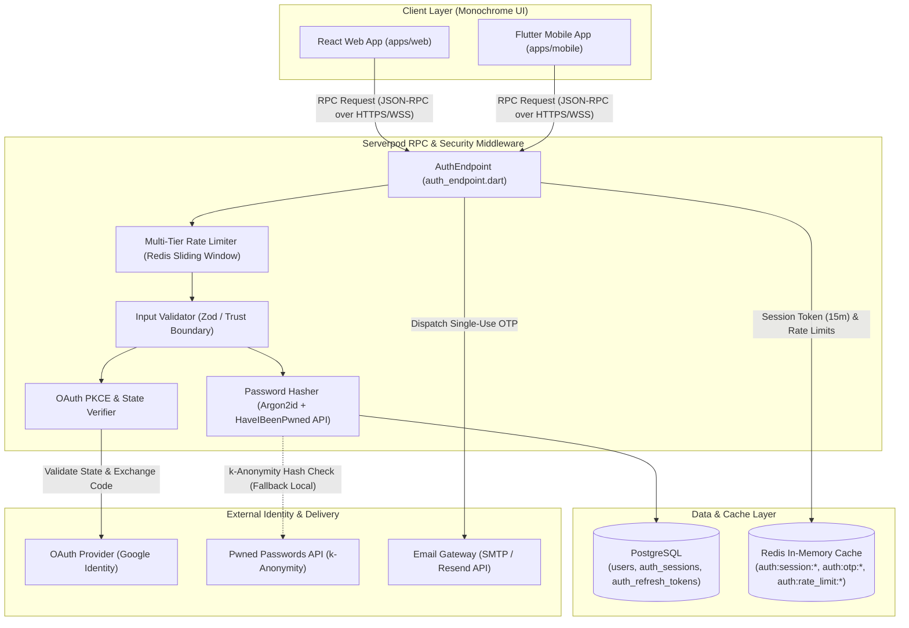
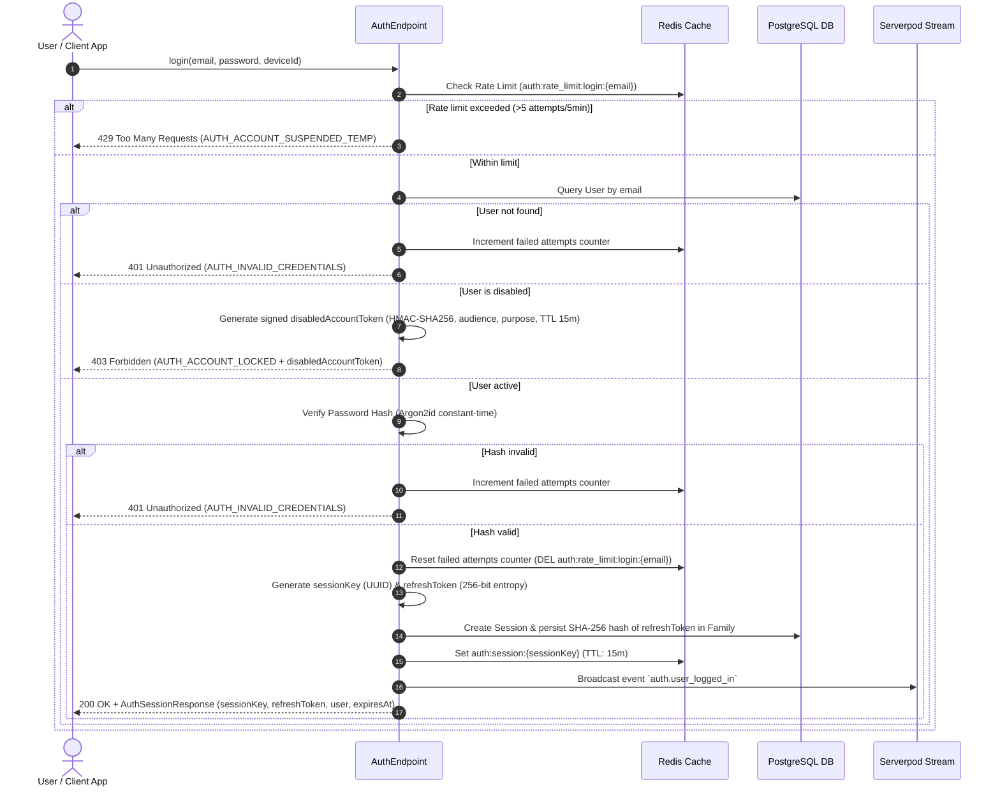
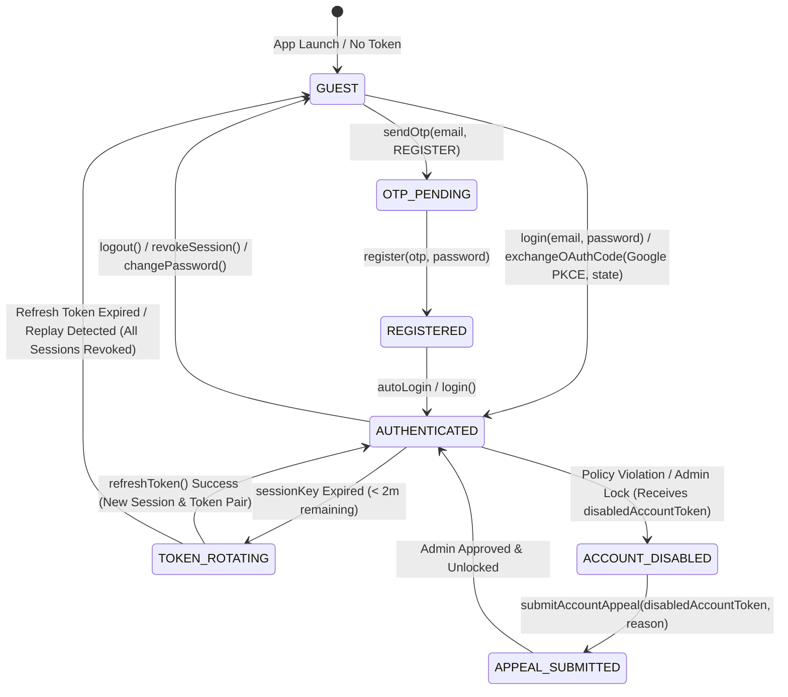

# Auth & Authorization Service Specification (`auth.md`)

> **Service**: `Auth & Access Control Service`  
> **Package**: `apps/server/lib/src/endpoints/auth_endpoint.dart`  
> **Specification Version**: `2.2.0`  
> **Status**: `APPROVED`  

---

### 1. Overview
Dịch vụ Authentication & Authorization chịu trách nhiệm quản lý toàn bộ vòng đời xác thực, phiên làm việc và phân quyền bảo mật cấp doanh nghiệp trong hệ thống `nodetask`. Dịch vụ thực thi các cơ chế bảo mật tiêu chuẩn cao:
- **Kiến trúc Dual-Token (Short-lived Session Key vs Long-lived Rotating Refresh Token)**:
  - **Session Key** (`sessionKey`): Token truy cập ngắn hạn (TTL 15 phút), lưu trữ trên Redis Cache (`auth:session:{session_key}`). Client tự động gia hạn ngầm khi thời gian hiệu lực còn dưới 2 phút.
  - **Refresh Token** (`refreshToken`): Token xoay vòng dài hạn (TTL 30 ngày, 256-bit entropy ngẫu nhiên), chỉ lưu trữ dưới dạng mã băm **SHA-256** trong PostgreSQL (`auth_refresh_tokens`). Hỗ trợ cấu trúc Token Family (`family_id`, `replaced_by`, `session_id`) và cơ chế phát hiện tái sử dụng token cũ (**Replay Attack Detection**) với cửa sổ ân hạn concurrency (Grace Period 5 giây) và tự động thu hồi toàn bộ token family khi phát hiện vi phạm.
- **Xác thực Đa kênh & Phòng thủ Mật khẩu Đa tầng**:
  - Đăng ký và kích hoạt tài khoản qua Email OTP 6 chữ số (băm SHA-256, TTL 5 phút, single-use).
  - Thuật toán băm mật khẩu chuẩn **Argon2id** (kết hợp bcrypt migration fallback) và đối soát thời gian không đổi `crypto.timingSafeEqual` nhằm loại trừ rủi ro Timing Side-Channel.
  - Kiểm tra từ điển rò rỉ mật khẩu qua **HaveIBeenPwned API** (mô hình k-anonymity SHA-1 5 ký tự đầu) kèm cơ chế Circuit Breaker Fallback sang từ điển cục bộ 100,000 mật khẩu khi dịch vụ ngoài gặp sự cố.
  - Chính sách khóa tạm 15 phút sau 5 lần nhập sai liên tiếp (tự động reset bộ đếm khi đăng nhập thành công) và phòng chống tấn công Credential Stuffing phân tán. Tuyệt đối không log thông tin nhạy cảm (`[REDACTED]`).
- **OAuth 2.0 / OIDC Google Identity Provider**:
  - Hỗ trợ duy nhất **Google Identity Provider** với cơ chế chống CSRF bắt buộc (`state` token 32-byte lưu Redis TTL 10 phút).
  - Chuẩn bảo vệ **RFC 7636 PKCE** (`code_verifier` & `code_challenge`), kiểm tra danh sách trắng Callback URL (`redirectUri` allowlist) nghiêm ngặt từ chối wildcard.
  - Xác thực cờ `email_verified: true` từ Google và yêu cầu mật khẩu hiện tại / Email OTP nếu email đã tồn tại cục bộ nhằm ngăn chặn Pre-Account Takeover.
- **Bảo vệ Chống IDOR & Quản lý Khiếu nại Tài khoản**:
  - Cơ chế tra cứu lý do khóa (`getAccountDisableReason`) và gửi khiếu nại (`submitAccountAppeal`) sử dụng **`disabledAccountToken`** (HMAC-SHA256 ký số, TTL 15 phút, ràng buộc `audience`, `purpose: ACCOUNT_APPEAL` và single-use ticket `jti`).
  - Loại bỏ vector IDOR do client-controlled accountId, đảm bảo toàn vẹn phân quyền qua kiểm tra chữ ký số, audience, purpose và single-use ticket.
- **Quản lý Phiên & Phân quyền Đa cấp (RBAC)**:
  - Hỗ trợ đăng xuất đơn lẻ (`logout`), thu hồi phiên theo thiết bị (`revokeSession`), thu hồi toàn bộ phiên (`revokeAllSessions`) với ma trận thu hồi rõ ràng.
  - Thực thi Ma trận Phân quyền Truy cập (RBAC) 5 cấp vai trò chuẩn: `GUEST`, `USER`, `ORG_MEMBER`, `ORG_ADMIN`, `SYSTEM_ADMIN`.

---

### 2. Endpoints
Hợp đồng giao tiếp qua Serverpod RPC Endpoint Methods:
- `AuthEndpoint.sendOtp(Session session, SendOtpInput input)`
- `AuthEndpoint.register(Session session, UserRegisterInput input)`
- `AuthEndpoint.login(Session session, UserLoginInput input)`
- `AuthEndpoint.refreshToken(Session session, UserRefreshTokenInput input)`
- `AuthEndpoint.verifyEmail(Session session, VerifyEmailInput input)`
- `AuthEndpoint.resendVerificationCode(Session session, SendOtpInput input)`
- `AuthEndpoint.requestPasswordReset(Session session, SendOtpInput input)`
- `AuthEndpoint.confirmPasswordReset(Session session, ConfirmPasswordResetInput input)`
- `AuthEndpoint.changePassword(Session session, UserChangePasswordInput input)`
- `AuthEndpoint.verifyInviteToken(Session session, VerifyInviteTokenInput input)`
- `AuthEndpoint.acceptInvite(Session session, AcceptInviteInput input)`
- `AuthEndpoint.getAccountDisableReason(Session session, AccountDisableReasonInput input)`
- `AuthEndpoint.submitAccountAppeal(Session session, SubmitAccountAppealInput input)`
- `AuthEndpoint.exchangeOAuthCode(Session session, ExchangeOAuthCodeInput input)`
- `AuthEndpoint.checkSession(Session session)`
- `AuthEndpoint.logout(Session session)`
- `AuthEndpoint.revokeSession(Session session, RevokeSessionInput input)`
- `AuthEndpoint.revokeAllSessions(Session session)`
- `AuthEndpoint.me(Session session)`

---

### 3. Request
Cấu trúc Request DTOs (dạng `interface`):
```typescript
interface SendOtpInput {
  email: string;
  type: 'REGISTER' | 'FORGOT_PASSWORD' | 'VERIFY_EMAIL';
}

interface UserRegisterInput {
  fullName: string;
  email: string;
  otp: string;
  password: string;
  rePassword: string;
}

interface UserLoginInput {
  email: string;
  password: string;
  deviceId?: string;
  deviceInfo?: string;
}

interface UserRefreshTokenInput {
  refreshToken: string;
  deviceId?: string;
}

interface VerifyEmailInput {
  email: string;
  otp: string;
}

interface ConfirmPasswordResetInput {
  email: string;
  otp: string;
  token?: string;
  newPassword: string;
  reNewPassword: string;
}

interface UserChangePasswordInput {
  oldPassword: string;
  newPassword: string;
  reNewPassword: string;
  revokeOtherSessions?: boolean;
}

interface VerifyInviteTokenInput {
  token: string;
}

interface AcceptInviteInput {
  token: string;
  registerInput?: UserRegisterInput;
}

// Chống IDOR: Truyền disabledAccountToken ký số thay vì client-controlled accountId
interface AccountDisableReasonInput {
  disabledAccountToken: string;
}

interface SubmitAccountAppealInput {
  disabledAccountToken: string;
  reason: string;
  contactEmail: string;
}

interface ExchangeOAuthCodeInput {
  provider: 'GOOGLE';
  code: string;
  redirectUri: string;
  codeVerifier?: string; // RFC 7636 PKCE code_verifier
  state?: string;        // Chống OAuth / Login CSRF
}

interface RevokeSessionInput {
  sessionId: string;
}
```

---

### 4. Response
Cấu trúc Response DTOs (dạng `interface`):
```typescript
interface SendOtpResponse {
  success: boolean;
  message: string;
  expiresInSeconds: number;
}

interface ActionSuccessResponse {
  success: boolean;
  message: string;
}

interface AuthSessionResponse {
  sessionKey: string;     // Short-lived session access token (TTL: 15m)
  refreshToken: string;   // Long-lived rotating refresh token (TTL: 30d)
  user: {
    id: string;
    email: string;
    fullName: string;
    systemRole: 'SYSTEM_ADMIN' | 'USER';
    isEmailVerified: boolean;
    isDisabled: boolean;
  };
  expiresAt: string;
}

interface RefreshTokenResponse {
  sessionKey: string;     // New short-lived session access token (TTL: 15m)
  refreshToken: string;   // Rotated new refresh token (RTR)
  expiresAt: string;
}

interface InviteTokenDetailsResponse {
  valid: boolean;
  orgId: string;
  orgName: string;
  inviterName: string;
  role: 'ORG_MEMBER' | 'ORG_ADMIN';
  expiresAt: string;
}

interface AccountDisableReasonResponse {
  accountId: string;
  isDisabled: boolean;
  reasonCode: 'POLICY_VIOLATION' | 'PAYMENT_DEFAULT' | 'ADMIN_LOCK';
  reasonDescription: string;
  disabledAt: string;
  canAppeal: boolean;
}

interface CheckSessionResponse {
  isValid: boolean;
  user?: {
    id: string;
    email: string;
    fullName: string;
    systemRole: 'SYSTEM_ADMIN' | 'USER';
  };
}
```

---

### 5. Validation
Quy tắc kiểm tra dữ liệu đầu vào và ranh giới bảo mật (Zod & Serverpod Trust Boundary):
- `email`: Required, `string`, định dạng RFC 5322 chuẩn, tối đa 255 ký tự, tự động `trim()` và chuyển `lowercase`.
- `password` & `newPassword`: Required, `string`, độ dài từ 8 đến 64 ký tự (giới hạn 64 ký tự chống tấn công DoS hashing CPU exhaustion), bắt buộc chứa ít nhất 1 chữ cái in hoa, 1 chữ cái thường, 1 chữ số và 1 ký tự đặc biệt.
  - **Breach & Dictionary Check**: Bắt buộc kiểm tra danh sách 100,000 mật khẩu phổ biến và truy vấn HaveIBeenPwned API (mô hình k-anonymity băm 5 ký tự đầu SHA-1). Nếu HIBP API timeout (>1500ms) hoặc gặp sự cố, tự động fallback sang từ điển cục bộ mà không làm gián đoạn hệ thống.
  - **Password History**: Cấm sử dụng lại 3 mật khẩu gần nhất của tài khoản.
  - **Constant-Time Comparison**: Mọi phép so khớp mật khẩu và token đều dùng `crypto.timingSafeEqual` để loại trừ tấn công Timing Side-Channel.
  - **Zero Password Logging**: Toàn bộ chuỗi mật khẩu, mã OTP và private token được bôi đen (`[REDACTED]`) trước khi qua Logger, Sentry hay Crash Traces.
- `rePassword` & `reNewPassword`: Required, `string`, phải trùng khớp 100% với `password` / `newPassword`.
- `oldPassword`: Required, `string`, đối soát với mã băm Argon2id lưu trong DB.
- `fullName`: Required, `string`, tối thiểu 2 ký tự, tối đa 100 ký tự, làm sạch XSS/HTML tags.
- `otp`: Required, `string`, đúng 6 chữ số (`/^\d{6}$/`), chỉ sử dụng một lần (single-use, bị xóa khỏi Redis ngay khi xác thực thành công).
- `type`: Required, enum `'REGISTER' | 'FORGOT_PASSWORD' | 'VERIFY_EMAIL'`.
- `token`: Required, `string`, tối thiểu 16 ký tự, định dạng UUID v4 hoặc JWT ký số hợp lệ.
- `refreshToken`: Required, `string`, chuỗi ngẫu nhiên 256-bit an toàn mật mã (`rt_` prefix). Bắt buộc lưu trữ dưới dạng mã băm SHA-256 trong bảng `auth_refresh_tokens`. Mỗi lần gọi `refreshToken()` sẽ kích hoạt Refresh Token Rotation (RTR) trong giao dịch cơ sở dữ liệu `SELECT ... FOR UPDATE`: hủy token cũ và phát hành cặp token mới. Nếu phát hiện token cũ đã bị thu hồi/sử dụng lại ngoài cửa sổ ân hạn concurrency 5 giây (Replay Detection), hệ thống lập tức thu hồi toàn bộ token family của thiết bị/tài khoản.
- `disabledAccountToken`: Required, `string`, JWT ký số HMAC-SHA256 có thời hạn 15 phút, bắt buộc kiểm tra các claims: `iss: 'https://api.nodetask.io/auth'`, `aud: 'https://api.nodetask.io/auth/account-appeal'`, `purpose: 'ACCOUNT_APPEAL'`, `sub: userId`, `reasonCode`, và `jti` (single-use ticket ID). Loại bỏ vector IDOR do client-controlled accountId, đảm bảo toàn vẹn phân quyền.
- `provider`: Required, enum `'GOOGLE'`.
- `code`: Required, `string`, Authorization code nhận từ Google OAuth callback, chỉ sử dụng đúng 1 lần.
- `redirectUri`: Required, `string`, phải nằm trong Danh sách trắng URL (Whitelist) được cấu hình tại Backend (`https://nodetask.io/auth/callback`, `http://localhost:5173/auth/callback`, `nodetask://auth/callback`). Cấm tuyệt đối wildcard redirect URI.
- `codeVerifier`: Optional/Recommended, `string`, độ dài 43–128 ký tự chuẩn RFC 7636 PKCE.
- `state`: Optional/Recommended, `string`, chuỗi ngẫu nhiên 32-byte chống CSRF đối soát với cache Redis `auth:oauth_state:{state}`.
- `OAuth Account Linking Policy`: Chỉ cho phép tự động liên kết tài khoản Google OAuth nếu email từ Provider có cờ `email_verified: true`. Nếu email đã tồn tại dưới dạng mật khẩu cục bộ và chưa đăng nhập, bắt buộc người dùng nhập mật khẩu hiện tại hoặc xác minh OTP email trước khi liên kết để ngăn chặn tấn công Pre-Account Takeover.

---

### 6. Permissions
Ma trận Phân quyền Truy cập & Tài nguyên (RBAC Matrix):

| System / Resource Role | Auth (Register / Login / Reset / Verify / OAuth) | Xem Tài liệu Công khai (`is_public: true`) | Xem & Thao tác Tài liệu Cá nhân | Xem & Thao tác Tài liệu Tổ chức (Org) | Quản trị Hệ thống |
| :--- | :--- | :--- | :--- | :--- | :--- |
| `GUEST` (Chưa đăng nhập) | ✅ (Trừ ChangePass) | ✅ (Qua Public Link) | ❌ | ❌ | ❌ |
| `USER` (Thành viên Cá nhân) | ✅ | ✅ | ✅ (Tài liệu do mình tạo) | ❌ (Trừ khi được Invite vào Org) | ❌ |
| `ORG_MEMBER` (Thành viên Org) | ✅ | ✅ | ✅ | ✅ (Theo role Org: Viewer / Editor) | ❌ |
| `ORG_ADMIN` (Quản trị Org) | ✅ | ✅ | ✅ | ✅ (Toàn bộ tài liệu & thành viên Org) | ❌ |
| `SYSTEM_ADMIN` (Quản trị Hệ thống) | ✅ | ✅ | ✅ | ✅ | ✅ |

---

### 7. Errors
Mã lỗi chuẩn hóa trả về khi có thất bại:

| Error Code Constant | HTTP Status | Nguyên nhân |
| :--- | :--- | :--- |
| `AUTH_INVALID_CREDENTIALS` | `401` | Mật khẩu hoặc email nhập vào không chính xác khi đăng nhập. |
| `AUTH_UNAUTHORIZED` | `401` | Session token không hợp lệ hoặc đã hết hạn (TTL 15m). |
| `AUTH_REFRESH_TOKEN_EXPIRED` | `401` | Refresh token đã hết hạn hoặc không tồn tại trong DB. |
| `AUTH_REFRESH_TOKEN_REUSED` | `401` | Phát hiện tái sử dụng Refresh Token đã bị xoay vòng (Replay Attack). Toàn bộ token family liên quan đã bị thu hồi. |
| `AUTH_FORBIDDEN` | `403` | Không đủ quyền thực hiện hành động hoặc truy cập tài nguyên tổ chức. |
| `AUTH_ACCOUNT_LOCKED` | `403` | Tài khoản đã bị tạm khóa do vi phạm chính sách (`ACCOUNT_DISABLED`). Trả về kèm `disabledAccountToken` để xem lý do & khiếu nại. |
| `AUTH_ACCOUNT_SUSPENDED_TEMP` | `429` | Tài khoản bị tạm khóa 15 phút do nhập sai mật khẩu quá 5 lần liên tiếp. |
| `AUTH_EMAIL_NOT_FOUND` | `404` | Email không tồn tại trong hệ thống. |
| `AUTH_EMAIL_ALREADY_EXISTS` | `409` | Địa chỉ email đã được đăng ký trước đó. |
| `AUTH_INVALID_OTP` | `400` | Mã OTP không đúng, đã qua sử dụng hoặc đã hết hạn (TTL 5 phút). |
| `AUTH_INVALID_INVITE_TOKEN` | `400` | Token lời mời tham gia Organization bị hỏng, hết hạn hoặc không tồn tại. |
| `AUTH_PASSWORD_MISMATCH` | `400` | Mật khẩu mới nhập lại (`rePassword` / `reNewPassword`) không trùng khớp. |
| `AUTH_PASSWORD_BREACHED` | `400` | Mật khẩu nằm trong danh sách rò rỉ dữ liệu nguy hiểm (HaveIBeenPwned). |
| `AUTH_PASSWORD_HISTORY_VIOLATION` | `400` | Mật khẩu mới trùng với một trong 3 mật khẩu đã sử dụng gần nhất. |
| `AUTH_OLD_PASSWORD_INVALID` | `400` | Mật khẩu cũ nhập vào không chính xác khi thực hiện đổi mật khẩu. |
| `AUTH_OAUTH_EXCHANGE_FAILED` | `400` | Thất bại khi đổi OAuth Authorization Code với Google Provider. |
| `AUTH_OAUTH_STATE_MISMATCH` | `400` | Giá trị `state` không khớp hoặc đã hết hạn (Phát hiện nghi vấn CSRF). |
| `AUTH_INVALID_REDIRECT_URI` | `400` | URI chuyển hướng OAuth không nằm trong danh sách trắng cho phép. |
| `AUTH_OAUTH_EMAIL_UNVERIFIED` | `400` | Tài khoản Google OAuth chưa được xác minh email phía nhà cung cấp. |
| `AUTH_INVALID_DISABLED_TOKEN` | `400` | Mã token tra cứu tài khoản khóa không hợp lệ, sai audience/purpose hoặc đã hết hạn 15 phút. |
| `AUTH_RATE_LIMITED` | `429` | Thao tác gửi OTP, đăng nhập hoặc làm mới token vượt quá tần suất cho phép (Rate limit). |

---

### 8. Events
Danh sách các sự kiện xuất bản qua Serverpod Streaming Connection:
- `auth.otp_sent`: Phát khi mã OTP mới được tạo và gửi qua Email gateway.
- `auth.user_registered`: Phát khi tài khoản mới được đăng ký thành công.
- `auth.user_logged_in`: Phát khi người dùng đăng nhập nhận Session Token.
- `auth.token_refreshed`: Phát khi phiên được làm mới qua Refresh Token Rotation.
- `auth.token_family_revoked`: Phát cảnh báo bảo mật khi phát hiện tái sử dụng Refresh Token cũ.
- `auth.email_verified`: Phát khi tài khoản hoàn tất xác minh địa chỉ email.
- `auth.password_reset`: Phát khi người dùng đặt lại mật khẩu thành công.
- `auth.password_changed`: Phát khi người dùng thực hiện đổi mật khẩu trong Profile.
- `auth.invite_accepted`: Phát khi người dùng xác nhận tham gia Organization thành công.
- `auth.appeal_submitted`: Phát khi người dùng gửi khiếu nại tài khoản bị khóa.
- `auth.session_revoked`: Phát khi admin thu hồi quyền hoặc user đăng xuất thiết bị.
- `auth.all_sessions_revoked`: Phát khi toàn bộ phiên của tài khoản bị hủy (đổi mật khẩu / phát hiện rò rỉ).

---

### 9. Cache
Chiến lược Caching qua Redis, Mô hình Lưu trữ Cơ sở dữ liệu và Quản lý Tần suất (Rate Limiting Strategy):

- **Mô hình Cơ sở dữ liệu (PostgreSQL Schema cho Session & Refresh Token Family)**:
  ```sql
  CREATE TABLE auth_sessions (
    id UUID PRIMARY KEY DEFAULT gen_random_uuid(),
    user_id UUID NOT NULL REFERENCES users(id) ON DELETE CASCADE,
    session_key_hash VARCHAR(64) NOT NULL UNIQUE,
    device_id VARCHAR(100),
    device_info VARCHAR(255),
    ip_address VARCHAR(45),
    created_at TIMESTAMP WITH TIME ZONE DEFAULT NOW(),
    expires_at TIMESTAMP WITH TIME ZONE NOT NULL,
    revoked_at TIMESTAMP WITH TIME ZONE
  );

  CREATE TABLE auth_refresh_tokens (
    id UUID PRIMARY KEY DEFAULT gen_random_uuid(),
    family_id UUID NOT NULL,
    session_id UUID NOT NULL REFERENCES auth_sessions(id) ON DELETE CASCADE,
    user_id UUID NOT NULL REFERENCES users(id) ON DELETE CASCADE,
    token_hash VARCHAR(64) NOT NULL UNIQUE,
    issued_at TIMESTAMP WITH TIME ZONE DEFAULT NOW(),
    expires_at TIMESTAMP WITH TIME ZONE NOT NULL,
    revoked_at TIMESTAMP WITH TIME ZONE,
    replaced_by UUID REFERENCES auth_refresh_tokens(id),
    revoke_reason VARCHAR(50)
  );

  CREATE INDEX idx_refresh_token_hash ON auth_refresh_tokens(token_hash);
  CREATE INDEX idx_refresh_family_id ON auth_refresh_tokens(family_id);
  CREATE INDEX idx_refresh_session_id ON auth_refresh_tokens(session_id);
  CREATE INDEX idx_refresh_user_id ON auth_refresh_tokens(user_id);
  ```

- **Cấu trúc Khóa Cache & TTL**:
  - **OTP Verification Code**: `auth:otp:{type}:{email}` -> SHA-256 Hashed OTP String (TTL: 300 giây / 5 phút).
  - **OAuth CSRF State**: `auth:oauth_state:{state}` -> `{ provider: 'GOOGLE', codeVerifier, createdAt }` (TTL: 600 giây / 10 phút).
  - **Session Key**: `auth:session:{session_key}` -> User Session Payload `{ userId, systemRole, email, deviceId, expiresAt }` (TTL: 900 giây / 15 phút).
  - **Invite Token**: `auth:invite:{token}` -> Invite Details Payload (TTL: 604800 giây / 7 ngày).
  - **Disabled Account Ticket**: `auth:disabled_ticket:{ticketId}` -> `{ accountId, reasonCode, disabledAt }` (TTL: 900 giây / 15 phút).

- **Phân định Khóa Rate Limiting Riêng Biệt (Sliding Window)**:
  - **OTP Dispatch Rate Limit**:
    - Theo Email: `auth:rate_limit:otp:{email}` -> Max 1 request / 60 giây (TTL: 60s).
    - Theo IP: `auth:rate_limit:otp:ip:{ip}` -> Max 5 requests / 15 phút (TTL: 900s).
  - **Login Rate Limit & Brute-Force Defense**:
    - Theo Email: `auth:rate_limit:login:{email}` -> Max 5 lần thử sai / 5 phút (TTL: 300s). Khi đăng nhập thành công, Redis key này được xóa ngay lập tức để reset counter về 0. Nếu vượt quá ngưỡng 5 lần, tài khoản bị tạm khóa 15 phút và gửi email cảnh báo.
    - Theo IP: `auth:rate_limit:login:ip:{ip}` -> Max 20 requests / 1 phút (TTL: 60s) chống tấn công Credential Stuffing phân tán.
  - **Password Reset Rate Limit**:
    - Theo Email: `auth:rate_limit:password_reset:{email}` -> Max 3 requests / 1 giờ (TTL: 3600s).
    - Theo IP: `auth:rate_limit:password_reset:ip:{ip}` -> Max 10 requests / 1 giờ (TTL: 3600s).
  - **OAuth Code Exchange Rate Limit**:
    - Theo IP: `auth:rate_limit:oauth:google:{ip}` -> Max 10 requests / 1 phút (TTL: 60s).
  - **Token Refresh Rate Limit**:
    - Theo IP: `auth:rate_limit:refresh:ip:{ip}` -> Max 30 requests / 1 phút (TTL: 60s).
  - **Account Appeal Rate Limit**:
    - Theo IP: `auth:rate_limit:appeal:ip:{ip}` -> Max 3 requests / 1 giờ (TTL: 3600s).

- **Invalidation Strategy & Ma trận Thu hồi Quyền (Revocation Semantics)**:
  - **Single-Use Invalidation**: Xóa Redis Key `auth:otp:{type}:{email}` ngay lập tức khi mã OTP được xác thực thành công; xóa `auth:oauth_state:{state}` ngay khi hoàn tất trao đổi OAuth code; xóa `auth:disabled_ticket:{ticketId}` khi gửi khiếu nại thành công.
  - **Ma trận Thu hồi Phiên & Token Family**:

| Sự kiện / Hành động | Thao tác Redis Session Cache | Thao tác DB `auth_refresh_tokens` | Phạm vi Thiết bị | `revoke_reason` |
| :--- | :--- | :--- | :--- | :--- |
| `AuthEndpoint.logout()` | Xóa `auth:session:{current_key}` | `UPDATE auth_refresh_tokens SET revoked_at = NOW() WHERE session_id = current_session_id` | Thiết bị hiện tại | `USER_LOGOUT` |
| `AuthEndpoint.revokeSession(sessionId)` | Xóa `auth:session:{target_key}` | `UPDATE auth_refresh_tokens SET revoked_at = NOW() WHERE session_id = target_session_id` | Thiết bị chỉ định | `SESSION_REVOKED` |
| `AuthEndpoint.revokeAllSessions()` | Xóa toàn bộ `auth:session:*` của `user_id` | `UPDATE auth_refresh_tokens SET revoked_at = NOW() WHERE user_id = target_user_id` | Toàn bộ thiết bị | `USER_REVOKE_ALL` |
| `AuthEndpoint.changePassword()` | Xóa các session khác nếu `revokeOtherSessions: true` | Thu hồi các token families khác (`WHERE user_id = $1 AND session_id != $current`) | Các thiết bị khác | `PASSWORD_CHANGED` |
| `AuthEndpoint.confirmPasswordReset()` | Xóa toàn bộ `auth:session:*` của `user_id` | Thu hồi 100% token families của `user_id` | Toàn bộ thiết bị | `PASSWORD_RESET` |
| `Admin Khóa Tài khoản` | Xóa toàn bộ `auth:session:*` của `user_id` | Thu hồi 100% token families của `user_id` | Toàn bộ thiết bị | `ADMIN_LOCKED` |
| `Phát hiện Token Replay` | Xóa toàn bộ session thuộc `family_id` | Thu hồi 100% tokens thuộc `family_id` | Thiết bị thuộc family bị xâm nhập | `REPLAY_ATTACK` |

---

### 10. Examples
Code mẫu Request & Response:

```typescript
// 1. Send OTP Request Example (Register / Verify)
const otpRes = await client.auth.sendOtp({
  email: "developer@nodetask.io",
  type: "REGISTER"
});

// 2. Register Request Example
const regRes = await client.auth.register({
  fullName: "Senior Developer",
  email: "developer@nodetask.io",
  otp: "123456",
  password: "SecurePassword123!",
  rePassword: "SecurePassword123!"
});

// 3. Login Request Example
const loginRes = await client.auth.login({
  email: "developer@nodetask.io",
  password: "SecurePassword123!",
  deviceId: "device_macbook_pro_01"
});

// 4. Refresh Token Rotation (RTR) Request Example
const refreshRes = await client.auth.refreshToken({
  refreshToken: "rt_8f14e45c7b2a99d0e123456789abcdef...",
  deviceId: "device_macbook_pro_01"
});

// 5. Confirm Password Reset Request Example
const confirmResetRes = await client.auth.confirmPasswordReset({
  email: "developer@nodetask.io",
  otp: "654321",
  newPassword: "NewSecurePassword123!",
  reNewPassword: "NewSecurePassword123!"
});

// 6. Exchange Google OAuth Code with PKCE Example
const oauthRes = await client.auth.exchangeOAuthCode({
  provider: "GOOGLE",
  code: "4/0AY0e-g7X9abc123...",
  redirectUri: "https://nodetask.io/auth/callback",
  codeVerifier: "dBjftJeZ4CVP-mB92K27uhbUJU1p1r_wW1gFWFOEjXk",
  state: "xyz_secure_anti_csrf_state_token"
});

// 7. Get Account Disable Reason (Anti-IDOR with signed token)
const disableReason = await client.auth.getAccountDisableReason({
  disabledAccountToken: "eyJhbGciOiJIUzI1NiIsInR5cCI6IkpXVCJ9..."
});

// 8. Submit Account Appeal Example
const appealRes = await client.auth.submitAccountAppeal({
  disabledAccountToken: "eyJhbGciOiJIUzI1NiIsInR5cCI6IkpXVCJ9...",
  reason: "Tài khoản của tôi bị tạm khóa do nhầm lẫn thanh toán, xin vui lòng kiểm tra lại hóa đơn.",
  contactEmail: "developer@nodetask.io"
});

// 9. Verify Invite Token Example
const inviteDetails = await client.auth.verifyInviteToken({
  token: "inv_tok_987654321"
});
```

---

### 11. Diagrams

#### 11.1. Architecture & Component Interaction


#### 11.2. Core Authentication Handshake Sequence


#### 11.3. Refresh Token Rotation (RTR) & Concurrency-Safe Replay Detection Sequence
```mermaid
sequenceDiagram
  autonumber
  actor Client as Client App (Web / Mobile)
  participant AuthEP as AuthEndpoint
  participant Redis as Redis Cache
  participant DB as PostgreSQL DB
  participant EventBus as Serverpod Stream

  Client->>AuthEP: refreshToken(refreshToken, deviceId)
  AuthEP->>Redis: Check Rate Limit (auth:rate_limit:refresh:ip:{ip})
  AuthEP->>DB: BEGIN Transaction; SELECT * FROM auth_refresh_tokens WHERE token_hash = SHA256(rt) FOR UPDATE;
  alt Token not found or expired
    AuthEP->>DB: ROLLBACK
    AuthEP-->>Client: 401 Unauthorized (AUTH_REFRESH_TOKEN_EXPIRED)
  else Token already revoked (revoked_at IS NOT NULL)
    alt Within Grace Period (NOW - revoked_at <= 5s)
      AuthEP->>DB: Fetch replacement token from replaced_by
      AuthEP->>DB: COMMIT
      AuthEP-->>Client: 200 OK + RefreshTokenResponse (Replaced Token Pair)
    else Outside Grace Period (> 5s) -> Replay Attack Detected
      AuthEP->>DB: UPDATE auth_refresh_tokens SET revoked_at = NOW(), revoke_reason = 'REPLAY_ATTACK' WHERE family_id = target_family_id;
      AuthEP->>DB: COMMIT
      AuthEP->>Redis: Invalidate all sessions auth:session:* for this family
      AuthEP->>EventBus: Broadcast security alert `auth.token_family_revoked`
      AuthEP-->>Client: 401 Unauthorized (AUTH_REFRESH_TOKEN_REUSED)
    end
  else Token valid & active (revoked_at IS NULL)
    AuthEP->>AuthEP: Generate new sessionKey & newRefreshToken
    AuthEP->>DB: Insert new token record (same family_id, session_id);
    AuthEP->>DB: UPDATE auth_refresh_tokens SET revoked_at = NOW(), replaced_by = new_token_id, revoke_reason = 'ROTATED' WHERE id = old_token_id;
    AuthEP->>DB: COMMIT
    AuthEP->>Redis: Set auth:session:{newSessionKey} (TTL: 15m)
    AuthEP->>EventBus: Broadcast event `auth.token_refreshed`
    AuthEP-->>Client: 200 OK + RefreshTokenResponse (sessionKey, newRefreshToken, expiresAt)
  end
```

#### 11.4. User Session & Authentication Lifecycle State Machine

