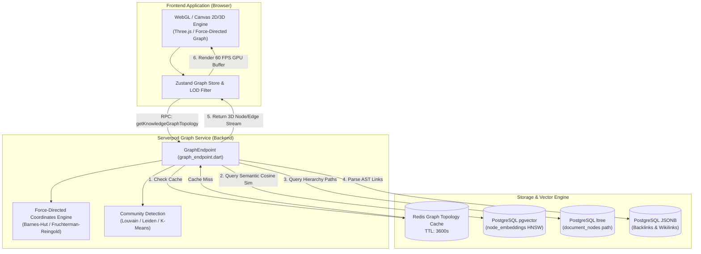
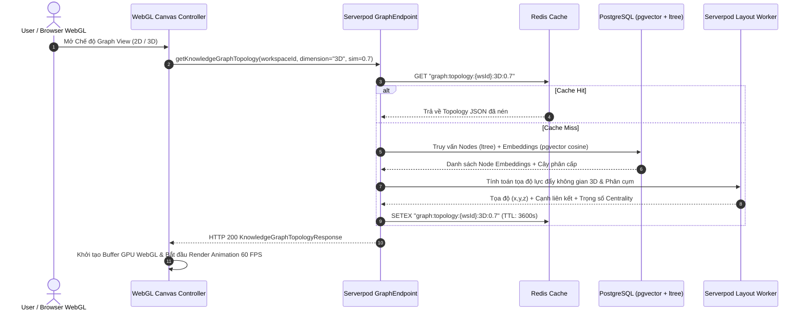
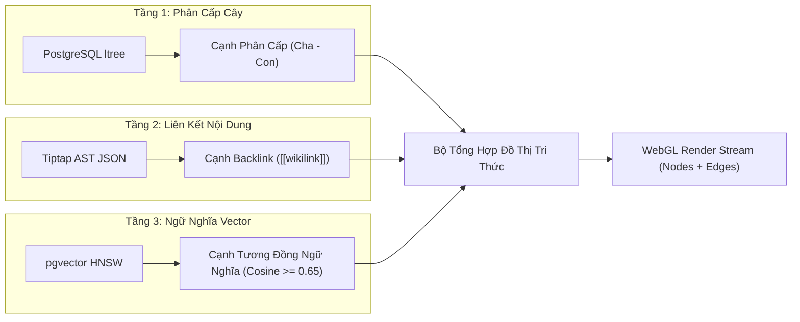

# AI Knowledge Graph View & Vector Topology Service Specification (`graph.md`)

> **Service**: `AI Knowledge Graph View & Vector Topology Service`  
> **Package**: `apps/server/lib/src/endpoints/graph_endpoint.dart`  
> **Specification Version**: `1.0.0`  
> **Status**: `APPROVED`  

---

### 1. Overview
Dịch vụ AI Knowledge Graph View & Vector Topology Service chịu trách nhiệm trích xuất, tổng hợp và tính toán cấu trúc đồ thị mạng lưới tri thức (Knowledge Graph Topology) 2D/3D từ toàn bộ kho tài liệu của Workspace. Dịch vụ được thiết kế chuyên biệt để cung cấp dữ liệu đồ thị tọa độ và liên kết hiệu năng cao cho các công cụ render **Canvas / WebGL (Three.js, Pixi.js, Force-Directed Graph)** trên giao diện người dùng, hỗ trợ trực quan hóa hàng chục ngàn nốt tài liệu mà không gây giật lag.

Hệ thống đồ thị tri thức hợp nhất 3 tầng quan hệ cốt lõi:
1. **Vector Semantic Similarity Edges**: Tự động tính toán khoảng cách ngữ nghĩa Cosine Similarity trực tiếp trên PostgreSQL `pgvector` HNSW (`node_embeddings`), kết nối các nốt tài liệu có cùng ngữ cảnh tư duy dù không được dẫn link trực tiếp.
2. **Explicit Backlinks & Wikilinks**: Trích xuất các siêu liên kết nội bộ `[[node-id]]` hoặc `@mention` từ nội dung Tiptap Block AST JSON.
3. **Hierarchical Tree Edges**: Khai thác đường dẫn phân cấp cha-con kế thừa từ PostgreSQL `ltree` (`path`).

Ngoài ra, dịch vụ cung cấp các thuật toán phân tích mạng lưới:
- **Community Clustering**: Phân cụm ngữ nghĩa tự động (Louvain / Leiden / K-Means) gán màu sắc và nhóm tri thức cho từng cụm tài liệu.
- **Centrality Metrics**: Tính toán bậc trung tâm (Degree Centrality, PageRank) để định cỡ kích thước nốt (Node Size) tương ứng với tầm quan trọng của tài liệu.
- **Level of Detail (LOD) Streaming**: Phân tầng dữ liệu theo khoảng cách camera và mức độ thu phóng trên WebGL.

---

### 2. Endpoints
Hợp đồng giao tiếp qua Serverpod RPC Endpoint Methods:
- `GraphEndpoint.getKnowledgeGraphTopology(Session session, GetGraphTopologyInput input)`
- `GraphEndpoint.getNodeNeighborhood(Session session, GetNodeNeighborhoodInput input)`
- `GraphEndpoint.getVectorSimilarityEdges(Session session, GetVectorSimilarityEdgesInput input)`
- `GraphEndpoint.computeClusterCommunities(Session session, ComputeClustersInput input)`
- `GraphEndpoint.getGraphMetrics(Session session, GetGraphMetricsInput input)`

---

### 3. Request
Cấu trúc Request DTOs:

```typescript
type GraphDimension = '2D' | '3D';
type EdgeTypeFilter = 'HIERARCHY' | 'BACKLINK' | 'SEMANTIC_SIMILARITY';

interface GetGraphTopologyInput {
  workspaceId: string;
  dimension: GraphDimension;
  similarityThreshold?: number; // Ngưỡng tương đồng cosine (0.0 -> 1.0, mặc định 0.65)
  maxNodes?: number; // Giới hạn số lượng node tối đa (mặc định 2000, max 50000)
  includeEdgeTypes?: EdgeTypeFilter[];
  tagFilter?: string[];
  rootNodeId?: string; // Giới hạn trong cây con nếu chỉ định
}

interface GetNodeNeighborhoodInput {
  workspaceId: string;
  nodeId: string;
  depth?: number; // Bán kính láng giềng (1 -> 5, mặc định 2)
  includeEdgeTypes?: EdgeTypeFilter[];
  similarityThreshold?: number;
}

interface GetVectorSimilarityEdgesInput {
  workspaceId: string;
  sourceNodeId: string;
  topK?: number; // Số lượng liên kết tương đồng cao nhất (mặc định 10)
  minSimilarity?: number;
}

interface ComputeClustersInput {
  workspaceId: string;
  algorithm?: 'LOUVAIN' | 'LEIDEN' | 'KMEANS';
  targetClusterCount?: number; // Áp dụng cho K-Means
  resolution?: number; // Độ phân giải phân cụm (0.1 -> 2.0)
}

interface GetGraphMetricsInput {
  workspaceId: string;
  includeCentrality?: boolean;
  includeOrphanNodes?: boolean;
}
```

---

### 4. Response
Cấu trúc Response DTOs:

```typescript
interface GraphNodeDTO {
  id: string;
  title: string;
  nodeType: 'WORKSPACE' | 'FOLDER' | 'DOCUMENT' | 'SECTION';
  path: string; // ltree path
  clusterId?: number;
  clusterLabel?: string;
  weight: number; // Degree centrality / PageRank score (0.0 -> 1.0)
  coordinates?: {
    x: number;
    y: number;
    z?: number; // Dành cho không gian 3D
  };
  neighborCount: number;
  wordCount: number;
  updatedAt: string;
}

interface GraphEdgeDTO {
  id: string;
  source: string; // source node UUID
  target: string; // target node UUID
  edgeType: 'HIERARCHY' | 'BACKLINK' | 'SEMANTIC_SIMILARITY';
  weight: number; // Trọng số liên kết / Điểm tương đồng cosine (0.0 -> 1.0)
}

interface GraphClusterDTO {
  clusterId: number;
  label: string; // Tên nhãn tự động sinh bởi AI tóm tắt chủ đề
  nodeCount: number;
  dominantKeywords: string[];
}

interface KnowledgeGraphTopologyResponse {
  workspaceId: string;
  dimension: GraphDimension;
  nodeCount: number;
  edgeCount: number;
  nodes: GraphNodeDTO[];
  edges: GraphEdgeDTO[];
  clusters: GraphClusterDTO[];
  computedAt: string;
}

interface NodeNeighborhoodResponse {
  centerNode: GraphNodeDTO;
  depth: number;
  neighborNodes: GraphNodeDTO[];
  connectingEdges: GraphEdgeDTO[];
}

interface GraphMetricsResponse {
  workspaceId: string;
  totalNodes: number;
  totalEdges: number;
  density: number; // Mật độ liên kết
  averageDegree: number;
  connectedComponents: number;
  orphanNodeIds: string[];
  topInfluentialNodes: Array<{ nodeId: string; title: string; score: number }>;
}
```

---

### 5. Validation
Quy tắc kiểm tra dữ liệu đầu vào (Zod & Dart Trust Boundary):
- `workspaceId`: Bắt buộc, chuỗi UUID v4 hợp lệ, người dùng phải có quyền truy cập Workspace.
- `dimension`: Bắt buộc, chuỗi thuộc tập `['2D', '3D']`.
- `similarityThreshold`: Số thực trong khoảng `[0.0, 1.0]`. Nếu không truyền, lấy mặc định `0.65`.
- `maxNodes`: Số nguyên dương trong khoảng `[10, 50000]`.
- `depth`: Bán kính mở rộng đồ thị láng giềng từ `1` đến `5`.
- `algorithm`: Chuỗi thuộc tập `['LOUVAIN', 'LEIDEN', 'KMEANS']`.
- `resolution`: Số thực trong khoảng `[0.1, 2.0]`.

---

### 6. Permissions
Ma trận Phân quyền Truy cập (RBAC Matrix):

| System / Resource Role | Xem Đồ thị Tri thức (`getKnowledgeGraphTopology`) | Truy vấn Láng giềng (`getNodeNeighborhood`) | Tính toán Phân cụm (`computeClusters`) | Xem Chỉ số Mạng lưới (`getGraphMetrics`) |
| :--- | :--- | :--- | :--- | :--- |
| `GUEST` (Chưa đăng nhập) | ❌ (Từ chối) | ❌ (Từ chối) | ❌ (Từ chối) | ❌ (Từ chối) |
| `USER` (Chủ Workspace cá nhân) | ✅ (Cho phép) | ✅ (Cho phép) | ✅ (Cho phép) | ✅ (Cho phép) |
| `ORG_MEMBER` (Thành viên Tổ chức) | ✅ (Theo quyền Workspace) | ✅ (Theo quyền Workspace) | ❌ (Chỉ đọc) | ✅ (Cho phép) |
| `ORG_ADMIN` (Quản trị Tổ chức) | ✅ (Toàn quyền) | ✅ (Toàn quyền) | ✅ (Toàn quyền) | ✅ (Toàn quyền) |
| `SYSTEM_ADMIN` (Quản trị Hệ thống) | ✅ (Toàn quyền) | ✅ (Toàn quyền) | ✅ (Toàn quyền) | ✅ (Toàn quyền) |

---

### 7. Errors
Mã lỗi chuẩn hóa trả về khi thao tác thất bại:

| Error Code Constant | HTTP Status | Nguyên nhân & Ngữ cảnh |
| :--- | :--- | :--- |
| `GRAPH_WORKSPACE_NOT_FOUND` | `404` | Workspace không tồn tại hoặc đã bị xóa. |
| `GRAPH_NODE_NOT_FOUND` | `404` | Nút tài liệu trung tâm không tồn tại trong Workspace. |
| `GRAPH_UNAUTHORIZED` | `403` | Người dùng không có quyền xem dữ liệu Workspace này. |
| `GRAPH_INVALID_SIMILARITY_THRESHOLD` | `400` | Ngưỡng tương đồng cosine vượt ngoài khoảng hợp lệ `[0.0, 1.0]`. |
| `GRAPH_CLUSTER_LIMIT_EXCEEDED` | `400` | Số lượng nốt vượt quá giới hạn tính toán phân cụm đồng thời. |
| `GRAPH_VECTOR_INDEX_UNAVAILABLE` | `503` | Chỉ mục `pgvector` HNSW đang trong quá trình reindex hoặc quá tải. |
| `GRAPH_CALCULATION_TIMEOUT` | `504` | Quá trình tính toán tọa độ lực đồ thị vượt quá thời gian tối đa (10s). |

---

### 8. Events
Danh sách sự kiện phát qua Serverpod WebSocket Streaming:
- `graph.topology_updated`: Phát khi có nốt tài liệu mới được tạo hoặc di chuyển trong cây phân cấp (`workspaceId`, `nodeCount`).
- `graph.cluster_recomputed`: Phát khi hoàn tất tái phân cụm cộng đồng tri thức (`workspaceId`, `clusterCount`).
- `graph.embedding_edge_created`: Phát khi có liên kết ngữ nghĩa mới được kết nối qua vector similarity.

---

### 9. Cache
Chiến lược lưu bộ nhớ đệm Redis:

#### Redis Caching Policy:
- **Redis Cache Key Topology**: `graph:topology:{workspaceId}:{dimension}:{similarityThreshold}:{includeEdgeTypesHash}`
- **Redis Cache Key Metrics**: `graph:metrics:{workspaceId}`
- **TTL**:
  - `graph:topology:*`: **1 Hour** (`3600` seconds) + Event-Driven Purge.
  - `graph:metrics:*`: **24 Hours** (`86400` seconds).
- **Invalidation Rules**:
  - Xóa cache `graph:topology:{workspaceId}:*` ngay lập tức khi phát sinh sự kiện `node.created`, `node.deleted`, `node.moved`, hoặc `ai.embedding_updated` thuộc `workspaceId`.
  - Tự động xóa cache cụm khi người dùng yêu cầu `computeClusterCommunities`.

---

### 10. Examples
Mã nguồn ví dụ truy vấn dữ liệu đồ thị tri thức trên Client:

```typescript
// 1. Fetch toàn bộ Topology Đồ thị Tri thức 3D cho WebGL Canvas
const graphData: KnowledgeGraphTopologyResponse = await client.graph.getKnowledgeGraphTopology({
  workspaceId: 'a0eebc99-9c0b-4ef8-bb6d-6bb9bd380a11',
  dimension: '3D',
  similarityThreshold: 0.70,
  maxNodes: 5000,
  includeEdgeTypes: ['HIERARCHY', 'BACKLINK', 'SEMANTIC_SIMILARITY']
});

console.log(`Đã nạp ${graphData.nodeCount} nốt và ${graphData.edgeCount} liên kết WebGL.`);

// 2. Lấy mạng lưới láng giềng cục bộ khi người dùng click vào 1 Nốt tài liệu
const neighborhood: NodeNeighborhoodResponse = await client.graph.getNodeNeighborhood({
  workspaceId: 'a0eebc99-9c0b-4ef8-bb6d-6bb9bd380a11',
  nodeId: '3fa85f64-5717-4562-b3fc-2c963f66afa6',
  depth: 2,
  similarityThreshold: 0.65
});

console.log(`Nốt trung tâm: ${neighborhood.centerNode.title}, Số láng giềng: ${neighborhood.neighborNodes.length}`);
```

---

### 11. Diagrams

#### 11.1. Architecture & WebGL Data Flow


#### 11.2. Sequence Diagram: Vector Topology Retrieval & Rendering


#### 11.3. Three-Tier Edge Synthesis Pipeline

