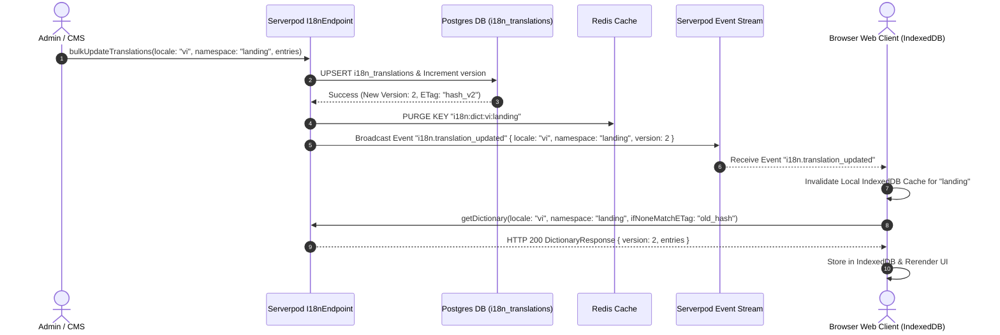
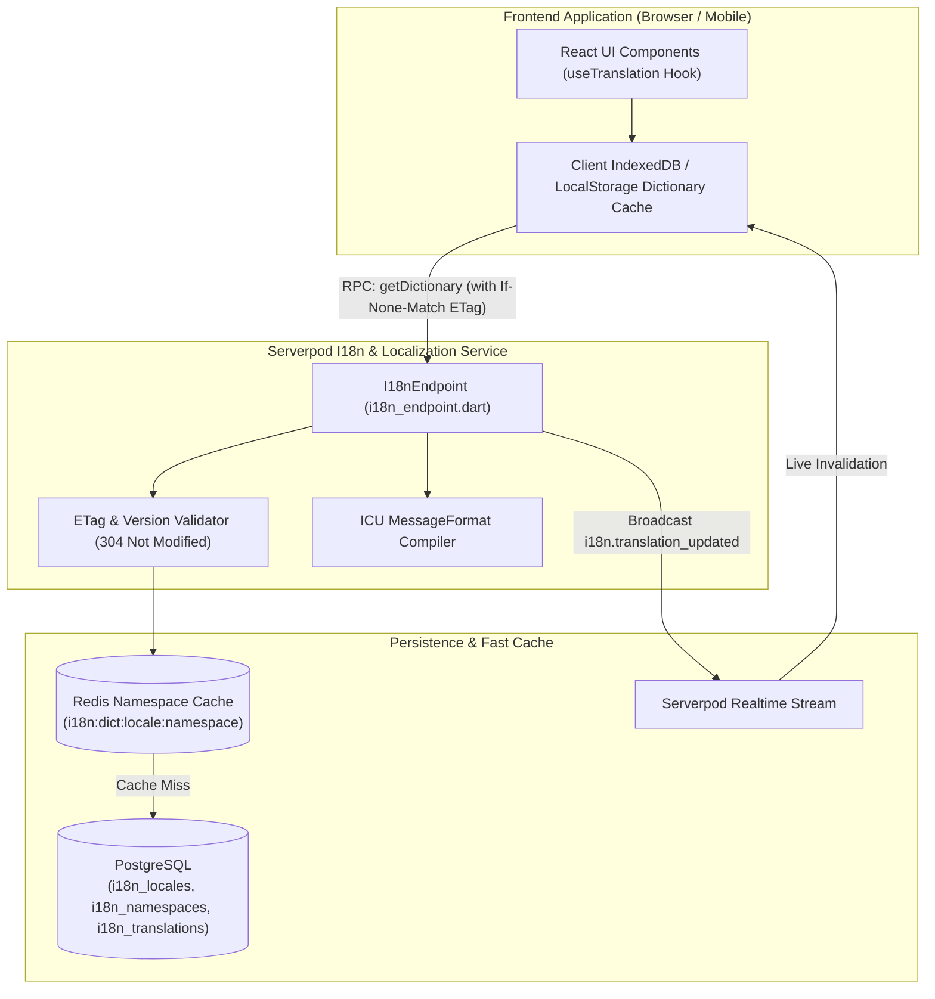
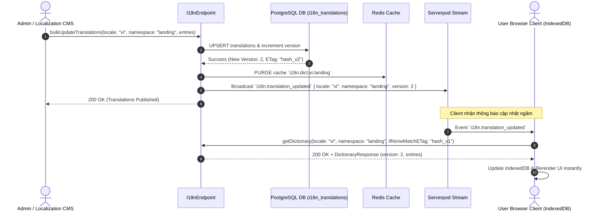
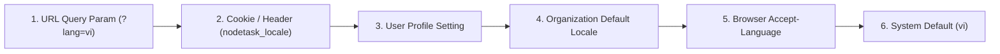

# Internationalization & Content Dictionary Service Specification (`i18n.md`)

> **Service**: `Internationalization & Content Dictionary Service`  
> **Package**: `apps/server/lib/src/endpoints/i18n_endpoint.dart`  
> **Specification Version**: `1.4.0`  
> **Status**: `APPROVED`  

---

### 1. Overview
Dịch vụ Internationalization & Content Dictionary (i18n) chịu trách nhiệm quản lý hệ thống từ điển đa ngôn ngữ động, chuỗi UI Content Dictionary hỗ trợ chuẩn **ICU Message Format** (biến số, số nhiều pluralization, giới tính), đồng bộ từ điển đa luồng (CMS/Admin ➡️ PostgreSQL ➡️ Redis ➡️ WebSocket Streaming ➡️ Client IndexedDB), cấp phiên bản ETag 304 Not Modified và cơ chế Fallback tự động đa cấp khi thiếu từ khóa.

---

### 2. Endpoints
Hợp đồng giao tiếp qua Serverpod RPC Endpoint Methods:
- `I18nEndpoint.getDictionary(Session session, GetDictionaryInput input)`
- `I18nEndpoint.updateTranslation(Session session, UpdateTranslationInput input)`
- `I18nEndpoint.bulkUpdateTranslations(Session session, BulkUpdateTranslationsInput input)`
- `I18nEndpoint.deleteTranslation(Session session, DeleteTranslationInput input)`
- `I18nEndpoint.createNamespace(Session session, CreateNamespaceInput input)`
- `I18nEndpoint.listLocales(Session session)`

---

### 3. Request
Cấu trúc Request DTOs:
```typescript
interface GetDictionaryInput {
  locale: string; // Dynamic locale code (e.g. 'vi', 'en', 'ja', 'fr')
  namespace: string; // e.g. 'landing', 'auth', 'workspace'
  ifNoneMatchETag?: string; // Client ETag version hash for HTTP 304
}

interface TranslationEntryInput {
  key: string; // e.g. 'landing.hero.heading'
  value: string; // ICU Message Format supported string
  description?: string;
  status?: 'DRAFT' | 'APPROVED';
}

interface UpdateTranslationInput {
  locale: string;
  namespace: string;
  entry: TranslationEntryInput;
}

interface BulkUpdateTranslationsInput {
  locale: string;
  namespace: string;
  entries: TranslationEntryInput[];
}

interface DeleteTranslationInput {
  locale: string;
  namespace: string;
  key: string;
}

interface CreateNamespaceInput {
  namespace: string;
  description?: string;
}
```

---

### 4. Response
Cấu trúc Response DTOs:
```typescript
interface TranslationEntry {
  key: string;
  value: string; // ICU Message Format string (e.g., "Hello {name}, you have {count, plural, =0 {no items} =1 {1 item} other {# items}}")
  version: number;
  status: 'DRAFT' | 'APPROVED';
  updatedAt: string;
  lastEditorId?: string;
  description?: string;
}

interface DictionaryResponse {
  locale: string;
  namespace: string;
  version: number; // Incrementing version number for cache invalidation
  eTag: string; // Hash of version & updatedAt
  isNotModified?: boolean; // Set to true if ETag matches client request (HTTP 304)
  fallbackLocaleUsed?: string; // Set if fallback occurred (e.g. 'en')
  entries: TranslationEntry[];
  updatedAt: string;
}

interface SupportedLocale {
  code: string; // e.g., 'en', 'vi', 'ja', 'fr'
  name: string; // e.g., 'English', 'Tiếng Việt'
  isDefault: boolean;
  fallbackCode: string; // e.g. 'en'
}
```

---

### 5. Validation
Quy tắc kiểm tra dữ liệu đầu vào (Dart & Serverpod Trust Boundary):
- `locale`: Required, string, lowercase 2-5 chars ISO 639-1 / BCP 47 (e.g. `en`, `vi`, `ja-JP`). Validated dynamically against `i18n_locales` table.
- `namespace`: Required, string, lowercase alphanumeric and hyphens, max 50 chars (`/^[a-z0-9-]+$/`).
- `key`: Required, dot-separated namespace key (e.g. `landing.hero.heading`), max 120 chars.
- `value`: Required, valid ICU Message Format string, max 5000 chars.

---

## Fallback Contract & Resolution Order
Khi Client yêu cầu từ điển của một `locale` (ví dụ: `fr` - Tiếng Pháp):

```text
[Request locale="fr" key="landing.hero.heading"]
               │
               ▼
   1. Check 'fr' Dictionary in Redis / DB
               │
       ┌───────┴───────┐
    [Found]        [Not Found]
       │               │
       ▼               ▼
  Return 'fr'    2. Check Fallback Locale 'en' (from i18n_locales.fallbackCode)
  Translation          │
               ┌───────┴───────┐
            [Found]        [Not Found]
               │               │
               ▼               ▼
          Return 'en'    3. Return Raw Key ("landing.hero.heading")
          Translation    (Log missing translation warning)
```

---

### 6. Permissions
Ma trận Phân quyền Truy cập & Tài nguyên (RBAC Matrix):

| System / Resource Role | Truy vấn Từ điển (`getDictionary`) | Danh sách Ngôn ngữ (`listLocales`) | Cập nhật Bản dịch (`updateTranslation` / `bulk`) | Xóa Key / Namespace (`deleteTranslation` / `createNamespace`) |
| :--- | :--- | :--- | :--- | :--- |
| `GUEST` (Chưa đăng nhập) | ✅ | ✅ | ❌ | ❌ |
| `USER` (Thành viên Cá nhân) | ✅ | ✅ | ❌ | ❌ |
| `ORG_MEMBER` (Thành viên Tổ chức) | ✅ | ✅ | ❌ | ❌ |
| `ORG_ADMIN` (Quản trị Tổ chức) | ✅ | ✅ | ❌ | ❌ |
| `SYSTEM_ADMIN` (Quản trị Hệ thống) | ✅ | ✅ | ✅ | ✅ |

---

### 7. Errors
Mã lỗi chuẩn hóa trả về khi thao tác thất bại:

| Error Code Constant | HTTP Status | Nguyên nhân |
| :--- | :--- | :--- |
| `I18N_LOCALE_NOT_SUPPORTED` | `400` | Mã ngôn ngữ không tồn tại trong bảng `i18n_locales`. |
| `I18N_INVALID_KEY_FORMAT` | `400` | Định dạng key không hợp lệ (vi phạm pattern dot-notation). |
| `I18N_UNAUTHORIZED` | `403` | Không có quyền quản trị để cập nhật từ điển. |
| `I18N_NAMESPACE_NOT_FOUND` | `404` | Namespace không tồn tại trong hệ thống. |
| `I18N_KEY_NOT_FOUND` | `404` | Từ khóa bản dịch không tồn tại và không có fallback. |
| `I18N_DUPLICATE_KEY` | `409` | Khóa bản dịch đã tồn tại trong namespace khi tạo mới. |
| `I18N_CACHE_SYNC_ERROR` | `500` | Lỗi không thể đồng bộ cache Redis hoặc phát event streaming. |

---

### 8. Events
Danh sách sự kiện phát qua Serverpod Streaming Connection:
- `i18n.translation_updated`: Phát khi có cập nhật bản dịch (gửi kèm `locale`, `namespace`, `version`, `eTag`) để các trình duyệt Client tự động xóa cache IndexedDB và fetch từ điển mới.

---

### 9. Cache (TTL & Invalidation Rules)

#### Server-side Redis Cache Policy
- **Redis Cache Key**: `i18n:dict:{locale}:{namespace}`
- **TTL Policy**: **7 Days** (`604800` seconds) + Event-Driven Purge.
- **Cache Invalidation Rule**: Xóa Redis Key `i18n:dict:{locale}:{namespace}` lập tức khi gọi `updateTranslation`, `bulkUpdateTranslations` hoặc `deleteTranslation`.

#### Browser Client-side Cache & Fallback Strategy
- **Feature-Sliced Fallback**: Trong trường hợp chưa có mạng / offline / SSG build time, Web Client sử dụng từ điển tự chứa tại `apps/web/src/features/<feature_name>/content/en.json` và `vi.json`. Các key không sử dụng tiền tố namespace trùng lặp (ví dụ: `"hero.heading"` thay vì `"landing.hero.heading"`).
- **Primary Storage**: Browser **IndexedDB** (`nodetask_i18n_db`).
- **ETag Validation**: Mỗi lần khởi chạy app, Web Client gửi ETag của Namespace lên Server via `ifNoneMatchETag`. Nếu Server trả về `isNotModified: true` (HTTP 304), Client tiếp tục dùng bản dịch trong IndexedDB mà không cần parse lại JSON payload.
- **UI Navigation Badging Rule**: Trên Header/Navbar, Language Switcher luôn sử dụng mã ISO 639-1 viết hoa (`[LANG: VI]`, `[LANG: EN]`, `[LANG: JA]`, `[LANG: FR]`) để giữ độ rộng nút cố định, tránh tràn vỡ layout khi mở rộng sang các ngôn ngữ có tên dài.

---

## Database Schema (PostgreSQL Persistence Model)

```sql
-- 1. Locales Table
CREATE TABLE i18n_locales (
    code VARCHAR(10) PRIMARY KEY, -- 'en', 'vi', 'ja', 'fr'
    name VARCHAR(100) NOT NULL,    -- 'English', 'Tiếng Việt'
    is_default BOOLEAN DEFAULT FALSE,
    fallback_code VARCHAR(10) REFERENCES i18n_locales(code),
    created_at TIMESTAMP WITH TIME ZONE DEFAULT CURRENT_TIMESTAMP
);

-- 2. Namespaces Table
CREATE TABLE i18n_namespaces (
    name VARCHAR(50) PRIMARY KEY, -- 'landing', 'auth', 'workspace'
    description TEXT,
    created_at TIMESTAMP WITH TIME ZONE DEFAULT CURRENT_TIMESTAMP
);

-- 3. Translations Table
CREATE TABLE i18n_translations (
    id UUID PRIMARY KEY DEFAULT gen_random_uuid(),
    namespace VARCHAR(50) NOT NULL REFERENCES i18n_namespaces(name) ON DELETE CASCADE,
    locale VARCHAR(10) NOT NULL REFERENCES i18n_locales(code) ON DELETE CASCADE,
    key VARCHAR(120) NOT NULL,
    value TEXT NOT NULL, -- ICU Message Format
    description TEXT,
    status VARCHAR(20) DEFAULT 'APPROVED', -- 'DRAFT', 'APPROVED'
    version INT DEFAULT 1,
    last_editor_id UUID,
    created_at TIMESTAMP WITH TIME ZONE DEFAULT CURRENT_TIMESTAMP,
    updated_at TIMESTAMP WITH TIME ZONE DEFAULT CURRENT_TIMESTAMP,
    CONSTRAINT i18n_ns_locale_key_uniq UNIQUE (namespace, locale, key)
);

CREATE INDEX i18n_trans_ns_locale_idx ON i18n_translations(namespace, locale);
```

---

## System Architecture Sync Strategy (Sequence Diagram)



---

### 10. Examples
Code mẫu Request & Response:

```typescript
// 1. Fetch Landing Page Dictionary with ETag Validation
const res = await client.i18n.getDictionary({
  locale: 'vi',
  namespace: 'landing',
  ifNoneMatchETag: 'eTag_v1_hash'
});

// Response payload with ICU Format string
console.log(res);
/*
{
  locale: 'vi',
  namespace: 'landing',
  version: 2,
  eTag: 'eTag_v2_hash',
  updatedAt: '2026-08-06T16:15:00Z',
  entries: [
    {
      key: 'landing.hero.heading',
      value: 'HỆ THỐNG QUẢN LÝ TRI THỨC VÀ TÀI LIỆU PHÂN CẤP',
      version: 2,
      status: 'APPROVED',
      updatedAt: '2026-08-06T16:15:00Z'
    },
    {
      key: 'landing.notification.count',
      value: 'Bạn có {count, plural, =0 {không có thông báo} =1 {1 thông báo} other {# thông báo}} mới.',
      version: 1,
      status: 'APPROVED',
      updatedAt: '2026-08-06T15:00:00Z'
    }
  ]
}
*/

// 2. Bulk Import / Update Translations from CMS (Admin Only)
await client.i18n.bulkUpdateTranslations({
  locale: 'vi',
  namespace: 'landing',
  entries: [
    {
      key: 'landing.hero.heading',
      value: 'HỆ THỐNG QUẢN LÝ TRI THỨC PHÂN CẤP CAO CẤP',
      description: 'Main display title on hero section'
    },
    {
      key: 'landing.hero.subheading',
      value: 'Trình soạn thảo AST Tiptap với giao diện tối giản Zero-Icon'
    }
  ]
});
```

---

### 11. Diagrams

#### 11.1. Architecture & Multi-Namespace I18n Topology


#### 11.2. Translation Sync & ETag Cache Validation Sequence


#### 11.3. Locale Resolution & Fallback Cascade Flow


