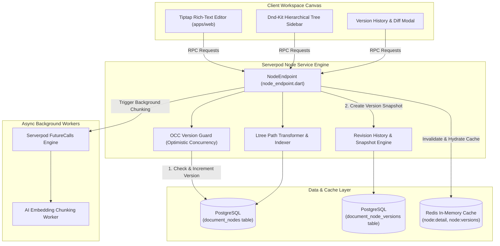
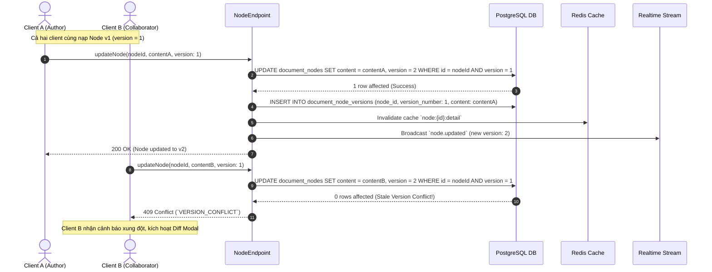
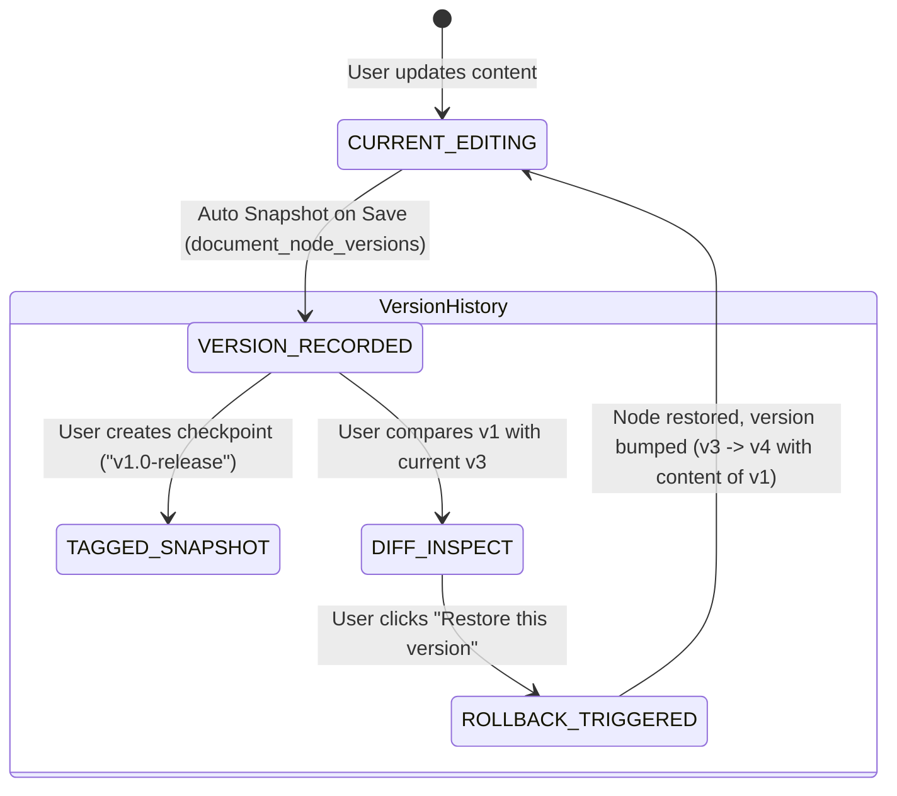

# Document Node & Version History Service Specification (`node.md`)

> **Service**: `Node Structure, AST Document & Version Control Service`  
> **Package**: `apps/server/lib/src/endpoints/node_endpoint.dart`  
> **Specification Version**: `2.1.0`  
> **Status**: `APPROVED`  

---

### 1. Overview
Dịch vụ Document Node Service quản lý từng khối dữ liệu phân cấp trong Workspace theo mô hình cấu trúc cây PostgreSQL `ltree`. Nút tài liệu (Node) hỗ trợ 4 định dạng chính: `WORKSPACE`, `FOLDER`, `DOCUMENT`, `SECTION`. Nội dung ghi chú được lưu trữ dưới dạng khối Tiptap AST JSON linh hoạt (Rich-Text Block).

Dịch vụ trang bị hệ thống **Kiểm soát Phiên bản Kép (Dual Version Control Mechanism)**:
1. **Optimistic Concurrency Control (OCC Versioning)**: Sử dụng trường `version: int` tăng dần khi có cập nhật, kiểm tra `WHERE id = $1 AND version = $2` nhằm ngăn chặn tình trạng ghi đè mất dữ liệu giữa các phiên cộng tác đồng thời (trả về `VERSION_CONFLICT` HTTP 409).
2. **Document Revision History & Snapshot Versioning**: Tự động lưu vết lịch sử sửa đổi nội dung vào bảng `document_node_versions`. Hỗ trợ: xem lại lịch sử phiên bản (`listNodeVersions`), so sánh sai khác (Diff view), khôi phục phiên bản trong quá khứ (`restoreNodeVersion`), và gắn thẻ bản chụp tức thời (`createNodeSnapshot` với tag như `v1.0-release`).
3. **Cấu trúc Cây Phân Cấp Siêu Tốc (`ltree`)**: Xử lý các thao tác kéo-thả sắp xếp vị trí (`reorderNodes`), di chuyển toàn bộ cây con (`moveNode`), tính toán lại đường dẫn phân cấp với chỉ mục GIST.

---

### 2. Endpoints
Hợp đồng giao tiếp qua Serverpod RPC Endpoint Methods:
- `NodeEndpoint.getNode(Session session, String nodeId)`
- `NodeEndpoint.createNode(Session session, CreateNodeInput input)`
- `NodeEndpoint.updateNode(Session session, UpdateNodeInput input)`
- `NodeEndpoint.deleteNode(Session session, String nodeId)`
- `NodeEndpoint.moveNode(Session session, MoveNodeInput input)`
- `NodeEndpoint.reorderNodes(Session session, ReorderNodesInput input)`
- `NodeEndpoint.duplicateNode(Session session, DuplicateNodeInput input)`
- `NodeEndpoint.getNodeBreadcrumb(Session session, String nodeId)`
- `NodeEndpoint.listNodeVersions(Session session, ListNodeVersionsInput input)`
- `NodeEndpoint.getNodeVersionDetail(Session session, GetNodeVersionDetailInput input)`
- `NodeEndpoint.restoreNodeVersion(Session session, RestoreNodeVersionInput input)`
- `NodeEndpoint.createNodeSnapshot(Session session, CreateNodeSnapshotInput input)`

---

### 3. Request
Cấu trúc Request DTOs:

```typescript
type NodeType = 'WORKSPACE' | 'FOLDER' | 'DOCUMENT' | 'SECTION';

interface CreateNodeInput {
  workspaceId: string;
  parentId?: string;
  nodeType: NodeType;
  title: string;
  content?: string; // Tiptap AST JSON string
  position?: number;
}

interface UpdateNodeInput {
  nodeId: string;
  title?: string;
  content?: string; // Tiptap AST JSON string
  version: number; // OCC Versioning check
  changeSummary?: string; // Tóm tắt thay đổi phiên bản
}

interface MoveNodeInput {
  nodeId: string;
  targetParentId?: string;
  targetPosition: number;
}

interface NodePositionItem {
  nodeId: string;
  position: number;
}

interface ReorderNodesInput {
  workspaceId: string;
  parentId?: string;
  items: NodePositionItem[];
}

interface DuplicateNodeInput {
  nodeId: string;
  targetParentId?: string;
  includeChildren?: boolean;
}

interface ListNodeVersionsInput {
  nodeId: string;
  page?: number;
  pageSize?: number;
  onlySnapshots?: boolean;
}

interface GetNodeVersionDetailInput {
  nodeId: string;
  versionNumber: number;
}

interface RestoreNodeVersionInput {
  nodeId: string;
  targetVersionNumber: number;
  currentVersion: number;
}

interface CreateNodeSnapshotInput {
  nodeId: string;
  snapshotTag: string; // e.g. "v1.0-final"
  changeSummary?: string;
}
```

---

### 4. Response
Cấu trúc Response DTOs:

```typescript
interface DocumentNodeResponse {
  id: string;
  workspaceId: string;
  parentId?: string;
  path: string; // ltree path
  nodeType: NodeType;
  title: string;
  content?: string; // JSON AST string
  position: number;
  version: number;
  todoCount: number;
  attachmentCount: number;
  createdAt: string;
  updatedAt: string;
}

interface NodeBreadcrumbItem {
  id: string;
  title: string;
  nodeType: NodeType;
  path: string;
}

interface NodeBreadcrumbResponse {
  nodeId: string;
  breadcrumbs: NodeBreadcrumbItem[];
}

interface ReorderNodesResponse {
  success: boolean;
  updatedNodesCount: number;
}

interface NodeVersionItem {
  id: string;
  nodeId: string;
  userId: string;
  authorName: string;
  versionNumber: number;
  title: string;
  changeSummary?: string;
  isSnapshot: boolean;
  snapshotTag?: string;
  createdAt: string;
}

interface ListNodeVersionsResponse {
  items: NodeVersionItem[];
  total: number;
  page: number;
  pageSize: number;
}

interface NodeVersionDetailResponse {
  version: NodeVersionItem;
  content: string; // Tiptap JSON AST của phiên bản lịch sử
}

interface RestoreNodeVersionResponse {
  node: DocumentNodeResponse;
  restoredFromVersion: number;
  newVersionNumber: number;
}
```

---

### 5. Validation
Quy chuẩn kiểm tra tính hợp lệ dữ liệu đầu vào:
- `title`: Bắt buộc, chuỗi từ 1 đến 255 ký tự.
- `version`: Số nguyên dương (`version >= 1`), bắt buộc khi gọi `updateNode` hoặc `restoreNodeVersion` để kiểm soát xung đột ghi đồng thời.
- `nodeType`: Bắt buộc thuộc enum `WORKSPACE`, `FOLDER`, `DOCUMENT`, `SECTION`.
- `content`: Chuỗi JSON hợp lệ theo Tiptap Block AST format (tối đa 5MB mỗi node).
- `snapshotTag`: Chuỗi từ 1 đến 50 ký tự, chỉ chứa chữ cái, số, dấu gạch nối, gạch dưới và dấu chấm (`^[a-zA-Z0-9._-]+$`).
- `items`: Mảng từ 1 đến 500 phần tử khi reorder các node con.

---

### 6. Permissions
Ma trận Phân quyền Truy cập (RBAC Matrix):

| Endpoint Method | GUEST | USER | ORG_MEMBER | ORG_ADMIN | SYSTEM_ADMIN |
| :--- | :---: | :---: | :---: | :---: | :---: |
| `NodeEndpoint.getNode` | ❌ (Public only) | ✅ (Owner/Shared) | ✅ (Org Scope) | ✅ (Org Scope) | ✅ (All) |
| `NodeEndpoint.createNode` | ❌ | ✅ (Owner/Editor) | ✅ (Editor/Owner) | ✅ (Org Scope) | ✅ (All) |
| `NodeEndpoint.updateNode` | ❌ | ✅ (Owner/Editor) | ✅ (Editor/Owner) | ✅ (Org Scope) | ✅ (All) |
| `NodeEndpoint.deleteNode` | ❌ | ✅ (Owner/Editor) | ✅ (Editor/Owner) | ✅ (Org Scope) | ✅ (All) |
| `NodeEndpoint.moveNode` | ❌ | ✅ (Owner/Editor) | ✅ (Editor/Owner) | ✅ (Org Scope) | ✅ (All) |
| `NodeEndpoint.reorderNodes` | ❌ | ✅ (Owner/Editor) | ✅ (Editor/Owner) | ✅ (Org Scope) | ✅ (All) |
| `NodeEndpoint.duplicateNode` | ❌ | ✅ (Owner/Editor) | ✅ (Editor/Owner) | ✅ (Org Scope) | ✅ (All) |
| `NodeEndpoint.getNodeBreadcrumb` | ❌ (Public only) | ✅ (Owner/Shared) | ✅ (Org Scope) | ✅ (Org Scope) | ✅ (All) |
| `NodeEndpoint.listNodeVersions` | ❌ (Public only) | ✅ (Owner/Shared) | ✅ (Org Scope) | ✅ (Org Scope) | ✅ (All) |
| `NodeEndpoint.getNodeVersionDetail` | ❌ (Public only) | ✅ (Owner/Shared) | ✅ (Org Scope) | ✅ (Org Scope) | ✅ (All) |
| `NodeEndpoint.restoreNodeVersion` | ❌ | ✅ (Owner/Editor) | ✅ (Editor/Owner) | ✅ (Org Scope) | ✅ (All) |
| `NodeEndpoint.createNodeSnapshot` | ❌ | ✅ (Owner/Editor) | ✅ (Editor/Owner) | ✅ (Org Scope) | ✅ (All) |

---

### 7. Errors
Bảng mã lỗi và HTTP Status tương ứng:

| Mã Lỗi (Error Code) | HTTP Status | Nguyên nhân | Hướng xử lý Client |
| :--- | :--- | :--- | :--- |
| `NODE_NOT_FOUND` | `404 Not Found` | Không tìm thấy `nodeId` trong cơ sở dữ liệu. | Thông báo tài liệu không tồn tại hoặc đã bị xóa. |
| `VERSION_CONFLICT` | `409 Conflict` | Xung đột ghi đồng thời (OCC version mismatch). | Rollback Optimistic UI, fetch lại nội dung mới nhất. |
| `VERSION_NOT_FOUND` | `404 Not Found` | Phiên bản lịch sử được yêu cầu không tồn tại. | Kiểm tra lại danh sách phiên bản có sẵn. |
| `SNAPSHOT_TAG_EXISTS` | `409 Conflict` | Thẻ bản chụp (Snapshot Tag) đã tồn tại cho tài liệu này. | Đặt tên tag khác hoặc cập nhật tag cũ. |
| `CIRCULAR_DEPENDENCY` | `400 Bad Request` | Cố gắng di chuyển node cha vào làm con của chính nó. | Chặn hành động di chuyển không hợp lệ. |
| `FORBIDDEN` | `403 Forbidden` | Không có quyền chỉnh sửa node hoặc khôi phục phiên bản. | Hiển thị thông báo quyền truy cập bị từ chối. |
| `INVALID_INPUT` | `400 Bad Request` | Payload hoặc JSON AST không hợp lệ. | Báo lỗi validation trên giao diện. |
| `INTERNAL_ERROR` | `500 Internal Error` | Lỗi máy chủ nội bộ không xác định. | Thông báo thử lại sau. |

---

### 8. Events
Danh sách Domain Events phát sinh:
- `node.created`: Phát ra khi tạo mới một nút tài liệu.
- `node.updated`: Phát ra khi cập nhật tiêu đề, phiên bản hoặc nội dung AST.
- `node.moved`: Phát ra khi node thay đổi vị trí hoặc cây cha trong cấu trúc `ltree`.
- `node.deleted`: Phát ra khi node bị xóa (kích hoạt FutureCalls dọn dẹp).
- `node.version_created`: Phát ra khi một bản ghi lịch sử phiên bản mới được lưu trữ.
- `node.version_restored`: Phát ra khi người dùng khôi phục tài liệu về một phiên bản cũ.
- `node.snapshot_created`: Phát ra khi một bản chụp checkpoint được gắn tag.

---

### 9. Cache
Chiến lược Caching qua Redis:
- **Keys & TTL**:
  - `node:{node_id}:detail` -> Toàn bộ dữ liệu chi tiết của node bao gồm nội dung AST (TTL: 1h).
  - `workspace:{workspace_id}:tree_json` -> Cây cấu trúc phân cấp (TTL: 30m).
  - `node:{node_id}:versions:page_{page}` -> Danh sách tóm tắt lịch sử phiên bản (TTL: 10m).
  - `node:{node_id}:version:{version_num}` -> Chi tiết nội dung của phiên bản lịch sử (TTL: 24h).
- **Invalidation Strategy**:
  - Khi gọi `updateNode` hoặc `restoreNodeVersion` $\rightarrow$ Xóa cache `node:{node_id}:detail`, `workspace:{workspace_id}:tree_json` và `node:{node_id}:versions:*`.
  - Khi gọi `moveNode` hoặc `reorderNodes` $\rightarrow$ Xóa cache `workspace:{workspace_id}:tree_json`.

---

### 10. Examples
Ví dụ tích hợp TypeScript Frontend Client:

```typescript
import { api } from '@/services/api';

// 1. Cập nhật nội dung tài liệu với OCC Version Check
try {
  const updated = await api.put('/rpc/node/updateNode', {
    nodeId: 'doc-node-uuid-1234',
    title: 'Quy chuẩn Kiến trúc Vi dịch vụ v2',
    content: JSON.stringify({ type: 'doc', content: [{ type: 'paragraph', text: 'Nội dung block mới...' }] }),
    version: 3,
    changeSummary: 'Bổ sung sơ đồ kiến trúc MinIO và phân quyền RBAC'
  });
  console.log('Phiên bản mới:', updated.data.version);
} catch (err: any) {
  if (err.code === 'VERSION_CONFLICT') {
    console.warn('Xung đột phiên bản ghi! Vui lòng tải lại trang.');
  }
}

// 2. Xem danh sách lịch sử sửa đổi (Revision History)
const history = await api.get('/rpc/node/listNodeVersions', {
  params: { nodeId: 'doc-node-uuid-1234', page: 1, pageSize: 10 }
});
console.log('Lịch sử các phiên bản:', history.data.items);

// 3. Khôi phục về phiên bản cũ (Rollback Version)
const restored = await api.post('/rpc/node/restoreNodeVersion', {
  nodeId: 'doc-node-uuid-1234',
  targetVersionNumber: 1,
  currentVersion: 4
});
console.log(`Đã khôi phục thành công về v1! Phiên bản hiện tại là v${restored.data.newVersionNumber}`);
```

---

### 11. Diagrams

#### 11.1. Architecture & Hierarchical Tree Engine with Version History


#### 11.2. OCC Concurrent Update & Version Conflict Flow


#### 11.3. Time-Travel Version Rollback & Snapshot Lifecycle

