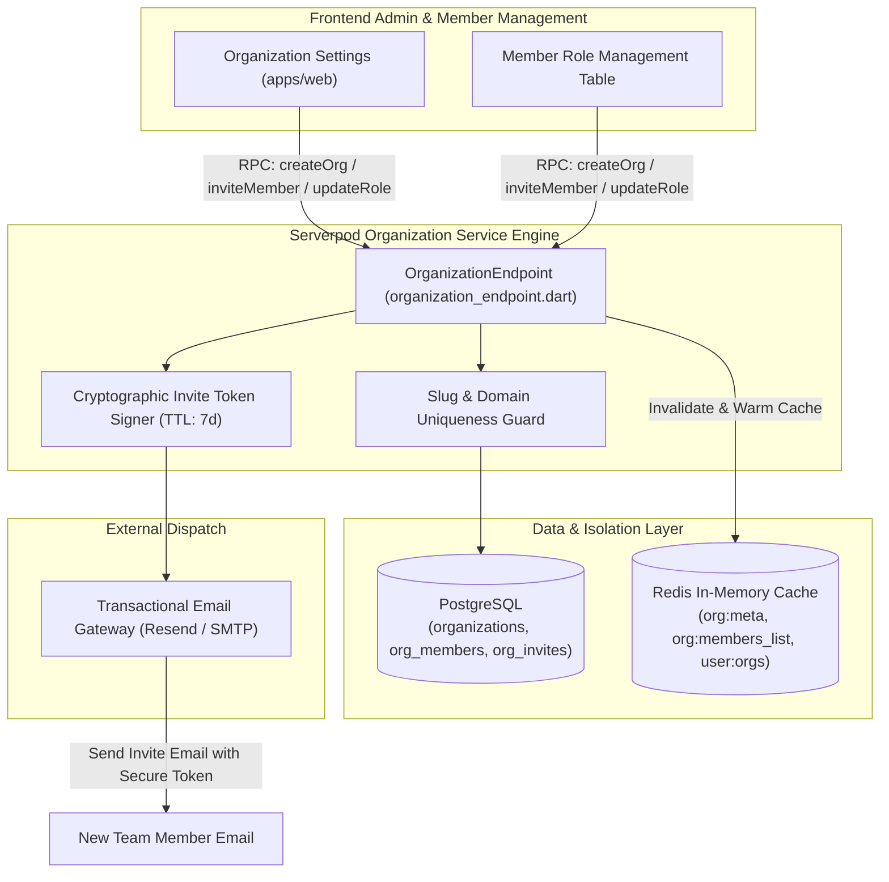
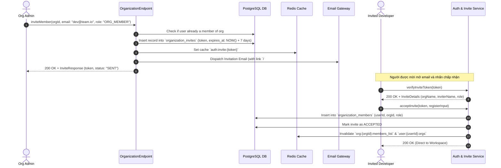
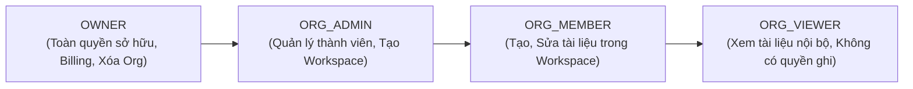

# Organization & Access Control Policy Service Specification (`organization.md`)

> **Service**: `Organization & Access Control Policy Service`  
> **Package**: `apps/server/lib/src/endpoints/organization_endpoint.dart`  
> **Specification Version**: `2.0.0`  
> **Status**: `APPROVED`  

---

### 1. Overview
Dịch vụ Organization & Access Control Policy Service quản lý toàn bộ hệ thống tổ chức, không gian làm việc nhóm, thành viên và chính sách phân quyền truy cập đa cấp (Multi-level RBAC & Resource ACLs) cho nền tảng `nodetask`. Dịch vụ thực thi 5 cấp độ vai trò chuẩn hệ thống: `GUEST`, `USER`, `ORG_MEMBER`, `ORG_ADMIN`, `SYSTEM_ADMIN` cùng 3 cấp quyền cục bộ tại từng Workspace/Node: `OWNER`, `EDITOR`, `VIEWER`. Dịch vụ hỗ trợ quản lý vòng đời tổ chức, lời mời tham gia qua Email/Link token, thu hồi quyền, chuyển nhượng quyền sở hữu và kiểm tra nhật ký truy cập (Audit Logs).

---

### 2. Endpoints
Hợp đồng giao tiếp qua Serverpod RPC Endpoint Methods:
- `OrganizationEndpoint.listOrganizations(Session session)`
- `OrganizationEndpoint.getOrganization(Session session, String orgId)`
- `OrganizationEndpoint.createOrganization(Session session, CreateOrganizationInput input)`
- `OrganizationEndpoint.updateOrganization(Session session, UpdateOrganizationInput input)`
- `OrganizationEndpoint.deleteOrganization(Session session, String orgId)`
- `OrganizationEndpoint.listMembers(Session session, ListMembersInput input)`
- `OrganizationEndpoint.inviteMember(Session session, InviteMemberInput input)`
- `OrganizationEndpoint.updateMemberRole(Session session, UpdateMemberRoleInput input)`
- `OrganizationEndpoint.removeMember(Session session, RemoveMemberInput input)`
- `OrganizationEndpoint.transferOwnership(Session session, TransferOwnershipInput input)`

---

### 3. Request
Cấu trúc Request DTOs:

```typescript
type SystemRole = 'GUEST' | 'USER' | 'ORG_MEMBER' | 'ORG_ADMIN' | 'SYSTEM_ADMIN';
type OrgRole = 'ORG_MEMBER' | 'ORG_ADMIN';

interface CreateOrganizationInput {
  name: string;
  slug: string;
  description?: string;
  billingEmail?: string;
}

interface UpdateOrganizationInput {
  orgId: string;
  name?: string;
  description?: string;
  logoUrl?: string;
}

interface ListMembersInput {
  orgId: string;
  page?: number;
  pageSize?: number;
  searchQuery?: string;
}

interface InviteMemberInput {
  orgId: string;
  email: string;
  role: OrgRole;
  assignedWorkspaceIds?: string[];
}

interface UpdateMemberRoleInput {
  orgId: string;
  memberUserId: string;
  role: OrgRole;
}

interface RemoveMemberInput {
  orgId: string;
  memberUserId: string;
}

interface TransferOwnershipInput {
  orgId: string;
  newOwnerUserId: string;
}
```

---

### 4. Response
Cấu trúc Response DTOs:

```typescript
interface OrganizationMemberResponse {
  userId: string;
  email: string;
  fullName: string;
  role: OrgRole;
  joinedAt: string;
}

interface OrganizationResponse {
  id: string;
  name: string;
  slug: string;
  description?: string;
  logoUrl?: string;
  ownerId: string;
  membersCount: number;
  workspacesCount: number;
  storageUsedBytes: number;
  createdAt: string;
  updatedAt: string;
}

interface InviteMemberResponse {
  inviteId: string;
  orgId: string;
  email: string;
  role: OrgRole;
  inviteToken: string;
  expiresAt: string;
}

interface ListMembersResponse {
  orgId: string;
  members: OrganizationMemberResponse[];
  totalCount: number;
}
```

---

### 5. Validation
Quy chuẩn kiểm tra tính hợp lệ dữ liệu đầu vào:
- `name`: Bắt buộc, chuỗi từ 2 đến 100 ký tự.
- `slug`: Bắt buộc, chuỗi từ 3 đến 50 ký tự, chỉ gồm ký tự thường `[a-z0-9-]`, duy nhất trong toàn hệ thống.
- `email`: Bắt buộc, định dạng email tiêu chuẩn RFC 5322.
- `role`: Bắt buộc thuộc `ORG_MEMBER` hoặc `ORG_ADMIN`.

---

### 6. Permissions
Ma trận Phân quyền Truy cập (RBAC Matrix):

| Endpoint Method | GUEST | USER | ORG_MEMBER | ORG_ADMIN | SYSTEM_ADMIN |
| :--- | :---: | :---: | :---: | :---: | :---: |
| `OrganizationEndpoint.listOrganizations` | ❌ | ✅ (Joined only) | ✅ (Joined only) | ✅ (Joined only) | ✅ (All) |
| `OrganizationEndpoint.getOrganization` | ❌ | ❌ | ✅ (Org Scope) | ✅ (Org Scope) | ✅ (All) |
| `OrganizationEndpoint.createOrganization` | ❌ | ✅ | ✅ | ✅ | ✅ (All) |
| `OrganizationEndpoint.updateOrganization` | ❌ | ❌ | ❌ | ✅ (Org Scope) | ✅ (All) |
| `OrganizationEndpoint.deleteOrganization` | ❌ | ❌ | ❌ | ✅ (Owner only) | ✅ (All) |
| `OrganizationEndpoint.listMembers` | ❌ | ❌ | ✅ (Org Scope) | ✅ (Org Scope) | ✅ (All) |
| `OrganizationEndpoint.inviteMember` | ❌ | ❌ | ❌ | ✅ (Org Scope) | ✅ (All) |
| `OrganizationEndpoint.updateMemberRole` | ❌ | ❌ | ❌ | ✅ (Org Scope) | ✅ (All) |
| `OrganizationEndpoint.removeMember` | ❌ | ❌ | ❌ | ✅ (Org Scope) | ✅ (All) |
| `OrganizationEndpoint.transferOwnership` | ❌ | ❌ | ❌ | ✅ (Owner only) | ✅ (All) |

---

### 7. Errors
Bảng mã lỗi và HTTP Status tương ứng:

| Mã Lỗi (Error Code) | HTTP Status | Nguyên nhân | Hướng xử lý Client |
| :--- | :--- | :--- | :--- |
| `ORGANIZATION_NOT_FOUND` | `404 Not Found` | Không tìm thấy tổ chức yêu cầu. | Báo lỗi không tìm thấy tổ chức. |
| `SLUG_ALREADY_EXISTS` | `409 Conflict` | Slug định danh tổ chức đã được sử dụng bởi tổ chức khác. | Nhập slug khác. |
| `MEMBER_ALREADY_EXISTS` | `409 Conflict` | Thành viên này đã có trong tổ chức. | Thông báo thành viên đã tham gia. |
| `FORBIDDEN` | `403 Forbidden` | Người dùng không có quyền quản trị viên tổ chức (`ORG_ADMIN`). | Báo lỗi không đủ thẩm quyền. |
| `INVALID_INPUT` | `400 Bad Request` | Dữ liệu đầu vào vi phạm Zod schema. | Hiển thị lỗi validation. |
| `INTERNAL_ERROR` | `500 Internal Error` | Lỗi máy chủ nội bộ. | Thử lại sau. |

---

### 8. Events
Danh sách Domain Events phát sinh:
- `organization.created`: Phát ra khi tạo mới một tổ chức.
- `organization.member_invited`: Phát ra khi gửi lời mời gia nhập tổ chức.
- `organization.member_joined`: Phát ra khi thành viên chấp nhận lời mời.
- `organization.member_removed`: Phát ra khi gỡ thành viên khỏi tổ chức.
- `organization.ownership_transferred`: Phát ra khi quyền sở hữu tổ chức được chuyển giao.

---

### 9. Cache
Chiến lược Caching qua Redis:
- **Keys & TTL**:
  - `org:{org_id}:meta` -> Siêu dữ liệu tổ chức (TTL: 1h).
  - `org:{org_id}:members_list` -> Danh sách thành viên tổ chức (TTL: 15m).
  - `user:{user_id}:orgs` -> Danh sách tổ chức của một người dùng (TTL: 15m).
- **Invalidation Strategy**:
  - Khi có thay đổi thành viên hoặc cập nhật thông tin tổ chức -> Xóa cache `org:{org_id}:meta`, `org:{org_id}:members_list` và `user:{user_id}:orgs`.

---

### 10. Examples
Ví dụ tích hợp TypeScript Frontend Client:

```typescript
import { api } from '@/services/api';

// 1. Tạo Tổ chức mới
const newOrg = await api.post('/rpc/organization/createOrganization', {
  name: 'Đội ngũ Kỹ thuật Hệ thống',
  slug: 'core-infra-team',
  description: 'Nhóm nghiên cứu và phát triển nền tảng Nodetask'
});

// 2. Mời thành viên mới vào Tổ chức
const invite = await api.post('/rpc/organization/inviteMember', {
  orgId: newOrg.data.id,
  email: 'developer@example.com',
  role: 'ORG_MEMBER'
});
console.log('Mã lời mời:', invite.data.inviteToken);
```

---

### 11. Diagrams

#### 11.1. Architecture & Multi-Tenancy Isolation Topology


#### 11.2. Member Invitation & Email Onboarding Sequence


#### 11.3. Role Hierarchy & Access Scope


