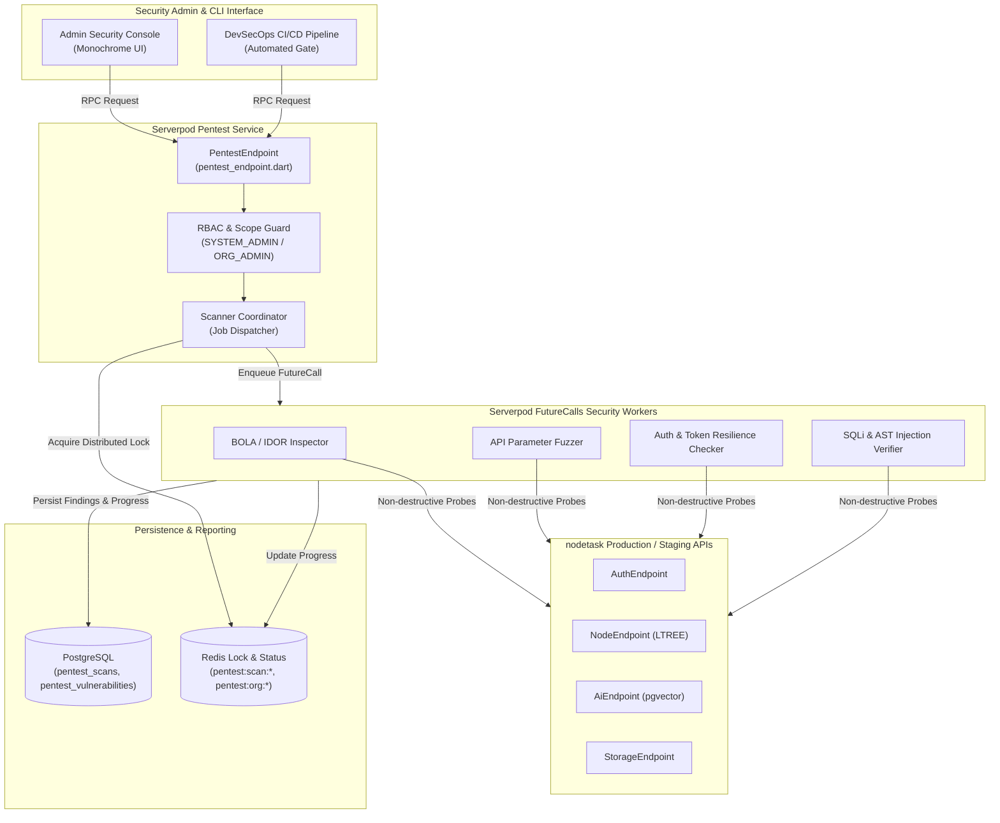
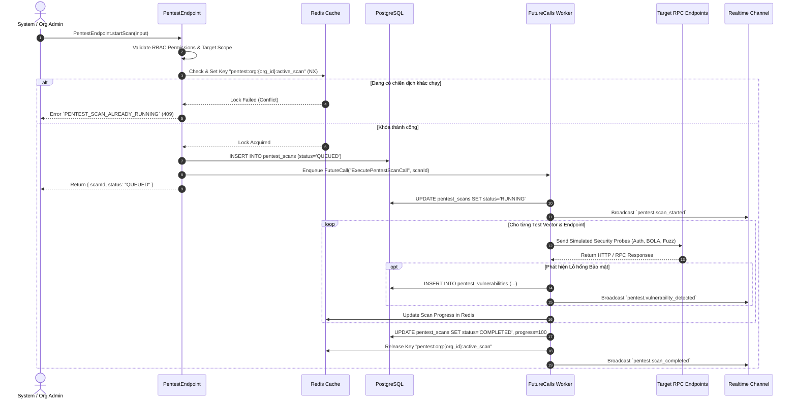
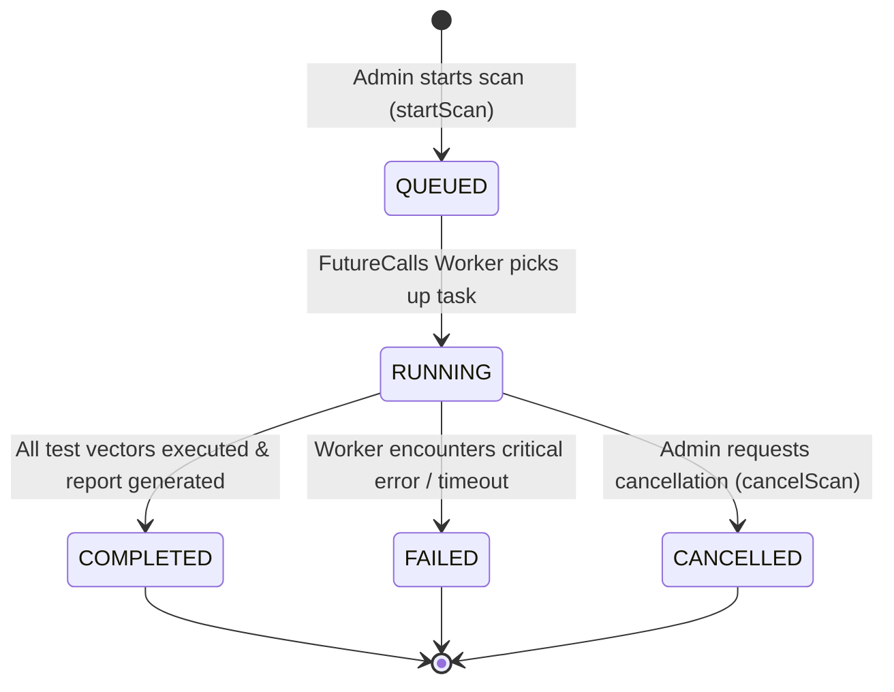

# Pentest & API Security Testing Service Specification (`pentest.md`)

> **Service**: `Pentest & API Security Testing Service`  
> **Package**: `apps/server/lib/src/endpoints/pentest_endpoint.dart`  
> **Specification Version**: `2.0.0`  
> **Status**: `APPROVED`  

---

### 1. Overview
Dịch vụ Pentest & API Security Testing Service chịu trách nhiệm kiểm thử an ninh tự động, đánh giá lỗ hổng bảo mật (Vulnerability Assessment) và mô phỏng tấn công xâm nhập có kiểm soát (DAST - Dynamic Application Security Testing, SAST, Fuzzing) trên các Serverpod RPC Endpoints và REST Gateways của hệ thống `nodetask`.

Dịch vụ tập trung kiểm định toàn diện theo chuẩn **OWASP API Security Top 10**:
1. **Broken Object Level Authorization (BOLA / IDOR)**: Kiểm tra truy cập chéo tài nguyên giữa các Tenant/Workspace mà không có quyền hợp lệ.
2. **Broken Authentication**: Thử nghiệm brute-force OTP, kiểm tra độ bền Token, giả mạo Session Key, bỏ qua bước xác thực đa yếu tố.
3. **Broken Object Property Level Authorization (Mass Assignment)**: Phát hiện khả năng ghi đè trái phép các trường nhạy cảm (`system_role`, `is_active`, `owner_id`).
4. **Unrestricted Resource Consumption**: Kiểm thử quá tải tài nguyên, vượt ngưỡng Rate Limit, flood WebSocket connections.
5. **Broken Function Level Authorization (BFLA)**: Đảm bảo người dùng thường (`USER`, `ORG_MEMBER`) không thể thực thi các RPC quản trị cấp cao (`SYSTEM_ADMIN`).
6. **Server-Side Request Forgery (SSRF)**: Kiểm tra các luồng tải file từ xa, webhook callback và webhook URL validation.
7. **Security Misconfiguration & Header Leakage**: Kiểm tra CORS policy, CSP, HSTS, Secure/HttpOnly Cookies và thông tin phiên bản nhạy cảm trong response headers.
8. **Lack of Protection from Automated Threats**: Kiểm tra khả năng chống replay attacks và credential stuffing.
9. **Improper Inventory Management & Shadow APIs**: Tự động phát hiện các endpoints cũ, deprecated hoặc chưa được đăng ký trong danh mục API chính thức.
10. **Unsafe Consumption of APIs & Injection**: Kiểm tra SQL Injection (PostgreSQL), Command Injection, XSS trong Rich Text Block Content (Tiptap AST JSON).

---

### 2. Endpoints
Hợp đồng giao tiếp qua Serverpod RPC Endpoint Methods:
- `PentestEndpoint.startScan(Session session, StartScanInput input)`
- `PentestEndpoint.getScanStatus(Session session, GetScanStatusInput input)`
- `PentestEndpoint.listScans(Session session, ListScansInput input)`
- `PentestEndpoint.getVulnerabilityReport(Session session, GetReportInput input)`
- `PentestEndpoint.runEndpointFuzzTest(Session session, RunFuzzTestInput input)`
- `PentestEndpoint.cancelScan(Session session, CancelScanInput input)`

---

### 3. Request
Cấu trúc Request DTOs:

```typescript
interface StartScanInput {
  targetScope: 'FULL_SYSTEM' | 'WORKSPACE_SCOPE' | 'AUTH_GATEWAY' | 'STORAGE_PIPELINE' | 'AI_VECTOR_ENGINE';
  scanType: 'PASSIVE_AUDIT' | 'ACTIVE_FUZZING' | 'BOLA_INSPECTION' | 'FULL_PENETRATION_TEST';
  targetWorkspaceId?: string;
  targetOrganizationId?: string;
  concurrencyLimit?: number; // Số lượng workers đồng thời (1 - 10)
  enableDestructivePayloads?: boolean; // Mặc định false (chỉ chạy safe/read-only payloads)
}

interface GetScanStatusInput {
  scanId: string;
}

interface ListScansInput {
  page?: number;
  pageSize?: number;
  statusFilter?: 'QUEUED' | 'RUNNING' | 'COMPLETED' | 'FAILED' | 'CANCELLED';
  organizationId?: string;
}

interface GetReportInput {
  scanId: string;
  minSeverity?: 'INFO' | 'LOW' | 'MEDIUM' | 'HIGH' | 'CRITICAL';
  exportFormat?: 'JSON' | 'MARKDOWN' | 'PDF';
}

interface RunFuzzTestInput {
  endpointName: string; // Ví dụ: 'NodeEndpoint.reorder'
  methodName: string;
  testVectors: Array<'SQL_INJECTION' | 'AUTH_BYPASS' | 'BOLA' | 'PAYLOAD_OVERFLOW' | 'UNICODE_CORRUPTION'>;
  iterationCount?: number; // 10 - 500
}

interface CancelScanInput {
  scanId: string;
  reason?: string;
}
```

---

### 4. Response
Cấu trúc Response DTOs:

```typescript
interface VulnerabilityDetail {
  id: string;
  scanId: string;
  endpointName: string;
  vulnerabilityType: string;
  owaspCategory: string; // Ví dụ: 'API1:2023-BOLA'
  severity: 'INFO' | 'LOW' | 'MEDIUM' | 'HIGH' | 'CRITICAL';
  cvssScore: number; // 0.0 - 10.0
  title: string;
  description: string;
  reproductionSteps: string[];
  proofOfConceptPayload?: string;
  remediationAdvice: string;
  detectedAt: string;
}

interface ScanSummary {
  id: string;
  targetScope: string;
  scanType: string;
  status: 'QUEUED' | 'RUNNING' | 'COMPLETED' | 'FAILED' | 'CANCELLED';
  progressPercentage: number;
  totalEndpointsScanned: number;
  vulnerabilitiesFoundCount: {
    critical: number;
    high: number;
    medium: number;
    low: number;
    info: number;
  };
  startedAt: string;
  completedAt?: string;
  durationSeconds?: number;
}

interface StartScanResponse {
  scanId: string;
  status: 'QUEUED';
  message: string;
  estimatedDurationSeconds: number;
}

interface ScanReportResponse {
  summary: ScanSummary;
  vulnerabilities: VulnerabilityDetail[];
  complianceScore: number; // Thang điểm 0 - 100
  exportDownloadUrl?: string;
}

interface FuzzTestResult {
  endpointName: string;
  totalIterations: number;
  passedCount: number;
  failedCount: number;
  anomaliesDetected: Array<{
    payload: string;
    httpStatus: number;
    responseTimeMs: number;
    potentialIssue: string;
  }>;
  executionTimeMs: number;
}

interface ListScansResponse {
  items: ScanSummary[];
  total: number;
  page: number;
  pageSize: number;
}
```

---

### 5. Validation
Quy chuẩn kiểm tra tính hợp lệ dữ liệu đầu vào:
- `targetScope`: Bắt buộc thuộc một trong các enum hợp lệ (`FULL_SYSTEM`, `WORKSPACE_SCOPE`, `AUTH_GATEWAY`, `STORAGE_PIPELINE`, `AI_VECTOR_ENGINE`).
- `concurrencyLimit`: Số nguyên dương trong khoảng từ `1` đến `10` (Mặc định: `3` để tránh làm nghẽn CPU server).
- `enableDestructivePayloads`: Chỉ cho phép `true` khi người thực hiện là `SYSTEM_ADMIN` và môi trường là `staging`/`development`. Tuyệt đối từ chối trên `production`.
- `iterationCount`: Số nguyên trong khoảng từ `10` đến `500` (Mặc định: `50`).
- `scanId`: Định dạng chuẩn UUID v4 hợp lệ.

---

### 6. Permissions
Ma trận Phân quyền Truy cập (RBAC Matrix):

| Endpoint Method | GUEST | USER | ORG_MEMBER | ORG_ADMIN | SYSTEM_ADMIN |
| :--- | :---: | :---: | :---: | :---: | :---: |
| `PentestEndpoint.startScan` | ❌ | ❌ | ❌ | ✅ (Org Scope Only) | ✅ (Full System) |
| `PentestEndpoint.getScanStatus` | ❌ | ❌ | ❌ | ✅ (Org Scope Only) | ✅ (All Scans) |
| `PentestEndpoint.listScans` | ❌ | ❌ | ❌ | ✅ (Org Scope Only) | ✅ (All Scans) |
| `PentestEndpoint.getVulnerabilityReport` | ❌ | ❌ | ❌ | ✅ (Org Scope Only) | ✅ (All Scans) |
| `PentestEndpoint.runEndpointFuzzTest` | ❌ | ❌ | ❌ | ❌ | ✅ (Full System) |
| `PentestEndpoint.cancelScan` | ❌ | ❌ | ❌ | ✅ (Own Org Scans) | ✅ (All Scans) |

---

### 7. Errors
Bảng mã lỗi và HTTP Status tương ứng:

| Mã Lỗi (Error Code) | HTTP Status | Nguyên nhân | Hướng xử lý Client |
| :--- | :--- | :--- | :--- |
| `PENTEST_UNAUTHORIZED_TARGET` | `403 Forbidden` | Cố gắng quét phạm vi hệ thống hoặc tổ chức mà người dùng không có quyền quản trị. | Chỉ định đúng phạm vi tổ chức của mình. |
| `PENTEST_SCAN_ALREADY_RUNNING` | `409 Conflict` | Đang có một chiến dịch quét bảo mật chạy trên cùng phạm vi mục tiêu. | Chờ chiến dịch hiện tại hoàn tất hoặc hủy trước khi bắt đầu mới. |
| `PENTEST_SCAN_NOT_FOUND` | `404 Not Found` | Mã `scanId` không tồn tại trong cơ sở dữ liệu. | Kiểm tra lại danh sách mã quét hợp lệ. |
| `PENTEST_RATE_LIMIT_BLOCKED` | `429 Too Many Requests` | Số lượng yêu cầu khởi tạo quét vượt quá hạn mức an toàn (tối đa 3 lần/giờ). | Thử lại sau khi hết thời gian cooldown. |
| `PENTEST_DESTRUCTIVE_NOT_ALLOWED` | `400 Bad Request` | Kích hoạt payload phá hủy dữ liệu trên môi trường production. | Chuyển chế độ sang an toàn (`enableDestructivePayloads = false`). |
| `FORBIDDEN` | `403 Forbidden` | Người dùng không đủ thẩm quyền (Yêu cầu `ORG_ADMIN` hoặc `SYSTEM_ADMIN`). | Nâng cấp quyền tài khoản. |
| `INVALID_INPUT` | `400 Bad Request` | Tham số cấu hình quét không vượt qua Zod/Dart boundary validation. | Điều chỉnh lại tham số đầu vào. |
| `INTERNAL_ERROR` | `500 Internal Error` | Lỗi phát sinh từ worker nền khi điều phối kiểm thử an ninh. | Kiểm tra system audit logs. |

---

### 8. Events
Danh sách Domain Events phát sinh:
- `pentest.scan_started`: Phát ra khi chiến dịch quét bắt đầu được gán worker và khởi chạy.
- `pentest.vulnerability_detected`: Phát ra ngay khi phát hiện một lỗ hổng an ninh mới (kèm mức độ nghiêm trọng `CRITICAL` / `HIGH`).
- `pentest.scan_completed`: Phát ra khi toàn bộ các bài test hoàn tất và báo cáo đã sẵn sàng.
- `pentest.scan_failed`: Phát ra khi tiến trình quét gặp lỗi bất khả kháng.

---

### 9. Cache
Chiến lược Caching qua Redis:
- **Keys & TTL**:
  - `pentest:scan:{scan_id}:summary` -> Thông tin tóm tắt và tiến độ của chiến dịch quét (TTL: 1h).
  - `pentest:rules:active` -> Danh mục các bộ quy tắc và test vectors bảo mật hiện hành (TTL: 24h).
  - `pentest:org:{organization_id}:active_scan` -> Khóa chặn xung đột quét đồng thời theo từng tổ chức (TTL: 2h, tự giải phóng khi scan kết thúc).
- **Invalidation Strategy**:
  - Khi scan chuyển trạng thái (`RUNNING` $\rightarrow$ `COMPLETED` / `FAILED` / `CANCELLED`) $\rightarrow$ Xóa `pentest:org:{organization_id}:active_scan` và cập nhật `pentest:scan:{scan_id}:summary`.

---

### 10. Examples
Ví dụ tích hợp TypeScript Frontend Client / CLI Security Suite:

```typescript
import { api } from '@/services/api';

// 1. Khởi chạy chiến dịch kiểm thử an ninh cho Tổ chức
const startResponse = await api.post('/rpc/pentest/startScan', {
  targetScope: 'WORKSPACE_SCOPE',
  scanType: 'BOLA_INSPECTION',
  targetOrganizationId: 'org-uuid-1234',
  concurrencyLimit: 4,
  enableDestructivePayloads: false
});
console.log('Chiến dịch quét đã khởi tạo:', startResponse.data.scanId);

// 2. Theo dõi tiến độ quét an ninh
const statusResponse = await api.post('/rpc/pentest/getScanStatus', {
  scanId: startResponse.data.scanId
});
console.log(`Tiến độ quét: ${statusResponse.data.progressPercentage}%`);

// 3. Lấy báo cáo chi tiết các lỗ hổng đã phát hiện
const reportResponse = await api.post('/rpc/pentest/getVulnerabilityReport', {
  scanId: startResponse.data.scanId,
  minSeverity: 'MEDIUM',
  exportFormat: 'JSON'
});
console.log('Điểm tuân thủ bảo mật:', reportResponse.data.complianceScore);
console.log('Danh sách lỗ hổng phát hiện:', reportResponse.data.vulnerabilities);
```

---

### 11. Diagrams

#### 11.1. Architecture & Pentest Engine Topology


#### 11.2. Asynchronous Security Scan Execution Flow


#### 11.3. Pentest Campaign Lifecycle State Machine

