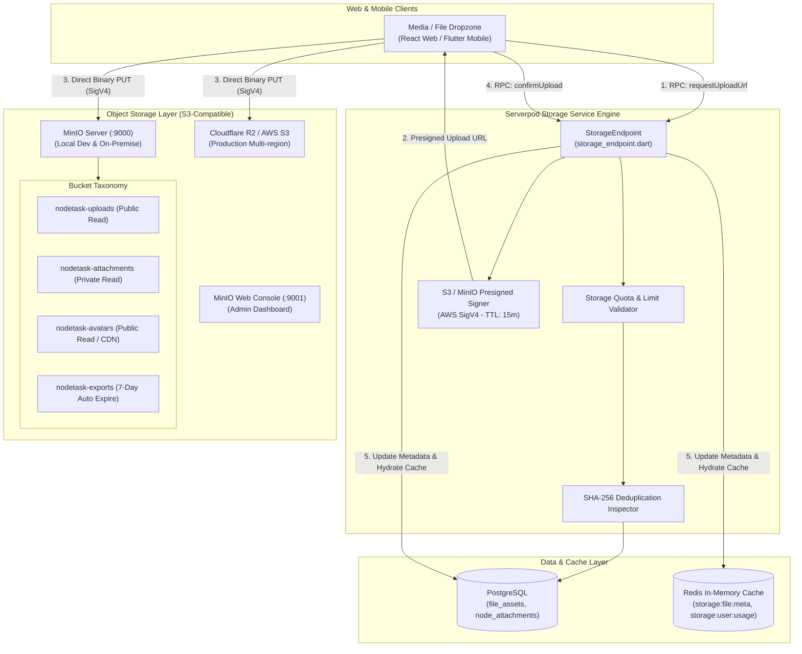
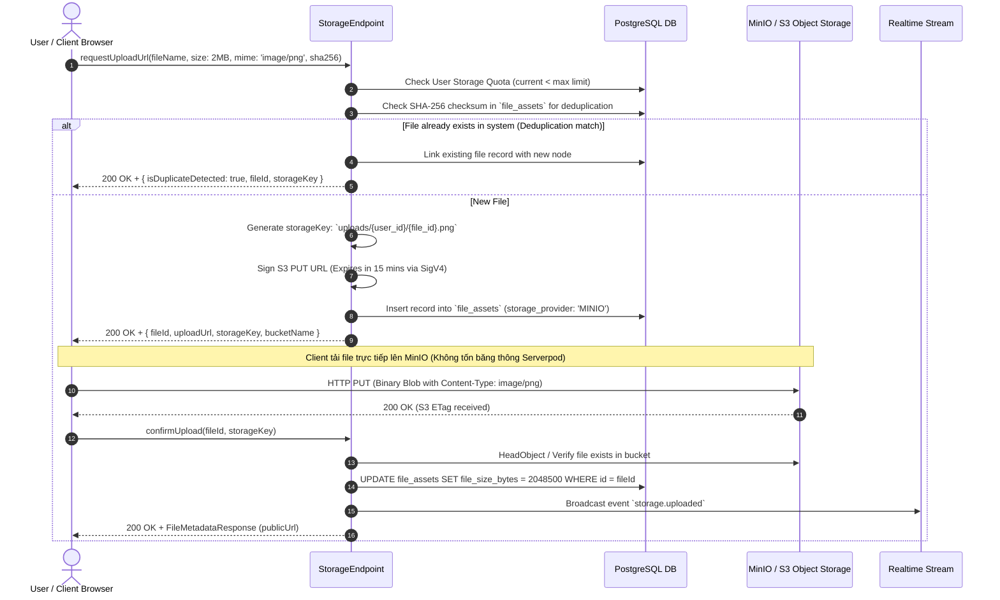
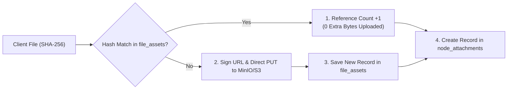

# Storage & File Attachments Service Specification (`storage.md`)

> **Service**: `Storage & File Attachments Service`  
> **Package**: `apps/server/lib/src/endpoints/storage_endpoint.dart`  
> **Specification Version**: `2.1.0`  
> **Status**: `APPROVED`  

---

### 1. Overview
Dịch vụ Storage & File Attachments Service chịu trách nhiệm quản lý toàn bộ vòng đời tệp tin đa phương tiện và file đính kèm trong nền tảng `nodetask`. Dịch vụ hỗ trợ: tải lên file nhúng trong ghi chú Tiptap (ảnh JPG/PNG/WebP/SVG), tài liệu đính kèm nút (`node_attachments` như PDF, Word, Excel, Markdown, Zip), tệp xuất bản tạm thời (PDF/HTML export), và ảnh đại diện Workspace/User.

Hạ tầng lưu trữ được trừu tượng hóa qua **S3-Compatible Storage Driver Adapter** tương thích 100% chuẩn AWS S3 API:
1. **Môi trường Development & On-Premise**: Sử dụng **MinIO Object Storage** cục bộ (`http://localhost:9000` cho S3 API và `http://localhost:9001` cho MinIO Web Console).
2. **Môi trường Production**: Hỗ trợ chuyển đổi liền mạch sang **Cloudflare R2** (Zero Egress Fees) hoặc **AWS S3** mà không thay đổi bất kỳ dòng mã nghiệp vụ nào.
3. **Cơ chế 3-Way Presigned URL Handshake**: Toàn bộ luồng tải lên/tải xuống tệp tin dung lượng lớn đều thực hiện trực tiếp giữa Client (Web/Mobile) và MinIO/S3 thông qua **Presigned PUT/GET URLs** (ký bằng AWS Signature Version 4 với TTL 15 phút), giải phóng 100% băng thông và bộ nhớ RAM của Serverpod API Server.
4. **Content Deduplication qua SHA-256**: Tự động phát hiện tệp tin trùng lặp dựa trên mã băm SHA-256, tăng số lượng tham chiếu (Reference Count) và liên kết ngay lập tức mà không cần tốn tài nguyên tải lên nhiều lần.
5. **Phân cấp Bucket Chuyên biệt (Bucket Taxonomy)**:
   - `nodetask-uploads`: Lưu trữ tệp tải lên tạm thời và ảnh nhúng trong block editor Tiptap (Public Read).
   - `nodetask-attachments`: Lưu trữ tài liệu đính kèm nút ghi chú phân cấp (Private Read qua Presigned GET).
   - `nodetask-avatars`: Lưu trữ ảnh đại diện người dùng và logo tổ chức (Public Read qua CDN).
   - `nodetask-exports`: Lưu trữ tệp xuất PDF/Markdown tự động dọn dẹp sau 7 ngày (Lifecycle Expire).

---

### 2. Endpoints
Hợp đồng giao tiếp qua Serverpod RPC Endpoint Methods:
- `StorageEndpoint.requestUploadUrl(Session session, RequestUploadUrlInput input)`
- `StorageEndpoint.confirmUpload(Session session, ConfirmUploadInput input)`
- `StorageEndpoint.getFileMetadata(Session session, String fileId)`
- `StorageEndpoint.getPresignedDownloadUrl(Session session, GetDownloadUrlInput input)`
- `StorageEndpoint.listNodeAttachments(Session session, String nodeId)`
- `StorageEndpoint.attachFileToNode(Session session, AttachFileInput input)`
- `StorageEndpoint.detachFileFromNode(Session session, DetachFileInput input)`
- `StorageEndpoint.deleteFile(Session session, String fileId)`
- `StorageEndpoint.getUserStorageUsage(Session session)`

---

### 3. Request
Cấu trúc Request DTOs:

```typescript
type FileCategory = 'EMBEDDED_IMAGE' | 'ATTACHMENT' | 'AVATAR' | 'EXPORT_TEMP';
type StorageProviderType = 'MINIO' | 'S3' | 'R2' | 'LOCAL';

interface RequestUploadUrlInput {
  workspaceId?: string;
  nodeId?: string;
  fileName: string;
  fileSizeBytes: number;
  mimeType: string;
  category: FileCategory;
  checksumSha256?: string;
}

interface ConfirmUploadInput {
  fileId: string;
  storageKey: string;
}

interface GetDownloadUrlInput {
  fileId: string;
  expiresInSeconds?: number; // Mặc định: 900s (15 phút)
}

interface AttachFileInput {
  nodeId: string;
  fileId: string;
  displayName?: string;
}

interface DetachFileInput {
  nodeId: string;
  fileId: string;
}

interface ListNodeAttachmentsInput {
  nodeId: string;
  category?: FileCategory;
}
```

---

### 4. Response
Cấu trúc Response DTOs:

```typescript
interface RequestUploadUrlResponse {
  fileId: string;
  uploadUrl: string; // Presigned S3/MinIO PUT URL (AWS SigV4)
  storageKey: string;
  bucketName: string;
  expiresInSeconds: number;
  isDuplicateDetected: boolean; // Nếu file đã tồn tại theo SHA-256 hash
}

interface PresignedDownloadUrlResponse {
  fileId: string;
  downloadUrl: string;
  expiresInSeconds: number;
  fileName: string;
  mimeType: string;
}

interface FileMetadataResponse {
  id: string;
  workspaceId?: string;
  userId: string;
  fileName: string;
  fileSizeBytes: number;
  mimeType: string;
  category: FileCategory;
  storageKey: string;
  publicUrl: string;
  storageProvider: StorageProviderType;
  checksumSha256?: string;
  createdAt: string;
}

interface NodeAttachmentItem {
  attachmentId: string;
  nodeId: string;
  file: FileMetadataResponse;
  displayName: string;
  attachedAt: string;
}

interface StorageUsageResponse {
  usedBytes: number;
  quotaBytes: number;
  usagePercentage: number;
  filesCount: number;
  storageProvider: StorageProviderType;
}
```

---

### 5. Validation
Quy chuẩn kiểm tra tính hợp lệ dữ liệu đầu vào:
- `fileName`: Bắt buộc, chuỗi từ 1 đến 255 ký tự, không chứa ký tự cấm `/ \ : * ? " < > |`.
- `fileSizeBytes`: Bắt buộc, giới hạn tối đa tùy danh mục:
  - `EMBEDDED_IMAGE`: Tối đa 10 MB (`10 * 1024 * 1024` bytes).
  - `ATTACHMENT`: Tối đa 50 MB (`50 * 1024 * 1024` bytes).
  - `AVATAR`: Tối đa 2 MB (`2 * 1024 * 1024` bytes).
  - `EXPORT_TEMP`: Tối đa 100 MB (`100 * 1024 * 1024` bytes).
- `mimeType`: Bắt buộc nằm trong danh sách whitelist cho phép: `image/jpeg`, `image/png`, `image/webp`, `image/svg+xml`, `application/pdf`, `text/plain`, `text/markdown`, `application/zip`, `application/vnd.openxmlformats-officedocument.wordprocessingml.document`.
- `expiresInSeconds`: Giới hạn từ `60` đến `3600` giây (Mặc định: `900` giây).

---

### 6. Permissions
Ma trận Phân quyền Truy cập (RBAC Matrix):

| Endpoint Method | GUEST | USER | ORG_MEMBER | ORG_ADMIN | SYSTEM_ADMIN |
| :--- | :---: | :---: | :---: | :---: | :---: |
| `StorageEndpoint.requestUploadUrl` | ❌ | ✅ (Personal Quota) | ✅ (Org Quota) | ✅ (Org Quota) | ✅ (Unlimited) |
| `StorageEndpoint.confirmUpload` | ❌ | ✅ (Owner) | ✅ (Owner) | ✅ (Org Scope) | ✅ (All) |
| `StorageEndpoint.getFileMetadata` | ❌ (Public only) | ✅ (Owner/Shared) | ✅ (Org Scope) | ✅ (Org Scope) | ✅ (All) |
| `StorageEndpoint.getPresignedDownloadUrl` | ❌ (Public only) | ✅ (Owner/Shared) | ✅ (Org Scope) | ✅ (Org Scope) | ✅ (All) |
| `StorageEndpoint.listNodeAttachments` | ❌ (Public only) | ✅ (Owner/Shared) | ✅ (Org Scope) | ✅ (Org Scope) | ✅ (All) |
| `StorageEndpoint.attachFileToNode` | ❌ | ✅ (Editor/Owner) | ✅ (Editor/Owner) | ✅ (Org Scope) | ✅ (All) |
| `StorageEndpoint.detachFileFromNode` | ❌ | ✅ (Editor/Owner) | ✅ (Editor/Owner) | ✅ (Org Scope) | ✅ (All) |
| `StorageEndpoint.deleteFile` | ❌ | ✅ (Owner) | ✅ (Owner) | ✅ (Org Scope) | ✅ (All) |
| `StorageEndpoint.getUserStorageUsage` | ❌ | ✅ (Self) | ✅ (Self) | ✅ (Org Scope) | ✅ (All) |

---

### 7. Errors
Bảng mã lỗi và HTTP Status tương ứng:

| Mã Lỗi (Error Code) | HTTP Status | Nguyên nhân | Hướng xử lý Client |
| :--- | :--- | :--- | :--- |
| `STORAGE_QUOTA_EXCEEDED` | `413 Payload Too Large` | Người dùng hoặc tổ chức đã sử dụng hết dung lượng lưu trữ cho phép. | Gợi ý dọn dẹp file cũ hoặc nâng cấp gói lưu trữ. |
| `UNSUPPORTED_MIME_TYPE` | `415 Unsupported Media Type` | File tải lên không nằm trong danh mục định dạng được phép. | Thông báo định dạng tệp không được hỗ trợ. |
| `FILE_TOO_LARGE` | `413 Payload Too Large` | Kích thước file vượt quá ngưỡng tối đa cho danh mục tương ứng. | Chọn file có kích thước nhỏ hơn giới hạn. |
| `FILE_NOT_FOUND` | `404 Not Found` | Không tìm thấy tệp tin yêu cầu trong bảng `file_assets`. | Thông báo tệp tin không tồn tại. |
| `MINIO_CONNECTION_FAILED` | `502 Bad Gateway` | Không thể kết nối tới MinIO / S3 Object Storage để ký URL hoặc kiểm tra tệp. | Kiểm tra trạng thái container MinIO hoặc kết nối mạng. |
| `PRESIGNED_URL_EXPIRED` | `410 Gone` | Presigned URL đã quá hạn thời gian hiệu lực (15 phút). | Yêu cầu cấp mới Presigned URL. |
| `CHECKSUM_MISMATCH` | `400 Bad Request` | Mã băm SHA-256 của file tải lên không khớp với thông tin đã khai báo. | Tải lại file từ client. |
| `FORBIDDEN` | `403 Forbidden` | Không có quyền thao tác trên tệp tin này (RBAC violation). | Báo lỗi quyền truy cập. |
| `INVALID_INPUT` | `400 Bad Request` | Tên file hoặc tham số tải lên chứa ký tự không hợp lệ. | Điều chỉnh lại dữ liệu đầu vào. |
| `INTERNAL_ERROR` | `500 Internal Error` | Lỗi trong quá trình tạo Presigned URL hoặc ghi dữ liệu PostgreSQL. | Thông báo thử lại sau ít phút. |

---

### 8. Events
Danh sách Domain Events phát sinh:
- `storage.uploaded`: Phát ra khi tệp tin được xác nhận tải lên thành công trên Object Storage.
- `storage.attached`: Phát ra khi tệp tin được liên kết vào một nút tài liệu.
- `storage.detached`: Phát ra khi tệp tin bị gỡ bỏ khỏi nút tài liệu.
- `storage.deleted`: Phát ra khi tệp tin bị xóa vĩnh viễn khỏi hệ thống lưu trữ.
- `storage.bucket_created`: Phát ra khi hệ sinh thái MinIO khởi tạo thành công một Bucket mới.

---

### 9. Cache
Chiến lược Caching qua Redis:
- **Keys & TTL**:
  - `storage:file:{file_id}:meta` -> Siêu dữ liệu của tệp tin trong `file_assets` (TTL: 24h).
  - `storage:node:{node_id}:attachments` -> Danh sách file đính kèm theo node (TTL: 1h).
  - `storage:user:{user_id}:usage` -> Thống kê dung lượng đã dùng (TTL: 10m).
  - `storage:presigned:{file_id}:download` -> Cache Presigned Download URL còn hiệu lực (TTL: 10m).
- **Invalidation Strategy**:
  - Khi có thao tác `attachFileToNode` hoặc `detachFileFromNode` $\rightarrow$ Xóa cache `storage:node:{node_id}:attachments`.
  - Khi xác nhận upload hoặc xóa file $\rightarrow$ Xóa cache `storage:user:{user_id}:usage`, `storage:file:{file_id}:meta` và `storage:presigned:{file_id}:download`.

---

### 10. Examples
Ví dụ tích hợp TypeScript Frontend Client:

```typescript
import { api } from '@/services/api';

// 1. Yêu cầu Presigned URL để upload file ảnh trực tiếp lên MinIO/S3 Object Storage
const uploadSession = await api.post('/rpc/storage/requestUploadUrl', {
  nodeId: 'doc-node-1234',
  fileName: 'system-architecture.png',
  fileSizeBytes: 2048500,
  mimeType: 'image/png',
  category: 'EMBEDDED_IMAGE',
  checksumSha256: 'e3b0c44298fc1c149afbf4c8996fb92427ae41e4649b934ca495991b7852b855'
});

// Nếu phát hiện file trùng lặp (Deduplication), có thể dùng ngay URL mà không cần upload
if (uploadSession.data.isDuplicateDetected) {
  console.log('File trùng lặp đã tồn tại, liên kết ngay:', uploadSession.data.storageKey);
} else {
  // 2. Upload file nhị phân trực tiếp lên MinIO S3 API qua Fetch API
  await fetch(uploadSession.data.uploadUrl, {
    method: 'PUT',
    headers: { 'Content-Type': 'image/png' },
    body: fileBlob
  });

  // 3. Xác nhận hoàn tất upload với Backend Serverpod
  const confirmed = await api.post('/rpc/storage/confirmUpload', {
    fileId: uploadSession.data.fileId,
    storageKey: uploadSession.data.storageKey
  });
  console.log('Public URL của ảnh:', confirmed.data.publicUrl);
}
```

---

### 11. Diagrams

#### 11.1. Architecture & MinIO S3 Object Storage Topology


#### 11.2. 3-Way Presigned Upload Handshake Sequence


#### 11.3. File Deduplication & Attachment Linkage Flow

