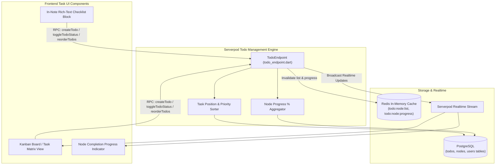
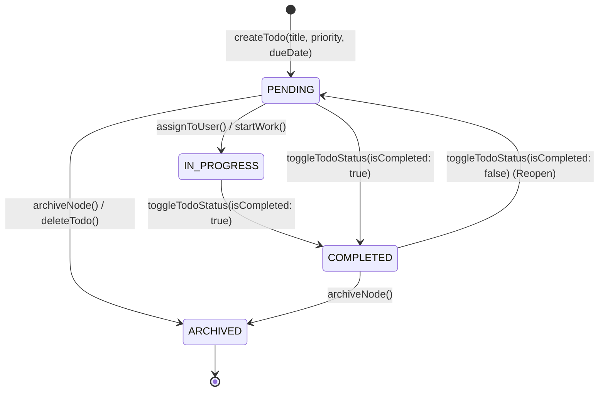
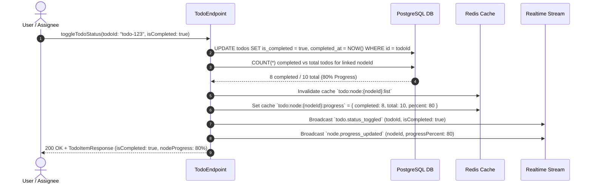

# Todo & Task Management Service Specification (`todo.md`)

> **Service**: `Todo & Task Management Service`  
> **Package**: `apps/server/lib/src/endpoints/todo_endpoint.dart`  
> **Specification Version**: `2.0.0`  
> **Status**: `APPROVED`  

---

### 1. Overview
Dịch vụ Todo & Task Management Service chịu trách nhiệm quản lý các đầu việc (Tasks/Todos) đính kèm trực tiếp vào từng Nút tài liệu (`node_todos`) hoặc theo dõi tổng thể trong toàn bộ Workspace. Dịch vụ cung cấp các tính năng: tạo mới, cập nhật tiêu đề, gán mức độ ưu tiên (`LOW`, `MEDIUM`, `HIGH`), hạn chót (`dueDate`), chuyển đổi trạng thái hoàn thành (`toggleTodoStatus`), tính toán tự động tỷ lệ phần trăm hoàn thành theo từng nút và toàn bộ Workspace, cùng cơ chế phản hồi lạc quan (Optimistic UI) dưới 16ms.

---

### 2. Endpoints
Hợp đồng giao tiếp qua Serverpod RPC Endpoint Methods:
- `TodoEndpoint.listNodeTodos(Session session, String nodeId)`
- `TodoEndpoint.listWorkspaceTodos(Session session, ListWorkspaceTodosInput input)`
- `TodoEndpoint.createTodo(Session session, CreateTodoInput input)`
- `TodoEndpoint.updateTodo(Session session, UpdateTodoInput input)`
- `TodoEndpoint.toggleTodoStatus(Session session, ToggleTodoStatusInput input)`
- `TodoEndpoint.deleteTodo(Session session, String todoId)`
- `TodoEndpoint.reorderTodos(Session session, ReorderTodosInput input)`
- `TodoEndpoint.getNodeProgress(Session session, String nodeId)`

---

### 3. Request
Cấu trúc Request DTOs:

```typescript
type TodoPriority = 'LOW' | 'MEDIUM' | 'HIGH';

interface ListWorkspaceTodosInput {
  workspaceId: string;
  isCompleted?: boolean;
  priority?: TodoPriority;
  page?: number;
  pageSize?: number;
}

interface CreateTodoInput {
  nodeId: string;
  title: string;
  priority?: TodoPriority;
  dueDate?: string;
}

interface UpdateTodoInput {
  todoId: string;
  title?: string;
  priority?: TodoPriority;
  dueDate?: string;
}

interface ToggleTodoStatusInput {
  todoId: string;
  isCompleted: boolean;
}

interface TodoReorderItem {
  todoId: string;
  position: number;
}

interface ReorderTodosInput {
  nodeId: string;
  items: TodoReorderItem[];
}
```

---

### 4. Response
Cấu trúc Response DTOs:

```typescript
interface NodeTodoResponse {
  id: string;
  nodeId: string;
  userId: string;
  title: string;
  isCompleted: boolean;
  priority: TodoPriority;
  dueDate?: string;
  position: number;
  createdAt: string;
  updatedAt: string;
}

interface NodeProgressResponse {
  nodeId: string;
  totalTodos: number;
  completedTodos: number;
  percentage: number;
}

interface ListTodosResponse {
  todos: NodeTodoResponse[];
  totalCount: number;
  progress: NodeProgressResponse;
}
```

---

### 5. Validation
Quy chuẩn kiểm tra tính hợp lệ dữ liệu đầu vào:
- `title`: Bắt buộc, chuỗi từ 1 đến 255 ký tự.
- `priority`: Enum `LOW`, `MEDIUM`, `HIGH` (Mặc định: `MEDIUM`).
- `dueDate`: Chuỗi ISO-8601 DateTime hợp lệ trong tương lai hoặc quá khứ gần.
- `items`: Mảng từ 1 đến 200 phần tử khi sắp xếp vị trí.

---

### 6. Permissions
Ma trận Phân quyền Truy cập (RBAC Matrix):

| Endpoint Method | GUEST | USER | ORG_MEMBER | ORG_ADMIN | SYSTEM_ADMIN |
| :--- | :---: | :---: | :---: | :---: | :---: |
| `TodoEndpoint.listNodeTodos` | ❌ (Public only) | ✅ (Owner/Viewer) | ✅ (Org Scope) | ✅ (Org Scope) | ✅ (All) |
| `TodoEndpoint.listWorkspaceTodos` | ❌ (Public only) | ✅ (Owner/Viewer) | ✅ (Org Scope) | ✅ (Org Scope) | ✅ (All) |
| `TodoEndpoint.createTodo` | ❌ | ✅ (Owner/Editor) | ✅ (Editor/Owner) | ✅ (Org Scope) | ✅ (All) |
| `TodoEndpoint.updateTodo` | ❌ | ✅ (Owner/Editor) | ✅ (Editor/Owner) | ✅ (Org Scope) | ✅ (All) |
| `TodoEndpoint.toggleTodoStatus` | ❌ | ✅ (Owner/Editor) | ✅ (Editor/Owner) | ✅ (Org Scope) | ✅ (All) |
| `TodoEndpoint.deleteTodo` | ❌ | ✅ (Owner/Editor) | ✅ (Editor/Owner) | ✅ (Org Scope) | ✅ (All) |
| `TodoEndpoint.reorderTodos` | ❌ | ✅ (Owner/Editor) | ✅ (Editor/Owner) | ✅ (Org Scope) | ✅ (All) |
| `TodoEndpoint.getNodeProgress` | ❌ (Public only) | ✅ (Owner/Viewer) | ✅ (Org Scope) | ✅ (Org Scope) | ✅ (All) |

---

### 7. Errors
Bảng mã lỗi và HTTP Status tương ứng:

| Mã Lỗi (Error Code) | HTTP Status | Nguyên nhân | Hướng xử lý Client |
| :--- | :--- | :--- | :--- |
| `TODO_NOT_FOUND` | `404 Not Found` | Không tìm thấy `todoId` yêu cầu. | Báo lỗi công việc không tồn tại. |
| `NODE_NOT_FOUND` | `404 Not Found` | Node liên kết không tồn tại. | Kiểm tra lại tài liệu gốc. |
| `FORBIDDEN` | `403 Forbidden` | Không có quyền chỉnh sửa Todo trong nút này. | Báo lỗi quyền truy cập. |
| `INVALID_INPUT` | `400 Bad Request` | Tiêu đề Todo rỗng hoặc sai định dạng ngày. | Hiển thị lỗi form. |
| `INTERNAL_ERROR` | `500 Internal Error` | Lỗi máy chủ nội bộ. | Thử lại sau. |

---

### 8. Events
Danh sách Domain Events phát sinh:
- `todo.created`: Phát ra khi tạo mới một Todo.
- `todo.updated`: Phát ra khi tiêu đề, mức ưu tiên hoặc hạn chót thay đổi.
- `todo.status_toggled`: Phát ra khi trạng thái hoàn thành của Todo thay đổi (kích hoạt tính lại tiến độ node).
- `todo.deleted`: Phát ra khi xóa Todo.

---

### 9. Cache
Chiến lược Caching qua Redis:
- **Keys & TTL**:
  - `todo:node:{node_id}:list` -> Danh sách Todo theo nút (TTL: 10m).
  - `todo:node:{node_id}:progress` -> Thống kê tiến độ % hoàn thành (TTL: 10m).
- **Invalidation Strategy**:
  - Khi có thao tác `createTodo`, `updateTodo`, `toggleTodoStatus`, `deleteTodo` -> Xóa cache `todo:node:{node_id}:list` và `todo:node:{node_id}:progress`.

---

### 10. Examples
Ví dụ tích hợp TypeScript Frontend Client:

```typescript
import { api } from '@/services/api';

// 1. Tạo Todo mới đính kèm nút tài liệu
const newTodo = await api.post('/rpc/todo/createTodo', {
  nodeId: 'doc-node-456',
  title: 'Hoàn thành bản vẽ ERD chi tiết cho Database',
  priority: 'HIGH',
  dueDate: '2026-08-20T17:00:00Z'
});

// 2. Chuyển đổi trạng thái hoàn thành (Toggle Status)
const toggled = await api.put('/rpc/todo/toggleTodoStatus', {
  todoId: newTodo.data.id,
  isCompleted: true
});
console.log('Trạng thái mới:', toggled.data.isCompleted);
```

---

### 11. Diagrams

#### 11.1. Architecture & Kanban Board Integration


#### 11.2. Todo State Machine & Task Transitions


#### 11.3. Task Completion & Node Progress Recalculation Sequence


