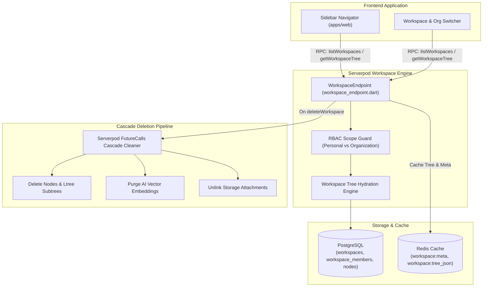
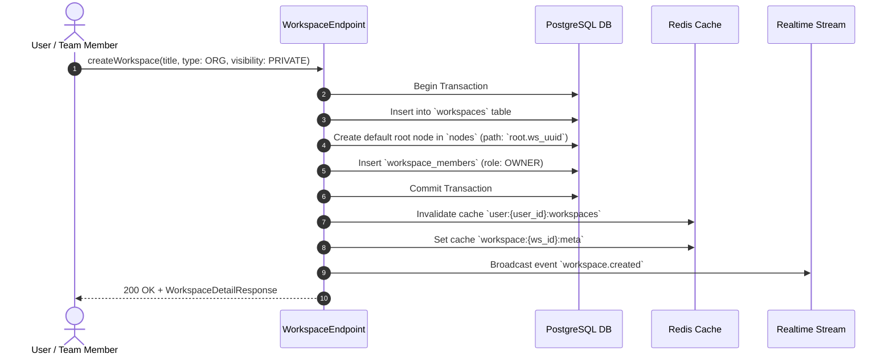
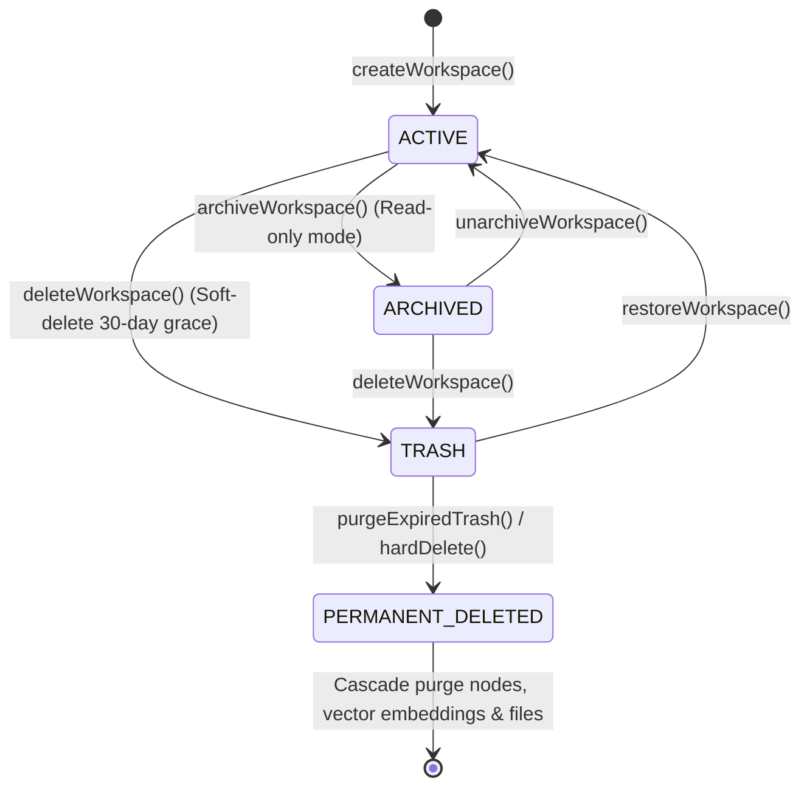

# Workspace Service Specification (`workspace.md`)

> **Service**: `Knowledge Workspace Service`  
> **Package**: `apps/server/lib/src/endpoints/workspace_endpoint.dart`  
> **Specification Version**: `2.0.0`  
> **Status**: `APPROVED`  

---

### 1. Overview
Dịch vụ Knowledge Workspace Service chịu trách nhiệm quản lý không gian tri thức làm việc (Workspace) cho người dùng cá nhân (Personal Workspace) và các tổ chức/nhóm làm việc (Organization Workspace). Dịch vụ cung cấp các cơ chế tạo mới, cập nhật thông tin, cấu hình chia sẻ công khai (`isPublic`), quản lý cây cấu trúc thư mục phân cấp cha-con, cấp quyền thành viên theo không gian làm việc (`OWNER`, `EDITOR`, `VIEWER`), và lưu trữ siêu dữ liệu (Metadata, Icon, Cover, Tags) phục vụ tra cứu.

---

### 2. Endpoints
Hợp đồng giao tiếp qua Serverpod RPC Endpoint Methods:
- `WorkspaceEndpoint.listWorkspaces(Session session, ListWorkspacesInput input)`
- `WorkspaceEndpoint.getWorkspace(Session session, String workspaceId)`
- `WorkspaceEndpoint.createWorkspace(Session session, CreateWorkspaceInput input)`
- `WorkspaceEndpoint.updateWorkspace(Session session, UpdateWorkspaceInput input)`
- `WorkspaceEndpoint.deleteWorkspace(Session session, String workspaceId)`
- `WorkspaceEndpoint.getWorkspaceTree(Session session, String workspaceId)`
- `WorkspaceEndpoint.updateWorkspaceSettings(Session session, UpdateWorkspaceSettingsInput input)`
- `WorkspaceEndpoint.shareWorkspace(Session session, ShareWorkspaceInput input)`

---

### 3. Request
Cấu trúc Request DTOs:

```typescript
type WorkspaceType = 'PERSONAL' | 'ORGANIZATION';
type WorkspaceVisibility = 'PRIVATE' | 'INTERNAL' | 'PUBLIC';
type WorkspaceMemberRole = 'OWNER' | 'EDITOR' | 'VIEWER';

interface ListWorkspacesInput {
  organizationId?: string;
  type?: WorkspaceType;
  page?: number;
  pageSize?: number;
}

interface CreateWorkspaceInput {
  organizationId?: string;
  title: string;
  description?: string;
  icon?: string;
  type: WorkspaceType;
  visibility: WorkspaceVisibility;
}

interface UpdateWorkspaceInput {
  workspaceId: string;
  title?: string;
  description?: string;
  icon?: string;
  visibility?: WorkspaceVisibility;
}

interface UpdateWorkspaceSettingsInput {
  workspaceId: string;
  allowPublicShare?: boolean;
  defaultMemberRole?: WorkspaceMemberRole;
  themePresetId?: string;
}

interface ShareWorkspaceInput {
  workspaceId: string;
  isPublic: boolean;
  publicAccessLevel?: 'READ' | 'COMMENT';
  publicPassword?: string;
}
```

---

### 4. Response
Cấu trúc Response DTOs:

```typescript
interface WorkspaceMemberSummary {
  userId: string;
  email: string;
  fullName: string;
  role: WorkspaceMemberRole;
  joinedAt: string;
}

interface WorkspaceResponse {
  id: string;
  organizationId?: string;
  ownerId: string;
  title: string;
  description?: string;
  icon?: string;
  type: WorkspaceType;
  visibility: WorkspaceVisibility;
  isPublic: boolean;
  nodeCount: number;
  membersCount: number;
  createdAt: string;
  updatedAt: string;
}

interface WorkspaceTreeNode {
  id: string;
  workspaceId: string;
  parentId?: string;
  path: string;
  nodeType: 'FOLDER' | 'DOCUMENT' | 'SECTION';
  title: string;
  position: number;
  version: number;
  children: WorkspaceTreeNode[];
}

interface WorkspaceTreeResponse {
  workspaceId: string;
  rootNodes: WorkspaceTreeNode[];
  totalNodes: number;
}
```

---

### 5. Validation
Quy chuẩn kiểm tra tính hợp lệ dữ liệu đầu vào (Zod Schema & Trust Boundary):
- `title`: Bắt buộc, chuỗi từ 1 đến 255 ký tự, không chứa ký tự điều khiển.
- `description`: Tùy chọn, tối đa 2000 ký tự.
- `type`: Thuộc enum `PERSONAL` hoặc `ORGANIZATION`. Nếu `ORGANIZATION`, bắt buộc truyền `organizationId` hợp lệ.
- `visibility`: Thuộc enum `PRIVATE`, `INTERNAL`, `PUBLIC`.
- `page` & `pageSize`: Số nguyên dương (`page >= 1`, `1 <= pageSize <= 100`).

---

### 6. Permissions
Ma trận Phân quyền Truy cập (RBAC Matrix):

| Endpoint Method | GUEST | USER | ORG_MEMBER | ORG_ADMIN | SYSTEM_ADMIN |
| :--- | :---: | :---: | :---: | :---: | :---: |
| `WorkspaceEndpoint.listWorkspaces` | ❌ | ✅ (Personal) | ✅ (Org Scope) | ✅ (Org Scope) | ✅ (All) |
| `WorkspaceEndpoint.getWorkspace` | ❌ (Public only) | ✅ (Owner/Shared) | ✅ (Org Scope) | ✅ (Org Scope) | ✅ (All) |
| `WorkspaceEndpoint.createWorkspace` | ❌ | ✅ (Personal) | ✅ (Org Scope) | ✅ (Org Scope) | ✅ (All) |
| `WorkspaceEndpoint.updateWorkspace` | ❌ | ✅ (Owner) | ✅ (Editor/Owner) | ✅ (Org Scope) | ✅ (All) |
| `WorkspaceEndpoint.deleteWorkspace` | ❌ | ✅ (Owner) | ❌ | ✅ (Org Scope) | ✅ (All) |
| `WorkspaceEndpoint.getWorkspaceTree` | ❌ (Public only) | ✅ (Owner/Shared) | ✅ (Org Scope) | ✅ (Org Scope) | ✅ (All) |
| `WorkspaceEndpoint.updateWorkspaceSettings` | ❌ | ✅ (Owner) | ❌ | ✅ (Org Scope) | ✅ (All) |
| `WorkspaceEndpoint.shareWorkspace` | ❌ | ✅ (Owner) | ❌ | ✅ (Org Scope) | ✅ (All) |

---

### 7. Errors
Bảng mã lỗi và HTTP Status tương ứng:

| Mã Lỗi (Error Code) | HTTP Status | Nguyên nhân | Hướng xử lý Client |
| :--- | :--- | :--- | :--- |
| `WORKSPACE_NOT_FOUND` | `404 Not Found` | Không tìm thấy `workspaceId` yêu cầu. | Thông báo không tìm thấy Workspace. |
| `FORBIDDEN` | `403 Forbidden` | Người dùng không có quyền truy cập hoặc chỉnh sửa Workspace. | Hiển thị thông báo không đủ quyền. |
| `INVALID_INPUT` | `400 Bad Request` | Dữ liệu đầu vào vi phạm Zod Validation. | Báo lỗi validation trên giao diện. |
| `UNAUTHORIZED` | `401 Unauthorized` | Phiên làm việc hết hạn hoặc chưa đăng nhập. | Điều hướng về trang Đăng nhập. |
| `WORKSPACE_LIMIT_REACHED` | `400 Bad Request` | Đạt giới hạn số lượng Workspace cho phép theo gói tài khoản. | Gợi ý nâng cấp gói thành viên. |
| `INTERNAL_ERROR` | `500 Internal Error` | Lỗi máy chủ nội bộ không xác định. | Thông báo thử lại sau ít phút. |

---

### 8. Events
Danh sách Domain Events phát sinh:
- `workspace.created`: Phát ra khi một Workspace mới được khởi tạo thành công.
- `workspace.updated`: Phát ra khi thông tin hoặc cài đặt Workspace thay đổi.
- `workspace.deleted`: Phát ra khi Workspace bị xóa (kích hoạt cascade dọn dẹp nodes, embeddings, attachments).
- `workspace.shared`: Phát ra khi trạng thái chia sẻ công khai của Workspace được cập nhật.

---

### 9. Cache
Chiến lược Caching qua Redis:
- **Keys & TTL**:
  - `workspace:{workspace_id}:meta` -> Metadata của Workspace (TTL: 1h).
  - `workspace:{workspace_id}:tree_json` -> Cây cấu trúc thư mục phân cấp JSON (TTL: 30m).
  - `user:{user_id}:workspaces` -> Danh sách Workspace của người dùng (TTL: 15m).
- **Invalidation Strategy**:
  - Khi có thao tác `createWorkspace`, `updateWorkspace`, `deleteWorkspace` -> Xóa cache `workspace:{id}:meta` và `user:{user_id}:workspaces`.
  - Khi có thao tác thêm/xóa/đổi vị trí nút con (`DocumentNode`) -> Xóa cache `workspace:{id}:tree_json`.

---

### 10. Examples
Ví dụ tích hợp TypeScript Frontend Client:

```typescript
import { api } from '@/services/api';

// 1. Tạo Workspace mới
const newWorkspace = await api.post('/rpc/workspace/createWorkspace', {
  title: 'Hệ thống Thiết kế Kiến trúc 2026',
  description: 'Tài liệu ghi chú và sơ đồ kiến trúc hệ thống phân tán',
  type: 'PERSONAL',
  visibility: 'PRIVATE'
});

// 2. Lấy cây cấu trúc thư mục phân cấp
const treeData = await api.get(`/rpc/workspace/getWorkspaceTree?workspaceId=${newWorkspace.data.id}`);
console.log('Cấu trúc cây tri thức:', treeData.data.rootNodes);
```

---

### 11. Diagrams

#### 11.1. Architecture & Multi-Tenant Boundary Topology


#### 11.2. Workspace Creation & Tree Hydration Sequence


#### 11.3. Workspace State Lifecycle Machine


