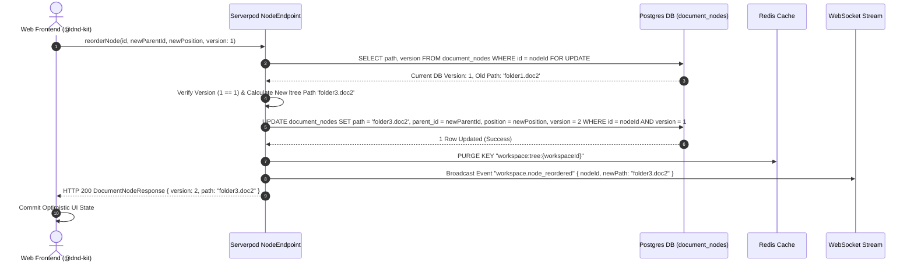

# Workspace & Knowledge Management Service Specification (`workspace.md`)

> **Service**: `Workspace & Knowledge Management Service`  
> **Package**: `apps/server/lib/src/endpoints/workspace_endpoint.dart` & `node_endpoint.dart`  
> **Specification Version**: `1.4.0`  
> **Status**: `APPROVED`  

---

### 1. Overview
Dịch vụ Workspace & Knowledge Management chịu trách nhiệm quản lý Không gian tài liệu tri thức (Workspace) cá nhân và tổ chức, cấu trúc cây nút tài liệu phân cấp (`DocumentNode`) bằng PostgreSQL `ltree` extension, trình soạn thảo Tiptap AST JSON, kéo-thả sắp xếp vị trí nút (Drag & Drop Reordering), cơ chế kiểm soát ghi đồng thời OCC (`version`), và tự động đẩy sự kiện sinh Vector Embeddings (`pgvector`) cho tìm kiếm AI RAG.

---

### 2. Endpoints
Hợp đồng giao tiếp qua Serverpod RPC Endpoint Methods:

#### 2.1 Workspace Level Endpoints
- `WorkspaceEndpoint.createWorkspace(Session session, CreateWorkspaceInput input)`
- `WorkspaceEndpoint.getWorkspace(Session session, String workspaceId)`
- `WorkspaceEndpoint.listWorkspaces(Session session)`
- `WorkspaceEndpoint.updateWorkspace(Session session, UpdateWorkspaceInput input)`
- `WorkspaceEndpoint.deleteWorkspace(Session session, String workspaceId)`
- `WorkspaceEndpoint.getPublicWorkspace(Session session, String shareToken)`

#### 2.2 Document Node & AST Tree Endpoints
- `NodeEndpoint.createNode(Session session, CreateNodeInput input)`
- `NodeEndpoint.getNode(Session session, String nodeId)`
- `NodeEndpoint.getWorkspaceTree(Session session, String workspaceId)`
- `NodeEndpoint.updateNodeContent(Session session, UpdateNodeContentInput input)`
- `NodeEndpoint.reorderNode(Session session, ReorderNodeInput input)`
- `NodeEndpoint.deleteNode(Session session, String nodeId)`

---

### 3. Request
Cấu trúc Request DTOs:

```typescript
interface CreateWorkspaceInput {
  title: string;
  description?: string;
  isPublic?: boolean;
  orgId?: string;
}

interface UpdateWorkspaceInput {
  id: string;
  title?: string;
  description?: string;
  isPublic?: boolean;
}

interface CreateNodeInput {
  workspaceId: string;
  parentId?: string | null;
  nodeType: 'WORKSPACE' | 'FOLDER' | 'DOCUMENT' | 'SECTION';
  title: string;
  content?: string | null; // Tiptap JSON AST string
}

interface UpdateNodeContentInput {
  id: string;
  title?: string;
  content: string; // Tiptap JSON AST string
  version: number; // Current client OCC version counter
}

interface ReorderNodeInput {
  id: string;
  newParentId?: string | null;
  newPosition: number;
  version: number;
}
```

---

### 4. Response
Cấu trúc Response DTOs:

```typescript
interface WorkspaceResponse {
  id: string;
  ownerId: string;
  orgId?: string;
  title: string;
  description?: string;
  isPublic: boolean;
  shareToken: string;
  createdAt: string;
  updatedAt: string;
}

interface DocumentNodeResponse {
  id: string;
  workspaceId: string;
  parentId?: string | null;
  path: string; // PostgreSQL ltree path string (e.g. 'folder1.doc2.section5')
  nodeType: 'WORKSPACE' | 'FOLDER' | 'DOCUMENT' | 'SECTION';
  title: string;
  content?: string | null; // Tiptap JSON AST
  position: number;
  version: number; // OCC Version counter
  createdAt: string;
  updatedAt: string;
  children?: DocumentNodeResponse[];
}
```

---

### 5. Validation
Quy tắc kiểm tra dữ liệu đầu vào (Dart & Serverpod Trust Boundary):
- `workspaceId`: Required, valid UUID v4 format.
- `title`: Required, string, min length 1, max length 200, trimmed.
- `nodeType`: Required, enum `'WORKSPACE' | 'FOLDER' | 'DOCUMENT' | 'SECTION'`.
- `content`: Optional, valid JSON string matching Tiptap AST specification schema.
- `version`: Required for updates, positive integer (`version >= 1`).
- `newPosition`: Required for reorder, non-negative integer (`newPosition >= 0`).

---

### 6. Permissions
Ma trận Phân quyền Truy cập & Tài nguyên (RBAC Matrix):

| System / Resource Role | Xem Workspace Công khai (`is_public: true`) | Tạo / Sửa Workspace Cá nhân | Xem / Sửa Node Cây Tài liệu Cá nhân | Quản trị Không gian Tổ chức | Quản trị Hệ thống |
| :--- | :--- | :--- | :--- | :--- | :--- |
| `GUEST` (Chưa đăng nhập) | ✅ (Qua Share Token) | ❌ | ❌ | ❌ | ❌ |
| `USER` (Thành viên Cá nhân) | ✅ | ✅ (Chỉ sở hữu của mình) | ✅ (Do mình tạo) | ❌ | ❌ |
| `ORG_MEMBER` (Thành viên Org) | ✅ | ✅ | ✅ | ✅ (Viewer / Editor Role) | ❌ |
| `SYSTEM_ADMIN` (Quản trị Hệ thống) | ✅ | ✅ | ✅ | ✅ | ✅ |

---

### 7. Errors
Mã lỗi chuẩn hóa trả về khi thao tác thất bại:

| Error Code Constant | HTTP Status | Nguyên nhân |
| :--- | :--- | :--- |
| `WORKSPACE_NOT_FOUND` | `404` | Workspace ID không tồn tại hoặc đã bị xóa. |
| `NODE_NOT_FOUND` | `404` | Document Node ID không tồn tại trong cây tài liệu. |
| `WORKSPACE_FORBIDDEN` | `403` | Người dùng không có quyền truy cập không gian tài liệu này. |
| `VERSION_CONFLICT` | `409` | Xung đột ghi đồng thời OCC (`version` client gửi khác `version` DB hiện tại). |
| `INVALID_PARENT_NODE` | `400` | Nút cha không hợp lệ hoặc gây ra vòng lặp cây tài liệu. |
| `LTREE_PATH_INVALID` | `400` | Đường dẫn `ltree` bị lỗi định dạng ký tự. |

---

### 8. Events
Danh sách sự kiện phát qua Serverpod Streaming Connection & Event Bus:
- `workspace.created`: Phát khi Workspace mới được tạo.
- `workspace.updated`: Phát khi thông tin Workspace thay đổi.
- `workspace.node_created`: Phát khi một nút tài liệu mới được tạo trong cây.
- `workspace.node_updated`: Tự động đẩy job ngầm tính toán lại Vector Embeddings (`pgvector`).
- `workspace.node_reordered`: Phát khi thứ tự các nút bị thay đổi kéo-thả (`ltree` path recalculation).
- `workspace.node_deleted`: Phát khi nút tài liệu bị xóa.

---

### 9. Cache Policy & Invalidation Rules
- **Workspace Info Cache**: `workspace:info:{id}` -> JSON Payload (TTL: 1 giờ).
- **Workspace Tree Cache**: `workspace:tree:{workspaceId}` -> Entire `DocumentNodeResponse[]` Tree (TTL: 24 giờ).
- **Invalidation Rules**:
  - Clear `workspace:info:{id}` khi `updateWorkspace` hoặc `deleteWorkspace`.
  - Clear `workspace:tree:{workspaceId}` ngay khi có bất kỳ thao tác `createNode`, `updateNodeContent`, `reorderNode` hoặc `deleteNode`.

---

## Database Schema (PostgreSQL `ltree` & `pgvector` DDL)

```sql
-- 1. Workspaces Table
CREATE TABLE workspaces (
    id UUID PRIMARY KEY DEFAULT gen_random_uuid(),
    user_id UUID NOT NULL,
    org_id UUID,
    title VARCHAR(200) NOT NULL,
    description TEXT,
    is_public BOOLEAN DEFAULT FALSE,
    share_token VARCHAR(64) UNIQUE NOT NULL DEFAULT encode(gen_random_bytes(32), 'hex'),
    created_at TIMESTAMP WITH TIME ZONE DEFAULT CURRENT_TIMESTAMP,
    updated_at TIMESTAMP WITH TIME ZONE DEFAULT CURRENT_TIMESTAMP
);

-- 2. Document Nodes Table (PostgreSQL ltree Extension)
CREATE EXTENSION IF NOT EXISTS ltree;

CREATE TABLE document_nodes (
    id UUID PRIMARY KEY DEFAULT gen_random_uuid(),
    workspace_id UUID NOT NULL REFERENCES workspaces(id) ON DELETE CASCADE,
    parent_id UUID REFERENCES document_nodes(id) ON DELETE CASCADE,
    path LTREE NOT NULL, -- PostgreSQL ltree path e.g. 'folder1.doc2.section5'
    node_type VARCHAR(20) NOT NULL, -- 'WORKSPACE', 'FOLDER', 'DOCUMENT', 'SECTION'
    title VARCHAR(200) NOT NULL,
    content JSONB, -- Notion-like Tiptap JSON AST
    position INT NOT NULL DEFAULT 0,
    version INT NOT NULL DEFAULT 1, -- OCC Concurrency Control
    created_at TIMESTAMP WITH TIME ZONE DEFAULT CURRENT_TIMESTAMP,
    updated_at TIMESTAMP WITH TIME ZONE DEFAULT CURRENT_TIMESTAMP
);

CREATE INDEX document_nodes_path_gist_idx ON document_nodes USING GIST (path);
CREATE INDEX document_nodes_ws_parent_pos_idx ON document_nodes (workspace_id, parent_id, position);

-- 3. Node Embeddings Table (PostgreSQL pgvector Extension)
CREATE EXTENSION IF NOT EXISTS vector;

CREATE TABLE node_embeddings (
    id UUID PRIMARY KEY DEFAULT gen_random_uuid(),
    node_id UUID NOT NULL REFERENCES document_nodes(id) ON DELETE CASCADE,
    workspace_id UUID NOT NULL REFERENCES workspaces(id) ON DELETE CASCADE,
    embedding VECTOR(1536), -- OpenAI / Gemini embedding dimension
    chunk_text TEXT NOT NULL,
    created_at TIMESTAMP WITH TIME ZONE DEFAULT CURRENT_TIMESTAMP
);

CREATE INDEX node_embeddings_vector_hnsw_idx ON node_embeddings USING hnsw (embedding vector_cosine_ops);
```

---

## Sequence Diagram: Drag & Drop Node Reordering (`ltree` & OCC)



---

### 10. Examples
Code mẫu Request & Response:

```typescript
// 1. Create New Knowledge Workspace
const workspace = await client.workspace.createWorkspace({
  title: "Sổ tay Kiến trúc Monorepo & AI Governance",
  description: "Không gian quản lý tài liệu kỹ thuật cá nhân",
  isPublic: true
});

// 2. Create Document Node (Folder level)
const folderNode = await client.node.createNode({
  workspaceId: workspace.id,
  nodeType: "FOLDER",
  title: "1. Core Architecture Specifications"
});

// 3. Update Document AST Content with OCC Version Check
const updatedNode = await client.node.updateNodeContent({
  id: folderNode.id,
  title: "1. Core Architecture Specifications (Updated)",
  content: JSON.stringify({
    type: "doc",
    content: [
      {
        type: "paragraph",
        content: [{ type: "text", text: "This document contains core monorepo architecture rules." }]
      }
    ]
  }),
  version: 1 // Must match current DB version, otherwise throws VERSION_CONFLICT (HTTP 409)
});
```
